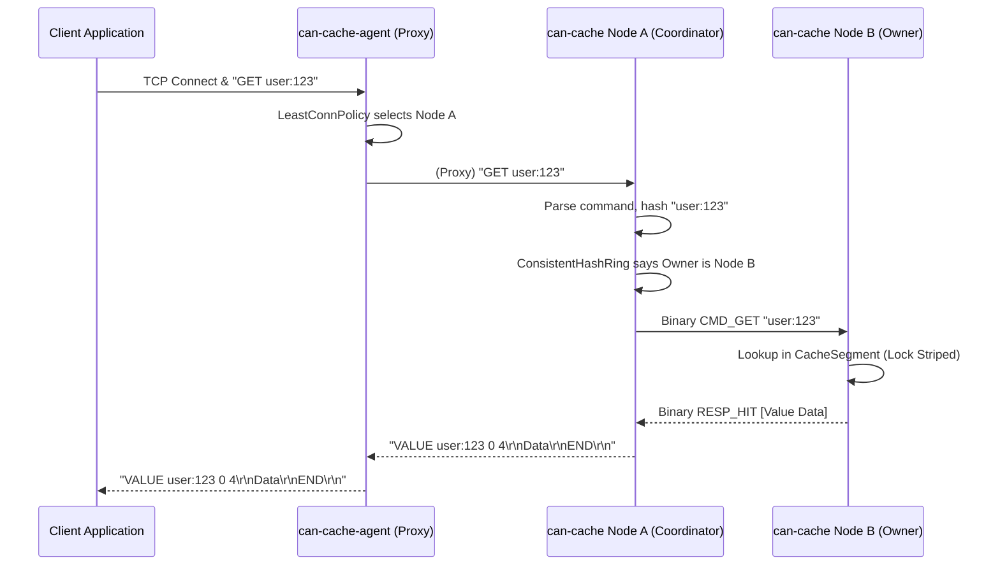

# `can-cache` Detaylı Mimari ve Tasarım Dokümanı

Bu doküman, `can-cache` sisteminin iç işleyişini, veri yapılarını, dağıtık sistem algoritmalarını ve eşzamanlılık (concurrency) modelini kod seviyesinde detaylandıran kapsamlı bir rehberdir.

---

## 1. Sistem Topolojisi ve Temel Felsefe

`can-cache`, düşük gecikmeli (low-latency), dağıtık, bellek-içi (in-memory) bir anahtar-değer (key-value) veri deposudur. İstemcilerle olan iletişiminde Memcached metin (text) protokolünü kullanır.

Sistem iki ayrı uygulamadan (deployable unit) oluşur:
1. **`can-cache-application` (Data Node):** Veriyi saklayan ve quorum tabanlı replikasyon yapan asıl önbellek düğümü. Sistem bir konsensüs protokolü uygulamaz; eventual consistency modelindedir.
2. **`can-cache-agent` (Edge Proxy):** İstemciler ile Data Node'lar arasında duran, akıllı yönlendirme ve yük dengeleme (load balancing) yapan, state tutmayan (stateless) proxy katmanı.

**Tasarım Felsefesi:**
*   **Tamamen Bellek-İçi (In-Memory):** Diske yazma maliyeti yoktur. Yeniden başlatmalarda veri kaybolur (ephemeral data). Bu durum, önbellek kullanım senaryoları için kabul edilebilir bir ödündür (trade-off).
*   **Paylaşılmayan (Shared-Nothing) Mimari:** Düğümler asimetrik değildir; her düğüm aynı yeteneklere sahiptir.
*   **Non-Blocking I/O:** Ağ işlemleri Eclipse Vert.x üzerinde asenkron olarak gerçekleştirilir.
*   **Lock Striping:** Her segment kendi `ReentrantLock` kilidine sahiptir. Farklı segmentlerdeki işlemler paralel ilerlerken aynı segmentteki bileşik işlemler atomik kalır.

---

## 2. Eşzamanlılık ve İş Parçacığı Modeli (Threading Model)

Sistem, Vert.x'in reaktif modelini ve Java'nın sanal iş parçacıklarını (Virtual Threads) harmanlayarak kullanır.

1.  **Event-Loop İş Parçacıkları (Vert.x):** Ağ bağlantılarını dinlemek, veriyi TCP soketinden okumak ve yazmak (Memcached protokolü ve Düğümler arası replikasyon protokolü) sadece Event-Loop iş parçacıklarında yapılır. Bu thread'ler **asla** bloklanmamalıdır.
2.  **Worker Pool (WorkerExecutor):** Ağdan gelen komut ayrıştırıldıktan sonra, `CacheEngine` üzerindeki asıl veri okuma/yazma (bloklama potansiyeli olan) işlemleri Vert.x Worker thread'lerine veya Virtual Thread'lere devredilir.
3.  **Koordinasyon İş Parçacıkları:** Küme keşfi (multicast dinleme) için bağımsız daemon thread'ler ve periyodik görevler için Vert.x timer'ları kullanılır.

---

## 3. Veri Depolama Katmanı (`core` Modülü)

Verinin bellekte saklanmasından, süresinin dolmasından (TTL) ve kapasite yönetiminden (Eviction) sorumlu olan en alt katmandır.

### 3.1. `CacheEngine` ve `CacheSegment` (Lock Striping)
Java'daki standart `ConcurrentHashMap` tek başına bazı gelişmiş TTL ve tahliye (eviction) kuralları için yetersiz veya yavaştır. `can-cache`, Java'nın eski `ConcurrentHashMap` uygulamalarına benzer şekilde **Segmentli (Lock Striping)** bir mimari kullanır.

*   **Segment Dizisi:** Önbellek varsayılan olarak 8, `app.cache.segments` ile ayarlanabilen `CacheSegment` nesnesine bölünür. Segment sayısı kapasiteyi aşarsa etkin sayı kapasiteyle sınırlandırılır; toplam segment kapasitesi tam olarak `app.cache.max-capacity` eder.
*   **Yönlendirme:** Gelen bir anahtarın (key) hash kodu alınarak hangi segmente ait olduğu bulunur `(hash % segmentCount)`.
*   **İzolasyon:** Her `CacheSegment` kendi içinde bir `LinkedHashMap` ve bir `ReentrantLock` barındırır. Bu sayede farklı segmentlere erişen thread'ler birbirini bloke etmez; gerçek ölçeklenme anahtar dağılımına ve iş yüküne bağlıdır.

### 3.2. Değer Kodlaması (`StoredValueCodec`)
Veriler bellekte ham metin olarak tutulmaz. Bir değer belleğe yazılırken `StoredValueCodec` aracılığıyla metadata ile paketlenir:
*   **Payload (byte[]):** Asıl veri.
*   **ExpireAt (long):** Verinin süresinin dolacağı milisaniye cinsinden mutlak zaman damgası (Epoch time).
*   **CAS (long):** Compare-and-Swap operasyonları için benzersiz versiyon numarası. Değer her güncellendiğinde bu sayı artar (genellikle timestamp veya atomic counter tabanlı).

### 3.3. Tahliye Politikaları (Eviction Policies)
Bellek dolduğunda hangi verinin feda edileceği `EvictionPolicy` arayüzü ile belirlenir.
*   **`LruEvictionPolicy`:** Çift yönlü bağlı liste (Doubly Linked List) ve HashMap kombinasyonu ile O(1) zaman karmaşıklığında En Az Yakın Zamanda Kullanılan (Least Recently Used) veriyi siler.
*   **`TinyLfuEvictionPolicy`:** Aday ile LRU kurbanını yaklaşık erişim frekanslarına göre karşılaştıran basitleştirilmiş bir TinyLFU admission politikasıdır. Tam W-TinyLFU pencere/probation/protected katmanlarını uygulamaz.

---

## 4. İstemci Ağ Katmanı (`net` Modülü)

İstemcilerin `can-cache-application`'a doğrudan bağlandığı (veya agent'ın yönlendirdiği) kısımdır.

### 4.1. `CanCachedServer`
Vert.x `NetServer` üzerine kuruludur. İstemciden gelen TCP paketlerini bir `Buffer` içerisine alır.

### 4.2. Memcached Text Protokolü Ayrıştırıcı (Parser)
Memcached protokolü CRLF (`\r\n`) karakterleriyle ayrılmış satırlardan oluşur.
*   Veri boyutu çok büyük olabileceğinden, ayrıştırıcı bir state-machine (durum makinesi) olarak çalışır.
*   `set mykey 0 900 5\r\n` (Header kısmı) okunduğunda sistem 5 byte daha veri beklentisine girer (`StorageCommand` durumu).
*   Geri kalan `value\r\n` paketi geldiğinde komut çalıştırılmak üzere `ClusterClient`'a iletilir.

---

## 5. Dağıtık Mimari ve Kümeleme (`cluster` Modülü)

Sistemi tek bir makineden çıkarıp dağıtık hale getiren katmandır.

### 5.1. Tutarlı Özetleme (Consistent Hashing - `ConsistentHashRing`)
Veriler (anahtarlar) düğümlere `ConsistentHashRing` ile dağıtılır.
*   **Ring (Halka):** 0 ile 2^32 (veya 2^64) arasında değer alabilen mantıksal bir çemberdir. Hem düğümler (node ID'lerine göre) hem de veriler (anahtarlarına göre) bu çembere hashlenerek yerleştirilir.
*   **Virtual Nodes (Sanal Düğümler):** Bir düğüm halkanın üzerine tek bir nokta olarak değil, `V-Node` (örneğin 100 farklı nokta) olarak yerleştirilir. Bu sayede veriler düğümler arasında çok daha dengeli (homojen) dağılır ve sıcak noktalar (hotspots) önlenir.
*   Verinin saklanacağı düğüm, anahtarın hash değerinden sonra halka üzerinde saat yönünde ilerlerken karşılaşılan **ilk** düğümdür (ve replikasyon için ondan sonraki N düğüm).

### 5.2. Quorum ve Replikasyon
`ClusterClient`, işlemleri koordine eder. Bir yazma isteği (örn. `set`) geldiğinde:
1.  `ConsistentHashRing` üzerinden anahtarın sahibi olan Ana Düğüm (Owner) ve Replika Düğümler (Replicas) bulunur (örn: Replication Factor = 3).
2.  İstek asenkron olarak bu 3 düğüme (kendisi dahil olabilir) paralel olarak gönderilir.
3.  **Quorum:** Başarılı sayılması için yapılandırılmış replication factor üzerinden `(RF / 2) + 1` onay gerekir. Aktif node sayısı azaldığında quorum sessizce küçülmez. Tek-node hızlı başlangıç bu nedenle `RF=1`, iki-node Docker örneği `RF=2` kullanır.

### 5.3. `HintedHandoffService` (Gecikmeli Tutarlılık)
Bir yazma sırasında Quorum sağlandı ancak replikalardan biri (Düğüm C) ağ sorunu nedeniyle yanıt vermedi diyelim.
*   Yazmayı koordine eden düğüm, Düğüm C için hedeflediği veriyi `HintedHandoffService`'e teslim eder.
*   Bu veri "Hint" (ipucu) olarak node başına sınırlandırılmış kuyrukta tutulur (`SetHint`, `DeleteHint` nesneleri). TTL mutlak son kullanma zamanı olarak saklanır; kesinti süresi TTL'yi uzatmaz.
*   Düğüm C daha sonra kümeye tekrar bağlandığında, koordinatör düğüm arka planda bu kuyruktaki Hint'leri (replay) Düğüm C'ye göndererek düğümleri senkronize eder (Eventual Consistency).

---

## 6. Düğümler Arası Koordinasyon (`cluster.coordination`)

Düğümlerin birbirini otomatik keşfetmesi ve replikasyon iletişimini içerir.

### 6.1. Multicast Tabanlı Keşif (`CoordinationService`)
*   **Discovery:** Seçilen stratejiye göre multicast heartbeat veya gossip kullanılır. Gossip paketleri Java nesne deserialization yerine sürümlü ve 1500 baytla sınırlandırılmış açık bir binary codec ile doğrulanır.
*   **Membership:** Bir düğüm, diğerlerinin anonslarını dinler. Yeni bir anons duyarsa, o düğümle bir "Join Handshake" (TCP üzerinden el sıkışma) yapar ve başarılı olursa `ConsistentHashRing`'e ekler. Belirli bir süre heartbeat gelmezse, ölü kabul eder ve ringden çıkarır.

### 6.2. İkili Replikasyon Protokolü (`ReplicationServer` ve `RemoteNode`)
Performansı maksimize etmek için düğümler arası replikasyon verileri Memcached metin protokolü ile **değil**, can-cache'e özel Binary Protocol ile taşınır.
*   **Tek Baytlık Komutlar:** Örn. `NodeProtocol.CMD_SET = 1`, `NodeProtocol.CMD_GET = 2`.
*   **Verimli Kodlama:** String uzunlukları, expire değerleri 4 veya 8 baytlık (Integer, Long) primitif tipler olarak doğrudan TCP socketine yazılır (Örn. `[1 byte CMD][4 byte Key Len][4 byte Val Len][8 byte TTL][Key Bytes][Val Bytes]`).
*   **`ByteBufferReader`:** Gelen parçalı (fragmented) TCP paketlerini bellek sızıntısına yol açmadan (compacting buffer) yöneten okuyucu mekanizmadır.

### 6.3. Bağlantı Havuzu (`ConnectionPoolManager`)
Her replikasyon isteğinde yeni bir TCP soketi açmak büyük bir gecikme yaratır. Sistem, diğer düğümlere olan bağlantıları bir havuzda (`SocketConnectionPool`) tutar. İstek havuzdan bir soket ödünç alır, veriyi gönderir, okur ve soketi havuza geri bırakır (`PooledSocket`).

### 6.4. Bootstrap (Durum Aktarımı)
Yeni bir düğüm kümeye katıldığında boştur. El sıkışma sırasında (Join Handshake), mevcut düğümlerden biri `CMD_STREAM` komutu ile kendi verilerinin (snapshot) bir kopyasını yeni düğüme akıtır.

---

## 7. Edge Proxy: `can-cache-agent` Katmanı

`can-cache-agent`, bağımsız çalışan bir Yük Dengeleyici (Load Balancer) ve Hizmet Keşfi (Service Discovery) aracıdır.

### 7.1. Rolü ve Amacı
Uygulama sunucuları (istemciler) memcached kütüphanelerine tüm IP'leri vermek yerine sadece Agent'ın IP ve portuna (örn. `127.0.0.1:11211`) bağlanır.
*   Kümede bir sunucu çökerse veya yeni sunucu eklenirse istemcinin haberi olmaz; bu karmaşıklığı Agent yönetir.
*   **Şeffaf Proxy:** İstemciden gelen Memcached komutlarını hiçbir şekilde ayrıştırmaz (parse etmez), sadece byte dizisi olarak seçtiği sağlıklı bir `can-cache-application` düğümüne tüneller (TCP Pipe).

### 7.2. Akıllı Yönlendirme (Upstream Selection)
Agent yeni bir TCP bağlantısı aldığında bir Seçim Politikası (`SelectionPolicy`) çalıştırır:
*   `RoundRobinPolicy`: Bağlantıları düğümlere sırayla dağıtır.
*   `LeastConnPolicy`: O an Agent üzerinden en az aktif TCP bağlantısı olan düğümü seçerek (NodeStats'a bakarak) yükü dengeler.

### 7.3. Sağlık Kontrolü (Health Checking)
*   **Kayıt (Registration):** `can-cache-application` düğümleri ayağa kalktığında özel bir port (örn 11311) üzerinden Agent'a ping atarak kendilerini kaydettirirler (`CanCacheAgentConnector`).
*   **Aktif Kontrol (`HealthService`):** Agent, `UpstreamRegistry`'deki tüm düğümlere periyodik olarak küçük boyutlu TCP probları gönderir. Yanıt alamadıklarını geçici olarak devre dışı (Unhealthy) bırakır ve trafiği diğerlerine kaydırır.

---

## 8. Zaman Akış Örnekleri (Sequence Diagrams)

*Daha anlaşılır bir yapı için sistem akışları diyagramlaştırılarak aşağıda sunulmuştur.*

### 8.1. Agent Üzerinden İstemci Okuma İşlemi (GET)

---

## 9. Gelecek İçin Genişletilebilirlik Noktaları (Roadmap Uyumluluğu)

Sistemin modüler yapısı sayesinde eklenebilecek olası özellikler:
*   **Veri Kalıcılığı (Persistence):** `CacheSegment`'ler arkasına bir Write-Ahead-Log (WAL) veya RocksDB entegrasyonu yazarak kalıcılık eklenebilir.
*   **Gossip Protokolü:** `CoordinationService`'deki Multicast bağımlılığı, büyük bulut ortamları (AWS, GCP Multicast kısıtlamaları) için bir Gossip algoritması (örn. SWIM) yazılarak aşılabilir.
*   **Agent HA:** Şu anda tek bir Agent darboğaz yaratabilir. Birden fazla Agent önüne Layer-4 yük dengeleyici (HAProxy) konularak agent katmanı da ölçeklenebilir.
