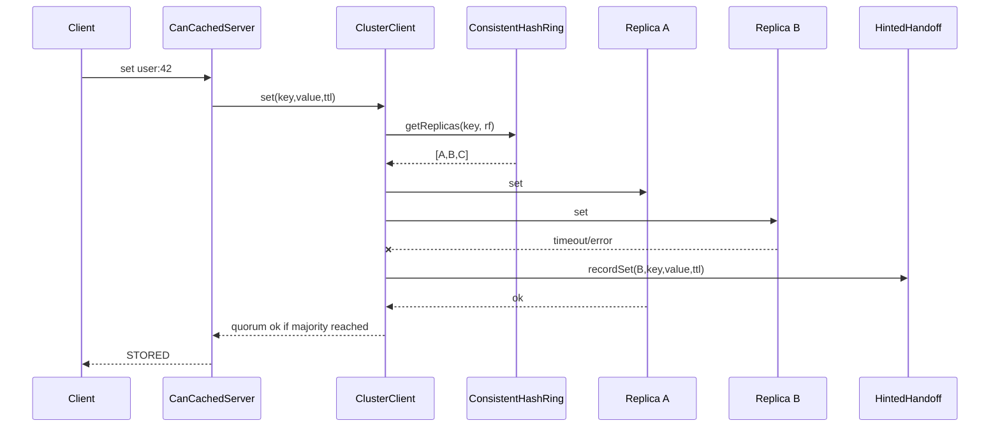
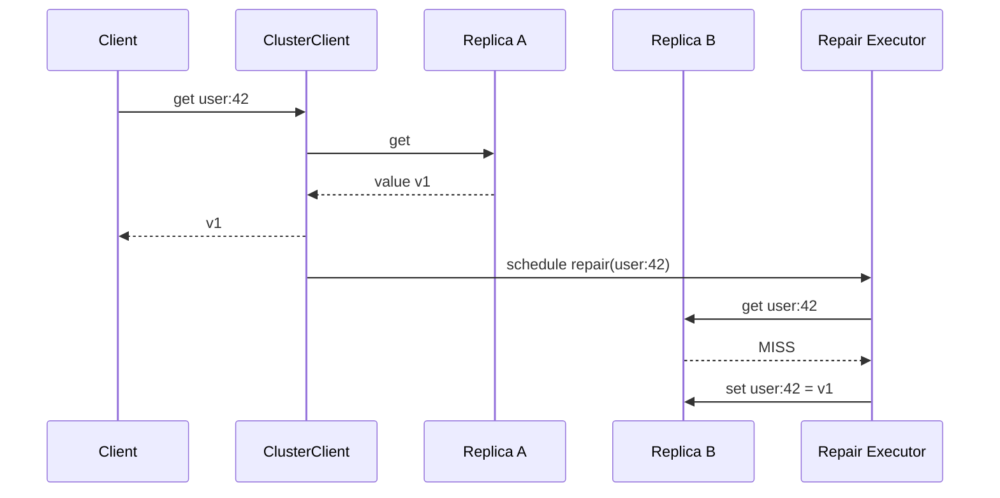
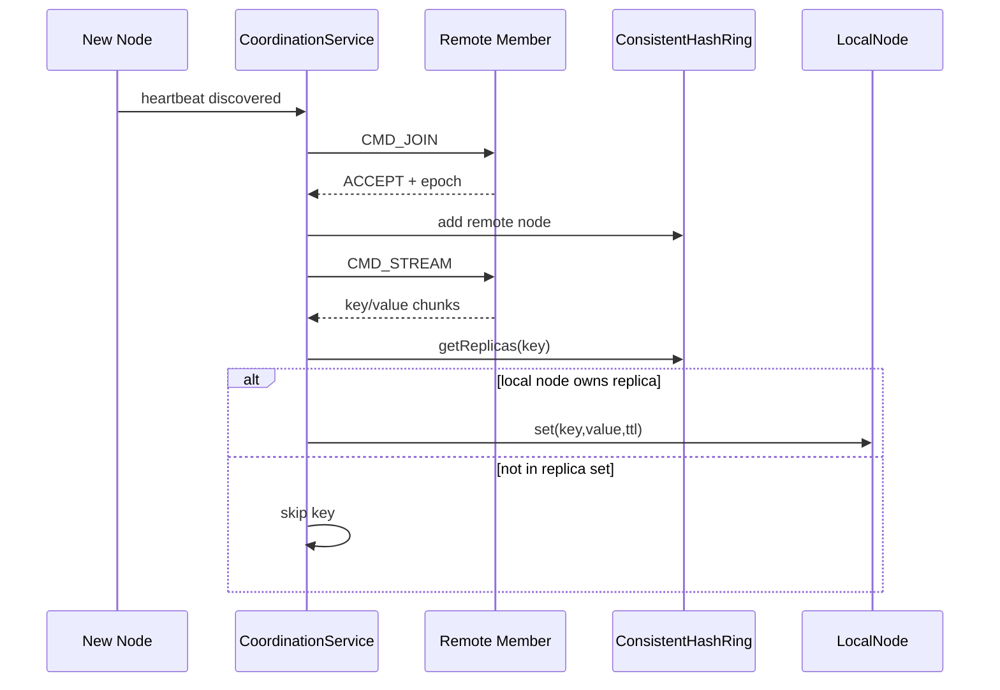

# can-cache Mimari Dokümanı

`can-cache`, Memcached text protokolü konuşan, dağıtık ve bellek içi bir cache sistemidir. Bu doküman kodun güncel halini esas alır ve sistemi ayakta tutan kritik algoritmaları görünür kılmaya odaklanır.

> Animasyonlu algoritma haritası: [docs/assets/critical-algorithms.svg](docs/assets/critical-algorithms.svg)



## 1. Kısa Özet

Sistem iki çalıştırılabilir parçadan oluşur:

| Parça | Rol | Önemli sınıflar |
| --- | --- | --- |
| `can-cache-application` | Asıl cache node'u; veri tutar, cluster üyeliğini izler, replikasyon yapar. | `CanCachedServer`, `CacheEngine`, `ClusterClient`, `CoordinationService`, `ReplicationServer`, `RemoteNode` |
| `can-cache-agent` | Stateless edge proxy; client bağlantılarını sağlıklı upstream node'lara taşır. | `AgentServer`, `UpstreamRegistry`, `HealthService`, `SelectionPolicy` |

Temel veri yolu:

```text
client
  -> can-cache-agent (opsiyonel proxy)
  -> CanCachedServer
  -> protocol parser
  -> ClusterClient
  -> CacheEngine veya RemoteNode
  -> ReplicationServer
```

Node tek başına da çalışabilir; cluster aktif olduğunda `ClusterClient` her key için replica setini ring üzerinden seçer ve quorum mantığını uygular.

## 2. Katmanlar

### 2.1. Protocol ve ağ katmanı

`CanCachedServer`, Vert.x `NetServer` üzerinde Memcached text protokolünü okur. TCP paketleri parçalı gelebileceği için parser state-machine gibi davranır:

1. Komut satırı okunur.
2. Storage komutları için belirtilen byte sayısı kadar payload beklenir.
3. Komut bir `CommandResult` üretmek üzere worker tarafa aktarılır.
4. Yanıt yine Memcached text formatında socket'e yazılır.

Bu katman cluster detayını bilmez; asıl yönlendirme `ClusterClient` üzerinde yapılır.

### 2.2. Bellek içi veri katmanı

`CacheEngine`, key-value verisini segmentlere bölerek tutar. Her `CacheSegment` kendi lock alanına sahiptir; farklı segmentlerdeki key'ler birbirini gereksiz yere bekletmez.

Veri saklama kuralları:

- TTL, absolute expire zamanı olarak taşınır.
- CAS, optimistic update için kullanılır.
- Değerler `StoredValueCodec` ile metadata ve payload birleşimi olarak encode edilir.
- Eviction politikası config ile seçilir; LRU ve TinyLFU ailesi desteklenir.

### 2.3. Cluster yönlendirme katmanı

`ClusterClient`, istemci komutunu cluster operasyonuna çevirir:

- `set`, `delete`, `cas`: replica setindeki node'lara uygulanır ve çoğunluk başarı sayılır.
- `get`: read-repair kapalıysa ilk başarılı replica değeri döner; açıksa FAST veya QUORUM moduna göre onarım tetiklenir.
- Ulaşılamayan replica için `HintedHandoffService` kuyruğuna hint yazılır.

### 2.4. Koordinasyon ve replikasyon katmanı

`CoordinationService`, multicast heartbeat ile üyelik bilgisini yönetir. Yeni node keşfedildiğinde TCP join handshake yapılır, node ring'e eklenir ve bootstrap stream başlatılır.

Node'lar arası veri taşıma Memcached text protokolüyle değil, özel binary protokol ile yapılır:

```text
SET frame:
[CMD_SET:1][keyLen:4][valueLen:4][expireAt:8][key bytes][value bytes]
```

`RemoteNode`, uzak node'u `Node<String,String>` arayüzü gibi gösterir. Altında Vert.x `NetClient`, connection pool ve bounded request executor vardır.

## 3. Kritik Algoritmalar

### 3.1. Consistent hash ve replica seçimi

Kod: `ConsistentHashRing`

Ring, node ID'lerini sanal node suffixleriyle hashleyip `TreeMap<Integer,N>` içinde tutar. Key hash'i bulunduktan sonra algoritma şu sırayla çalışır:

1. Key hash'inden başlayan tail map taranır.
2. Karşılaşılan node'lar `LinkedHashSet` ile tekilleştirilir.
3. Yeterli replica bulunmazsa ring başına sarılır.
4. `replicationFactor` kadar benzersiz node döner.

Bu yaklaşım iki özellik sağlar:

- Node ekleme/çıkarma sırasında sadece ring komşuluğundaki key'ler yer değiştirir.
- Sanal node'lar dağılımı yumuşatır ve tek node'a aşırı yük binmesini azaltır.

### 3.2. Quorum yazma

Kod: `ClusterClient#set`, `ClusterClient#delete`, `ClusterClient#compareAndSwap`

Yazma yolu `majority(nodes.size())` ile quorum eşiğini hesaplar. Replikasyon faktörü 3 ise quorum 2'dir.

Akış:

1. Key için replica set seçilir.
2. Her replica üzerinde işlem denenir.
3. Başarılı işlem sayısı quorum'a ulaşırsa client başarılı yanıt alır.
4. Başarısız veya exception atan replica için hint kaydedilir.
5. Leader başarısızlığı quorum da sağlanamıyorsa exception olarak yukarı taşınır.

Bu model availability ile consistency arasında pratik bir denge kurar: tüm node'lar gerekmeyebilir, ama çoğunluk kaybedilmişse yazma kabul edilmez.

### 3.3. Hinted handoff

Kod: `HintedHandoffService`

Bir replica geçici olarak ulaşılamadığında yazma tamamen kaybolmaz. Koordinatör node, hedef node ID'si altında bir hint kuyruğu tutar:

- `SetHint`: değer ve TTL ile tekrar set eder.
- `DeleteHint`: delete operasyonunu tekrarlar.
- `CasHint`: CAS operasyonunu tekrar dener.

`CoordinationService`, heartbeat ile node'u tekrar gördüğünde `hintedHandoffService.replay(...)` çağırır. Replay başarısız olursa hint kuyruğun başına geri konur; böylece sıradaki periyotta tekrar denenebilir.

### 3.4. Bootstrap replica filtresi

Kod: `CoordinationService#bootstrapFrom`

Yeni node cluster'a katıldığında mevcut node'dan `CMD_STREAM` ile snapshot alır. Kritik nokta şudur: yeni node her key'i almak zorunda değildir. Güncel davranış, stream'den gelen her key için tekrar ring hesabı yapar:

```text
stream key
  -> ring.getReplicas(key, replicationFactor)
  -> localNode replica setinde mi?
  -> evet: localNode.set(...)
  -> hayır: skip
```

Bu filtre olmazsa bootstrap node gereksiz veri taşır ve ring'in sahiplik modelini kirletir. Filtre, node katılımı sonrası veri dağılımını consistent hashing kararına hizalar.

### 3.5. Read-repair

Kod: `ClusterClient#get`

Read-repair, okuma sırasında replica drift'ini azaltır. İki mod vardır:

| Mod | Davranış | Kullanım |
| --- | --- | --- |
| `FAST` | İlk bulunan değeri döner, eksik replica onarımını arkaya atar. | Düşük gecikme öncelikli okuma |
| `QUORUM` | Reachable replica değerlerini sayar, kazanan değeri döner, eksikleri onarır. | Daha güçlü okuma tutarlılığı |

QUORUM modunda quorum policy ayrıca seçilir:

| Policy | Quorum hesabı |
| --- | --- |
| `STRICT` | Tam replica set boyutu üzerinden çoğunluk ister. |
| `DEGRADED` | Sadece ulaşılabilen replica sayısı üzerinden çoğunluk ister. |

Repair işleri bounded executor ile çalışır. Aynı key için eş zamanlı repair tekrarı `repairsInFlight` setiyle engellenir ve `rateLimitPerSecond` ile repair üretimi sınırlandırılır.

### 3.6. Anti-entropy

Kod: `AntiEntropyRepairer`

Anti-entropy, okuma beklemeden arka planda replica drift'ini azaltır. Periyodik olarak local snapshot taranır:

1. Local key'in replica seti hesaplanır.
2. Local node o replica setinde değilse key atlanır.
3. Remote replica eksikse veya expired değer taşıyorsa local değer gönderilir.
4. Remote değer farklıysa conflict metriği artar; değer zorla overwrite edilmez.

Yeni korumalar:

- Her run için `maxRepairsPerRun` bütçesi vardır.
- Per-key dedupe ile aynı key üzerinde çakışan repair engellenir.
- `repairRatePerSecond` ile onarım hızı sınırlanır.
- `CoordinationService` aynı anda ikinci anti-entropy run başlatmaz.

### 3.7. Pool ve backpressure

Kod: `RemoteNode`, `SocketConnectionPool`, `ConnectionPoolManager`

Uzak node çağrıları iki seviyede sınırlanır:

- Socket sayısı pool boyutuyla sınırlıdır.
- Non-virtual caller, bounded request executor kuyruğuna alınır.

Pool doluysa `acquireConnection()` request timeout süresi kadar boş socket bekler. Executor kuyruğu dolarsa `RejectedExecutionException` kontrollü biçimde communication error'a çevrilir. Böylece sınırsız thread veya sınırsız bekleyen request birikimi oluşmaz.

## 4. Uçtan Uca Akışlar

### 4.1. Yazma akışı



### 4.2. Read-repair akışı



### 4.3. Bootstrap akışı



## 5. Concurrency Modeli

| İş | Çalıştığı yer | Koruma |
| --- | --- | --- |
| Client TCP read/write | Vert.x event loop | Event loop bloklanmaz |
| Cache komutları | Worker executor / virtual thread | Segment lock |
| Coordination heartbeat | Vert.x timer + listener thread | `membershipLock` |
| Membership processing | Bounded coordination executor | Queue capacity |
| Read-repair | Bounded repair executor | Per-key dedupe + rate limit |
| Anti-entropy | Bounded coordination executor | Single-flight + repair budget |
| Remote node request | Bounded request executor + socket pool | Pool timeout + queue rejection |

Bu modelin amacı, arka plan bakım işlerinin client trafiğini boğmasını engellemektir.

## 6. Önemli Konfigürasyonlar

| Ayar | Etki |
| --- | --- |
| `app.cluster.replication-factor` | Her key için kaç replica seçileceği |
| `app.cluster.virtual-nodes` | Ring dağılımını yumuşatan sanal node sayısı |
| `app.cluster.discovery.*` | Multicast heartbeat ve failure timeout davranışı |
| `app.cluster.coordination.task-threads` | Coordination executor thread sayısı |
| `app.cluster.coordination.task-queue-capacity` | Coordination iş kuyruğu sınırı |
| `app.cluster.coordination.anti-entropy-max-repairs-per-run` | Tek anti-entropy turundaki repair bütçesi |
| `app.cluster.coordination.anti-entropy-repair-rate-per-second` | Anti-entropy repair rate limit |
| `app.cluster.read-repair.mode` | `FAST` veya `QUORUM` |
| `app.cluster.read-repair.quorum-policy` | `STRICT` veya `DEGRADED` |
| `app.cluster.read-repair.max-threads` | Read-repair executor thread sayısı |
| `app.cluster.read-repair.queue-capacity` | Read-repair kuyruğu sınırı |
| `app.cluster.read-repair.rate-limit-per-second` | Read-repair rate limit |
| `app.network.worker-threads` | Client komutlarının worker kapasitesi |

## 7. Failure Modeli

| Senaryo | Davranış |
| --- | --- |
| Replica yazma sırasında timeout olur | Quorum sağlanırsa client başarılı yanıt alır, failed replica için hint yazılır. |
| Quorum sağlanamaz | Operasyon başarısız döner veya leader exception'ı yukarı taşınır. |
| Node heartbeat kesilir | Failure timeout sonrası ring'den çıkarılır. |
| Node geri gelir | Join handshake yapılır, ring'e eklenir, bootstrap ve hint replay tetiklenir. |
| Replica drift oluşur | Read-repair veya anti-entropy eksik/expired replica'yı onarır. |
| Remote pool doyar | Request timeout veya bounded executor rejection ile backpressure uygulanır. |

## 8. Sınırlar ve Bilinçli Tercihler

- Veri bellek içidir; process restart sonrası kalıcılık hedeflenmez.
- Multicast discovery küçük/local cluster için uygundur; cloud ortamlarında gossip veya registry tabanlı discovery gerekebilir.
- Conflict durumunda read-repair ve anti-entropy otomatik overwrite yapmaz; conflict metriği üretir.
- Agent stateless proxy olarak tasarlanmıştır; tek başına veri tutarlılığı kararı vermez.

## 9. Kod Okuma Rotası

Dağıtık davranışı anlamak için önerilen sıra:

1. `ConsistentHashRing`
2. `ClusterClient`
3. `HintedHandoffService`
4. `CoordinationService`
5. `ReplicationServer`
6. `RemoteNode`
7. `AntiEntropyRepairer`
8. `CacheEngine` ve `CacheSegment`

Bu sıra, key'in ring üzerinde yer bulmasından başlayıp node'lar arası onarım ve backpressure davranışına kadar aynı zihinsel modeli korur.
