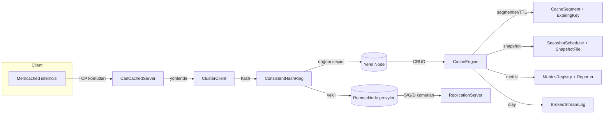
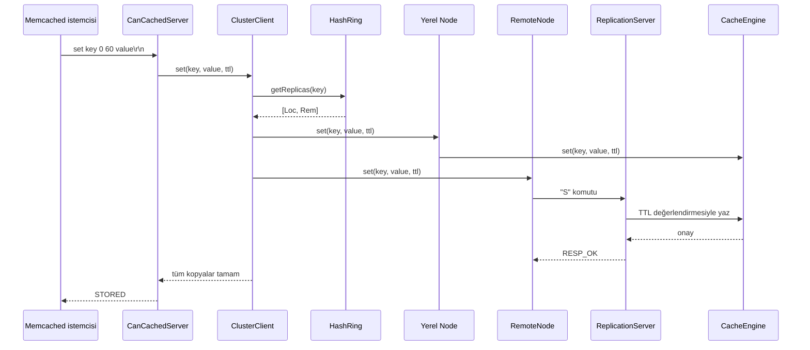

# can-cache

can-cache, Quarkus üzerinde çalışan, memcached metin protokolü ile uyumlu, çok düğümlü ve bellek içi bir anahtar-değer mağazasıdır. Sistem; tutarlı hash halkası tabanlı yönlendirme, çoklu kopya replikasyonu, TTL ve tahliye politikaları, RDB benzeri anlık görüntü alma, metrik raporlama ve publish-subscribe eklentileriyle zenginleştirilmiştir.【F:src/main/java/com/can/CanCacheApplication.java†L7-L24】【F:src/main/java/com/can/net/CanCachedServer.java†L31-L421】【F:src/main/java/com/can/cluster/ClusterClient.java†L7-L45】【F:src/main/java/com/can/core/CacheEngine.java†L16-L216】

## Öne çıkan yetenekler

- **Memcached uyumlu TCP sunucu:** `set/add/replace/append/prepend/cas/get/gets/delete/incr/decr/touch/flush_all/stats/version/quit` komutlarını metin protokolüyle kabul eder, TTL yorumlamasını memcached semantiğine göre yapar, CAS belirteçleri üretir ve isteğe bağlı `noreply` desteği sunar.【F:src/main/java/com/can/net/CanCachedServer.java†L97-L338】
- **Tutarlı hash ve çoklu kopya:** Sanal düğüm destekli halka yapı, her anahtar için deterministik düğüm seçimi ve belirlenen replikasyon faktörü kadar kopya üretir.【F:src/main/java/com/can/cluster/ConsistentHashRing.java†L10-L55】【F:src/main/java/com/can/cluster/ClusterClient.java†L13-L40】
- **Otomatik keşif ve replikasyon:** Multicast kalp atışlarıyla düğüm keşfi, TCP tabanlı replikasyon protokolü ve uzak düğüm proxy’leri sayesinde veriler kümede eşlenir.【F:src/main/java/com/can/cluster/coordination/CoordinationService.java†L30-L299】【F:src/main/java/com/can/cluster/coordination/RemoteNode.java†L16-L151】【F:src/main/java/com/can/cluster/coordination/ReplicationServer.java†L27-L199】
- **TTL, tahliye ve metrik entegrasyonu:** Segmentlere bölünmüş yapı, DelayQueue tabanlı TTL temizliği, LRU/TinyLFU politikaları ve sayaç/zamanlayıcı metrikleri sağlar.【F:src/main/java/com/can/core/CacheEngine.java†L25-L212】【F:src/main/java/com/can/core/CacheSegment.java†L10-L123】【F:src/main/java/com/can/core/LruEvictionPolicy.java†L5-L20】【F:src/main/java/com/can/core/TinyLfuEvictionPolicy.java†L5-L128】【F:src/main/java/com/can/core/ExpiringKey.java†L6-L22】
- **Kalıcılık ve toparlanma:** RDB benzeri düz dosya formatı, atomik dosya değişimi ve sanal thread ile periyodik snapshot alma desteği içerir.【F:src/main/java/com/can/rdb/SnapshotFile.java†L18-L99】【F:src/main/java/com/can/rdb/SnapshotScheduler.java†L11-L57】
- **Gözlemlenebilirlik ve genişletilebilirlik:** Counter/timer metrikleri, sanal thread’li raporlama ve olay yayın sistemi ile uygulama içi entegrasyonlar mümkün kılınır.【F:src/main/java/com/can/metric/MetricsRegistry.java†L6-L19】【F:src/main/java/com/can/metric/MetricsReporter.java†L7-L34】【F:src/main/java/com/can/pubsub/Broker.java†L6-L31】

## Mimari panorama



- **Ağ katmanı** `CanCachedServer` bileşeniyle başlar; bağlantıları kabul edip satır satır komut ayrıştırarak `ClusterClient`’a delegasyon yapar.【F:src/main/java/com/can/net/CanCachedServer.java†L64-L206】
- **Tutarlı hash halkası** `ConsistentHashRing`, sanal düğümlere göre deterministik sıra oluşturur; `ClusterClient` seçilen replikalara sırasıyla yazıp okur.【F:src/main/java/com/can/cluster/ConsistentHashRing.java†L22-L55】【F:src/main/java/com/can/cluster/ClusterClient.java†L21-L40】
- **Yerel düğüm** `AppConfig` içinde üretilen, `CacheEngine`’i saran hafif bir `Node` implementasyonudur; aynı factory ayrıca halka, metrikler, broker ve snapshot bileşenlerini CDI ile sağlar.【F:src/main/java/com/can/config/AppConfig.java†L43-L172】
- **Uzak düğümler** `CoordinationService` tarafından keşfedilir ve `RemoteNode` proxy’leri olarak halka eklenir; proxy’ler TCP üzerinden `ReplicationServer` ile konuşur.【F:src/main/java/com/can/cluster/coordination/CoordinationService.java†L71-L187】【F:src/main/java/com/can/cluster/coordination/RemoteNode.java†L24-L166】【F:src/main/java/com/can/cluster/coordination/ReplicationServer.java†L71-L184】
- **Çekirdek motor** `CacheEngine`, segment başına tahliye politikasını ve TTL kuyruğunu yönetir, broker ve metriklerle entegredir.【F:src/main/java/com/can/core/CacheEngine.java†L25-L212】
- **Kalıcılık katmanı** `SnapshotScheduler` tarafından belirli aralıklarla tetiklenen `SnapshotFile.write()` çağrılarıyla RDB dosyasını atomik olarak günceller.【F:src/main/java/com/can/rdb/SnapshotScheduler.java†L35-L57】【F:src/main/java/com/can/rdb/SnapshotFile.java†L27-L58】

## Komut yolculuğu (`set` örneği)



Bu akışta yerel düğüm `CacheEngine`’e doğrudan yazarken, uzak kopyalar `RemoteNode` aracılığıyla `ReplicationServer`’a tek baytlık komut protokolü gönderir; sunucu TTL süresini hesaplar, gerekirse silme veya yeniden yazma yapar.【F:src/main/java/com/can/cluster/ClusterClient.java†L25-L45】【F:src/main/java/com/can/cluster/coordination/RemoteNode.java†L26-L166】【F:src/main/java/com/can/cluster/coordination/ReplicationServer.java†L103-L184】 `CanCachedServer` gelen TTL değerini memcached kurallarına göre saniye veya epoch olarak yorumlar, CAS belirteci üretir ve `Duration.ZERO` sonucunda girişin silinmesini sağlar.【F:src/main/java/com/can/net/CanCachedServer.java†L230-L336】

## Bellek yönetimi ve TTL temizliği

```mermaid
flowchart TD
    NewSet[set(key,value,ttl)] --> Encode[Değer/anahtar codec ile baytlanır]
    Encode --> SegmentPut[Segment.put]
    SegmentPut -->|kabul edilirse| QueueOffer[DelayQueue'ya ExpiringKey ekle]
    QueueOffer --> Cleaner[Temizleyici sanal thread]
    Cleaner --> Poll[DelayQueue.poll()]
    Poll --> Check[segment.removeIfMatches]
    Check -->|başarılı| MetricsEvict[Eviction sayacı artar]
    MetricsEvict --> Done
    Check -->|zaman tutmadı| Done
```

- `CacheSegment` kilitli `LinkedHashMap` üzerinde tahliye politikasının `admit()` kararına göre giriş ekler veya reddeder; LRU en eski girdiyi, TinyLFU erişim frekansına göre kurban seçer.【F:src/main/java/com/can/core/CacheSegment.java†L30-L123】【F:src/main/java/com/can/core/LruEvictionPolicy.java†L5-L20】【F:src/main/java/com/can/core/TinyLfuEvictionPolicy.java†L19-L128】
- Kabul edilen girdiler için `CacheEngine`, TTL süresi >0 ise `ExpiringKey` kaydını `DelayQueue`ya bırakır; arka plan temizleyicisi sanal thread olarak çalışır ve süresi dolan kayıtları segmentten idempotent şekilde kaldırır, gerekirse `cache_evictions` sayacını artırır.【F:src/main/java/com/can/core/CacheEngine.java†L93-L126】【F:src/main/java/com/can/core/ExpiringKey.java†L6-L22】
- Okuma sırasında süresi dolmuş bir kayıtla karşılaşılırsa temizleme tetiklenir ve `cache_misses` artar; başarıyla okunan değerler `cache_hits` olarak raporlanır, tüm operasyon süreleri `Timer` örneklerinde tutulur.【F:src/main/java/com/can/core/CacheEngine.java†L128-L153】【F:src/main/java/com/can/metric/MetricsRegistry.java†L15-L19】【F:src/main/java/com/can/metric/Timer.java†L28-L55】

## Kalıcılık katmanı

- **Snapshot formatı:** `SnapshotFile.write()` her kayıt için `S base64Key base64Value expireAt` satırı üretir; satırlar geçici dosyaya yazıldıktan sonra atomik olarak hedef dosya ile değiştirilir. Okuma sırasında satırlar parse edilip `CacheEngine.replay()` aracılığıyla belleğe yeniden yüklenir, süresi geçmiş kayıtlar atlanır.【F:src/main/java/com/can/rdb/SnapshotFile.java†L27-L99】【F:src/main/java/com/can/core/CacheEngine.java†L174-L198】
- **Zamanlama:** `SnapshotScheduler.start()` ilk snapshot’ı hemen tetikler, ardından yapılandırılan saniye aralığıyla `safeSnapshot()` çalıştırır; hata durumları loglanır ve planlayıcı sanal thread ile yönetilir.【F:src/main/java/com/can/rdb/SnapshotScheduler.java†L28-L57】
- **Dosya konumu:** Varsayılan yol `data.rdb` olup `application.properties` üzerinden değiştirilebilir.【F:src/main/resources/application.properties†L5-L6】

## Kümeleme, keşif ve replikasyon

- **Koordinasyon:** `CoordinationService`, uygulama başlar başlamaz yerel düğümü halkaya ekler, multicast grubuna katılır ve belirli aralıklarla `HELLO|id|host|port` mesajları gönderir. Gelen mesajlar yeni düğümleri `RemoteNode` olarak kaydeder, taşınmış düğümleri günceller veya kalp atışı kesilenleri halkadan çıkarır.【F:src/main/java/com/can/cluster/coordination/CoordinationService.java†L71-L215】
- **Uzak çağrılar:** `RemoteNode`, her istek için kısa ömürlü bir `Socket` açar; tek baytlık komut başlığı (S/G/D) ve uzunluk alanlarıyla replike düğüme bağlanır, cevapları doğrulayamazsa istisna fırlatır.【F:src/main/java/com/can/cluster/coordination/RemoteNode.java†L24-L151】
- **Replikasyon sunucusu:** `ReplicationServer`, sanal thread havuzu ile gelen bağlantıları işler; set komutlarında TTL’yi epoch zamanına göre değerlendirip silme veya yeniden yazma kararı verir, get/delete yanıtlarını memcached benzeri tek bayt cevaplarla döner.【F:src/main/java/com/can/cluster/coordination/ReplicationServer.java†L53-L180】
- **İstemci davranışı:** `ClusterClient`, replikalar listesini sıralı olarak dolaşarak yazma işlemlerini hepsine, okuma işlemlerini ise ilk bulduğu `hit` ile sınırlar. Bu sayede veri tutarlılığı ve okuma performansı dengelenir.【F:src/main/java/com/can/cluster/ClusterClient.java†L21-L40】

## Yapılandırma referansı

`AppProperties` arayüzü ve varsayılan değerler `application.properties` dosyasında tanımlıdır.【F:src/main/java/com/can/config/AppProperties.java†L6-L105】【F:src/main/resources/application.properties†L1-L26】

| Anahtar | Açıklama | Varsayılan |
| --- | --- | --- |
| `app.cache.segments` | Segment sayısı; eşzamanlılığı artırır, kapasite segmentlere bölünür. | 8 |
| `app.cache.max-capacity` | Toplam anahtar sayısı sınırı. | 10000 |
| `app.cache.cleaner-poll-millis` | TTL temizleyicisinin DelayQueue’yu yoklama periyodu (ms). | 100 |
| `app.cache.eviction-policy` | `LRU` veya `TINY_LFU`. | LRU |
| `app.rdb.path` | Snapshot dosyasının yolu. | `data.rdb` |
| `app.rdb.snapshot-interval-seconds` | Snapshot periyodu; 0 ise yalnızca başlangıç snapshot’ı alınır. | 60 |
| `app.cluster.virtual-nodes` | Her fiziksel düğüm için sanal düğüm sayısı. | 64 |
| `app.cluster.replication-factor` | Anahtar başına kopya sayısı. | 1 |
| `app.cluster.discovery.*` | Multicast grup/portu, kalp atışı aralığı, zaman aşımı, opsiyonel özel node kimliği. | bkz. dosya |
| `app.cluster.replication.*` | Replikasyon sunucusu bind/advertise adresi, port ve bağlantı zaman aşımı. | bkz. dosya |
| `app.network.*` | Memcached sunucusunun bind adresi, portu, backlog ve işçi thread sayısı. | bkz. dosya |
| `app.metrics.report-interval-seconds` | Metrik raporlayıcının konsola yazma aralığı. | 5 |

## Çalıştırma

1. **Ön koşullar:** Maven Wrapper (`./mvnw`) ve JDK 25 (proje `maven.compiler.release=25` olarak yapılandırılmıştır).【F:pom.xml†L12-L44】
2. **Geliştirme modu:**
   ```bash
   ./mvnw quarkus:dev
   ```
   Sunucu varsayılan olarak `0.0.0.0:11211` adresinde memcached komutlarını kabul eder.【F:src/main/resources/application.properties†L10-L13】
3. **Standalone çalışma:**
   ```bash
   ./mvnw package
   java -jar target/quarkus-app/quarkus-run.jar
   ```
4. **Çok düğümlü örnek:** Aynı makinada ikinci bir düğümü farklı portlarla başlatmak için Quarkus config override kullanılabilir:
   ```bash
   ./mvnw quarkus:dev -Dquarkus.http.port=0 \
       -Dapp.network.port=11212 \
       -Dapp.cluster.replication.port=18081 \
       -Dapp.cluster.discovery.node-id=node-b
   ```
   Düğümler multicast üzerinden birbirini keşfedecek, halkaya ekleyip replikasyon kuracaklardır.【F:src/main/java/com/can/cluster/coordination/CoordinationService.java†L71-L187】
5. **Memcached istemci testi:**
   ```bash
   printf 'set foo 0 10 3\r\nbar\r\nget foo\r\n' | nc 127.0.0.1 11211
   ```
   Çıktıda `STORED` ve `VALUE foo 0 3` satırlarını görmeniz gerekir.

## Gözlemlenebilirlik

- `MetricsReporter`, belirlenen aralıkla sayaç ve zamanlayıcı değerlerini konsola basar; örneğin `cache_get` süresi veya `cache_evictions` toplamı raporlanır. Raporlayıcı sanal thread zamanlayıcısı kullanır ve durdurulduğunda kaynakları serbest bırakır.【F:src/main/java/com/can/metric/MetricsReporter.java†L18-L34】【F:src/main/java/com/can/metric/MetricsRegistry.java†L6-L19】
- Her metrik örneği Quarkus CDI ile tekil olarak enjekte edilir; `CacheEngine` operasyon sürelerini nanosecond cinsinden kaydeder ve snapshot sırasında p50/p95 değerleri hesaplanır.【F:src/main/java/com/can/config/AppConfig.java†L72-L116】【F:src/main/java/com/can/metric/Timer.java†L28-L55】
- Log konfigürasyonu hem konsol hem de döner dosya için ayarlanmıştır (`logs/app.log`, 10MB rotasyon).【F:src/main/resources/application.properties†L17-L26】

## Olay sistemi

- `Broker`, konu bazlı abonelikler sağlar ve sanal thread’ler ile her mesajı abonelere iletir. `CacheEngine`, `keyspace:set` ve `keyspace:del` konularında byte dizisi olarak anahtar yayımlar.【F:src/main/java/com/can/pubsub/Broker.java†L14-L31】【F:src/main/java/com/can/core/CacheEngine.java†L118-L151】
- `StreamLog` yardımıyla gelen olaylar hafızada tutulup son X kayıt okunabilir, bu da izleme araçlarına temel sağlar.【F:src/main/java/com/can/pubsub/StreamLog.java†L8-L30】

## Genişletilebilirlik ipuçları

- **Yeni codec veya veri türleri:** `CacheEngine.builder()` anahtar ve değer codec’lerini parametre olarak alır; farklı türler için `Codec<T>` implementasyonu yeterlidir.【F:src/main/java/com/can/core/CacheEngine.java†L68-L89】【F:src/main/java/com/can/codec/Codec.java†L4-L10】
- **Özel tahliye politikası:** `EvictionPolicy` arayüzünü implemente edip `EvictionPolicyType` içine ekleyerek veya doğrudan builder’da kullanarak yeni bir strateji entegre edilebilir.【F:src/main/java/com/can/core/EvictionPolicy.java†L8-L44】【F:src/main/java/com/can/core/EvictionPolicyType.java†L5-L31】
- **Gelişmiş replikasyon:** `RemoteNode` ve `ReplicationServer` tek baytlık protokolü basit tutar; ihtiyaç halinde komut kümesi genişletilerek yeni işlemler eklenebilir.【F:src/main/java/com/can/cluster/coordination/RemoteNode.java†L24-L151】【F:src/main/java/com/can/cluster/coordination/ReplicationServer.java†L103-L180】

## Depo yapısı

| Dizin | İçerik |
| --- | --- |
| `src/main/java/com/can/net` | Memcached protokolünü dinleyen TCP sunucusu. |
| `src/main/java/com/can/cluster` | Tutarlı hash, koordinasyon, replikasyon ve node soyutlamaları. |
| `src/main/java/com/can/core` | CacheEngine, segmentler, TTL, tahliye politikaları. |
| `src/main/java/com/can/rdb` | Snapshot okuma/yazma ve zamanlayıcı. |
| `src/main/java/com/can/metric` | Sayaç, zamanlayıcı ve raporlama altyapısı. |
| `src/main/java/com/can/pubsub` | Uygulama içi yayın/abonelik araçları. |
| `src/main/resources` | Varsayılan yapılandırma dosyaları. |

Bu README, sistemin her katmanını şemalarla ve kod referanslarıyla açıklayarak can-cache’i devreye alma, yapılandırma ve genişletme süreçlerinde kapsamlı bir rehber sunar.
