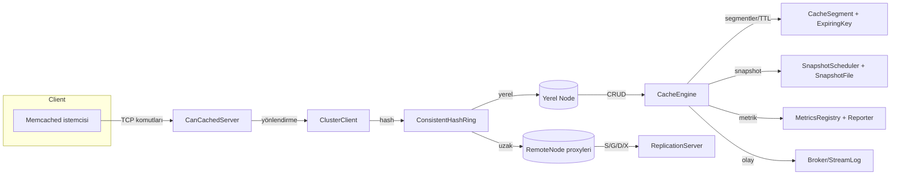
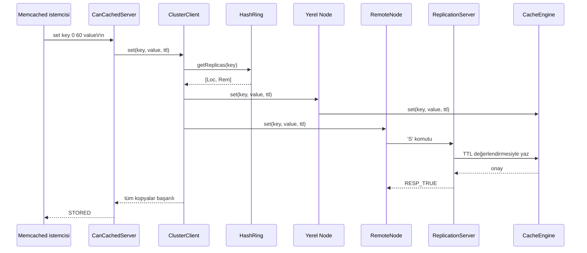

# can-cache

can-cache, Quarkus üzerinde çalışan, Memcached metin protokolü ile uyumlu ve
kümelenebilen bir bellek içi anahtar–değer hizmetidir. Sistem; tutarlı hash
tabanlı yönlendirme, replikasyon, TTL yönetimi, anlık görüntü alma, metrik
raporlama ve yayınla-abone ol entegrasyonları ile tek JVM’de başlayıp yatayda
büyüyebilecek şekilde tasarlandı.【F:src/main/java/com/can/net/CanCachedServer.java†L31-L213】【F:src/main/java/com/can/cluster/ClusterClient.java†L8-L44】【F:src/main/java/com/can/core/CacheEngine.java†L16-L217】

## Öne çıkan özellikler

- **Memcached uyumlu TCP sunucu:** `set/add/replace/append/prepend/cas/get/gets/delete/incr/decr/touch/flush_all/stats/version/quit`
  komutlarını metin protokolüyle kabul eder; TTL ve CAS semantiği memcached ile
tam uyumludur.【F:src/main/java/com/can/net/CanCachedServer.java†L64-L378】
- **Tutarlı hash ve çoklu kopya:** Sanal düğüm destekli halka sayesinde anahtarlar
deterministik olarak düğümlere dağıtılır, replikasyon faktörü kadar kopya
oluşturulur.【F:src/main/java/com/can/cluster/ConsistentHashRing.java†L10-L62】【F:src/main/java/com/can/cluster/ClusterClient.java†L8-L44】
- **Otomatik keşif ve replikasyon:** Multicast kalp atışlarıyla düğümler
birbirini bulur; hafif TCP protokolü ile veriler kopyalanır.【F:src/main/java/com/can/cluster/coordination/CoordinationService.java†L27-L220】【F:src/main/java/com/can/cluster/coordination/RemoteNode.java†L16-L168】【F:src/main/java/com/can/cluster/coordination/ReplicationServer.java†L17-L209】
- **TTL, tahliye ve metrik entegrasyonu:** Segmentlenmiş yapı DelayQueue tabanlı
TTL temizliği, LRU/TinyLFU tahliye politikaları, sayaç ve zamanlayıcı
metrikleriyle birlikte gelir.【F:src/main/java/com/can/core/CacheEngine.java†L22-L217】【F:src/main/java/com/can/core/CacheSegment.java†L12-L199】【F:src/main/java/com/can/core/TinyLfuEvictionPolicy.java†L9-L111】【F:src/main/java/com/can/metric/MetricsRegistry.java†L6-L18】
- **RDB benzeri kalıcılık:** Atomik dosya değişimiyle snapshot alır, yeniden
başlangıçta belleği doldurur.【F:src/main/java/com/can/rdb/SnapshotFile.java†L17-L108】【F:src/main/java/com/can/rdb/SnapshotScheduler.java†L17-L95】
- **Gözlemlenebilirlik ve genişletilebilirlik:** Sayaç/zamanlayıcı raporlama ve
yayınla-abone ol altyapısı uygulama içi entegrasyonları kolaylaştırır.【F:src/main/java/com/can/metric/MetricsReporter.java†L1-L86】【F:src/main/java/com/can/pubsub/Broker.java†L12-L77】

## Mimari genel bakış



### Ağ ve komut katmanı
- `CanCachedServer`, Quarkus uygulaması ayaklanınca TCP bağlantılarını kabul eder,
  komutları satır satır ayrıştırıp `ClusterClient` üzerinden ilgili düğümlere
  yönlendirir. TTL hesaplamasını ve CAS üretimini burada yapar.【F:src/main/java/com/can/net/CanCachedServer.java†L64-L397】
- `StoredValueCodec`, ağ katmanındaki bayrak, TTL ve CAS bilgilerini
  Base64-enkode dizeye çevirerek önbellek motoruyla aynı formatı paylaşır.【F:src/main/java/com/can/core/StoredValueCodec.java†L1-L96】

### Kümeleme ve replikasyon
- `ClusterClient`, anahtarları codec yardımıyla hash’leyip halka üzerindeki
  replikalara dağıtır; yazmalarda tüm kopyaları, okumada ilk başarıyı kullanır.【F:src/main/java/com/can/cluster/ClusterClient.java†L8-L44】
- `ConsistentHashRing`, sanal düğüm konseptiyle yük dağılımını sağlar ve düğüm
  ekleme/çıkarma işlemlerini yönetir.【F:src/main/java/com/can/cluster/ConsistentHashRing.java†L10-L62】
- `CoordinationService`, multicast kalp atışlarıyla yeni düğümleri keşfeder,
  halkaya ekler veya zaman aşımına uğrayanları çıkarır.【F:src/main/java/com/can/cluster/coordination/CoordinationService.java†L27-L220】
- `RemoteNode`, her çağrıda kısa ömürlü soket açıp tek baytlık komutlar (`S`,
  `G`, `D`, `X`, `C`) ile uzak düğüme vekillik yapar.【F:src/main/java/com/can/cluster/coordination/RemoteNode.java†L16-L168】
- `ReplicationServer`, gelen komutları değerlendirip `CacheEngine` üzerinde
  çalıştırır; TTL süresi geçmiş girdileri siler.【F:src/main/java/com/can/cluster/coordination/ReplicationServer.java†L17-L187】

### Çekirdek önbellek motoru
- `CacheEngine`, yapılandırılan segment sayısı kadar `CacheSegment` üretir,
  DelayQueue ile TTL süresi dolan anahtarları temizler ve pub/sub ile metrik
  entegrasyonu yapar.【F:src/main/java/com/can/core/CacheEngine.java†L22-L217】
- `CacheSegment`, segment başına kilit yönetimi ve tahliye politikasını uygular.
  `LruEvictionPolicy` ve `TinyLfuEvictionPolicy` farklı erişim desenlerine yönelik
  iki stratejidir.【F:src/main/java/com/can/core/CacheSegment.java†L12-L199】【F:src/main/java/com/can/core/TinyLfuEvictionPolicy.java†L9-L111】【F:src/main/java/com/can/core/LruEvictionPolicy.java†L5-L27】
- `ExpiringKey`, TTL kuyruğunda tutulan zaman damgasını taşır ve segmentteki
  değeri idempotent biçimde kaldırır.【F:src/main/java/com/can/core/ExpiringKey.java†L1-L19】

### Kalıcılık katmanı
- `SnapshotFile`, her kayıt için `S base64Key base64Value expireAt` formatında
  satırlar yazar, yeniden başlatıldığında aynı kayıtları belleğe tekrar oynatır.【F:src/main/java/com/can/rdb/SnapshotFile.java†L17-L108】
- `SnapshotScheduler`, uygulama başladığında ve tanımlı aralıklarla snapshot
  alır, hataları loglayıp çalışmayı sürdürür.【F:src/main/java/com/can/rdb/SnapshotScheduler.java†L17-L95】

### Gözlemlenebilirlik ve olaylar
- `MetricsRegistry`, sayaç ve zamanlayıcı nesnelerini saklar; `MetricsReporter`
  belirlenen aralıklarla istatistikleri konsola yazar.【F:src/main/java/com/can/metric/MetricsRegistry.java†L6-L18】【F:src/main/java/com/can/metric/MetricsReporter.java†L1-L86】
- `Broker`, `keyspace:set` ve `keyspace:del` gibi konularda abonelere sanal
  thread’lerle bildirim gönderir; `StreamLog` son X olayı hafızada tutar.【F:src/main/java/com/can/pubsub/Broker.java†L12-L77】【F:src/main/java/com/can/pubsub/StreamLog.java†L9-L29】

### Yapılandırma ve bean montajı
- `AppProperties`, `application.properties` dosyasını tip güvenli arayüzlere
  dönüştürür.【F:src/main/java/com/can/config/AppProperties.java†L1-L96】
- `AppConfig`, CDI aracılığıyla önbellek motoru, tutarlı halka, snapshot
  dosyası ve küme istemcisi bean’lerini üretir; uygulama başlarken snapshot
  dosyasını belleğe yükler.【F:src/main/java/com/can/config/AppConfig.java†L1-L118】

## Komut akışı örneği (`set`)



Sunucu TTL’yi memcached kurallarına göre saniye veya epoch olarak yorumlar,
`Duration.ZERO` çıktığında girdiyi siler, CAS değerlerini atomik sayaçtan üretir.【F:src/main/java/com/can/net/CanCachedServer.java†L214-L397】

## Bellek yönetimi ve TTL temizliği

```mermaid
flowchart TD
    NewSet[set(key,value,ttl)] --> Encode[Değer codec ile baytlanır]
    Encode --> SegmentPut[Segment.put]
    SegmentPut -->|kabul| QueueOffer[DelayQueue'ya ExpiringKey]
    QueueOffer --> Cleaner[Temizleyici sanal thread]
    Cleaner --> Poll[DelayQueue.poll()]
    Poll --> Check[segment.removeIfMatches]
    Check -->|başarılı| MetricsEvict[Eviction sayacı artar]
    MetricsEvict --> Done
    Check -->|zaman tutmadı| Done
```

- `CacheSegment`, tahliye politikasının kabul etmediği girişleri reddeder;
  TinyLFU sık erişilen adayları korurken LRU en eski girdiyi seçer.【F:src/main/java/com/can/core/CacheSegment.java†L12-L199】【F:src/main/java/com/can/core/TinyLfuEvictionPolicy.java†L9-L111】
- TTL’si olan girdiler için `CacheEngine`, `DelayQueue`ya `ExpiringKey` bırakır;
  temizleyici sanal thread süresi dolan kayıtları segmentten düşürür.【F:src/main/java/com/can/core/CacheEngine.java†L40-L139】

## Paket haritası

| Dizin | İçerik |
| --- | --- |
| `com.can.net` | Memcached protokolünü dinleyen TCP sunucusu ve yardımcıları.【F:src/main/java/com/can/net/CanCachedServer.java†L31-L397】 |
| `com.can.cluster` | Tutarlı hash, node soyutlaması ve küme istemcisi.【F:src/main/java/com/can/cluster/ClusterClient.java†L8-L44】 |
| `com.can.cluster.coordination` | Multicast keşfi, uzak düğüm proxy’si ve replikasyon sunucusu.【F:src/main/java/com/can/cluster/coordination/CoordinationService.java†L27-L220】【F:src/main/java/com/can/cluster/coordination/RemoteNode.java†L16-L168】 |
| `com.can.core` | Önbellek motoru, segmentler, TTL kuyruğu ve tahliye politikaları.【F:src/main/java/com/can/core/CacheEngine.java†L22-L217】 |
| `com.can.codec` | Anahtar/değer codec’leri (UTF-8, Java serileştirici).【F:src/main/java/com/can/codec/StringCodec.java†L1-L19】 |
| `com.can.rdb` | Snapshot dosyası ve zamanlayıcı bileşenleri.【F:src/main/java/com/can/rdb/SnapshotFile.java†L17-L108】 |
| `com.can.metric` | Sayaç, zamanlayıcı ve periyodik raporlama altyapısı.【F:src/main/java/com/can/metric/MetricsReporter.java†L1-L86】 |
| `com.can.pubsub` | Uygulama içi yayınla-abone ol ve log mekanizmaları.【F:src/main/java/com/can/pubsub/Broker.java†L12-L77】 |
| `com.can.config` | CDI bean montajı ve tip güvenli yapılandırma arayüzleri.【F:src/main/java/com/can/config/AppConfig.java†L1-L118】【F:src/main/java/com/can/config/AppProperties.java†L1-L96】 |

## Yapılandırma referansı

`application.properties` üzerinden gelen başlıca anahtarlar aşağıdadır.【F:src/main/resources/application.properties†L1-L24】

| Anahtar | Açıklama | Varsayılan |
| --- | --- | --- |
| `app.cache.segments` | Segment sayısı; eşzamanlılığı artırır, kapasite segmentlere bölünür. | 8 |
| `app.cache.max-capacity` | Toplam giriş sınırı. | 10000 |
| `app.cache.cleaner-poll-millis` | TTL temizleyicisinin DelayQueue’yu yoklama periyodu (ms). | 100 |
| `app.cache.eviction-policy` | `LRU` veya `TINY_LFU`. | LRU |
| `app.rdb.path` | Snapshot dosyasının yolu. | `data.rdb` |
| `app.rdb.snapshot-interval-seconds` | Snapshot periyodu; 0 ise sadece başlangıçta alınır. | 60 |
| `app.cluster.virtual-nodes` | Her fiziksel düğüm için sanal düğüm sayısı. | 64 |
| `app.cluster.replication-factor` | Anahtar başına kopya sayısı. | 1 |
| `app.cluster.discovery.multicast-group/port` | Multicast koordinasyon adresi ve portu. | 230.0.0.1 / 45565 |
| `app.cluster.discovery.heartbeat-interval-millis` | Kalp atışı aralığı. | 5000 |
| `app.cluster.discovery.failure-timeout-millis` | Üye yok sayılmadan önce beklenecek süre. | 15000 |
| `app.cluster.replication.bind-host/advertise-host/port` | Replikasyon sunucusunun dinlediği ve duyurduğu adres/port. | 0.0.0.0 / 127.0.0.1 / 18080 |
| `app.network.host/port/backlog/worker-threads` | Memcached TCP sunucusu ayarları. | 0.0.0.0 / 11211 / 128 / 16 |
| `app.metrics.report-interval-seconds` | Konsol metrik rapor periyodu. | 5 |

## Çalıştırma

1. **Ön koşul:** Maven Wrapper (`./mvnw`) ve JDK 25 (proje `maven.compiler.release=25`).【F:pom.xml†L1-L46】
2. **Geliştirme modu:** `./mvnw quarkus:dev` komutu sunucuyu
   `0.0.0.0:11211` adresinde memcached protokolüyle dinlemeye başlatır.【F:src/main/resources/application.properties†L10-L13】
3. **Paketleyip çalıştırma:**
   ```bash
   ./mvnw package
   java -jar target/quarkus-app/quarkus-run.jar
   ```
4. **Çok düğümlü örnek:** Portları ezerek ikinci bir düğüm başlatabilirsiniz;
   koordinasyon servisi multicast üzerinden üyeleri keşfeder.
   ```bash
   ./mvnw quarkus:dev \
       -Dquarkus.http.port=0 \
       -Dapp.network.port=11212 \
       -Dapp.cluster.replication.port=18081 \
       -Dapp.cluster.discovery.node-id=node-b
   ```
5. **Hızlı memcached testi:**
   ```bash
   printf 'set foo 0 10 3\r\nbar\r\nget foo\r\n' | nc 127.0.0.1 11211
   ```
   Beklenen çıktı `STORED` ve `VALUE foo 0 3` satırlarıdır.

## Geliştirme notları

- Snapshot dosyası varsayılan olarak depo kökündeki `data.rdb` konumuna yazılır;
  yerel geliştirmede dosyayı temizleyip yeni bir başlangıç yapabilirsiniz.【F:src/main/resources/application.properties†L5-L6】【F:src/main/java/com/can/rdb/SnapshotFile.java†L17-L108】
- Metrik raporlayıcıyı devre dışı bırakmak için `app.metrics.report-interval-seconds=0`
  girilebilir; `MetricsReporter` çalışmayı durdurur.【F:src/main/java/com/can/metric/MetricsReporter.java†L28-L71】
- Yeni veri türleri için `Codec<T>` implementasyonu yazıp `CacheEngine.builder()`
  üzerinden motoru özelleştirebilirsiniz.【F:src/main/java/com/can/core/CacheEngine.java†L51-L96】【F:src/main/java/com/can/codec/Codec.java†L1-L11】
- Özel tahliye stratejisi eklemek için `EvictionPolicy` arayüzünü uygulayıp
  `EvictionPolicyType` içine yeni bir sabit tanımlayın.【F:src/main/java/com/can/core/EvictionPolicy.java†L1-L47】【F:src/main/java/com/can/core/EvictionPolicyType.java†L1-L28】

## Bağımlılıklar

Proje yalnızca Quarkus Arc (CDI) ve JUnit 5 (test) bağımlılıklarını kullanır; ek
framework’ler olmadan saf TCP ve koleksiyon API’leri ile çalışır.【F:pom.xml†L23-L43】

## Proje girişi

Quarkus uygulaması `CanCacheApplication` üzerinden başlar ve `Quarkus.run`
çağrısıyla servislerin ayakta kalmasını sağlar.【F:src/main/java/com/can/CanCacheApplication.java†L1-L24】
