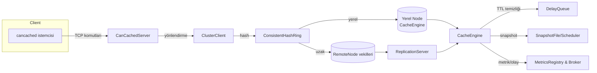

# can-cache

**can-cache**, Quarkus 3 üzerinde çalışan, cancached metin protokolü ile %100 uyumlu
bir bellek içi anahtar–değer sunucusudur. Tek JVM olarak başlayabilir, tutarlı
hash tabanlı yönlendirme ile yatayda ölçeklenir ve replikasyon sayesinde veri
kayıplarını en aza indirir. Sistem; TTL yönetimi, CAS desteği, gecikmeye duyarlı
replikasyon, anlık görüntü (snapshot) alma ve hafif gözlemlenebilirlik özellikleri
ile modern bir cache katmanının gereksinimlerini karşılayacak şekilde
kurgulanmıştır.

## Öne çıkan yetenekler

- **cancached uyumluluğu:** `set/add/replace/append/prepend/cas/get/gets/delete`
  `incr/decr/touch/flush_all/stats/version/quit` komutlarını metin protokolü ile
  işler. 1 MB üzerindeki yükleri engeller, 30 gün üzeri TTL değerlerini epoch
  olarak yorumlar ve CAS sayaçlarını atomik olarak üretir.
- **Tutarlı hash + replikasyon:** `ClusterClient`, sanal düğüm destekli
  `ConsistentHashRing` üzerinde replikasyon faktörü kadar kopya seçer; yazmaları
  çoğunluk quorum'una taşır, başarısız kopyalar için `HintedHandoffService`
  ipuçlarını kalıcılaştırıp yeniden oynatır, okumaları ilk başarılı yanıta
  yönlendirir. İlk kopya lider kabul edilir; lider yazması başarısız olursa
  istemciye hata fırlatılırken takipçi hataları hinted handoff ile toparlanır.
  Örnek akış: üç kopyalı bir yazmada lider ve iki takipçi seçilir; yanıt veren
  ilk iki kopya çoğunluğu sağladığında işlem başarılı sayılır, düşen kopyaya ait
  ipuçları toparlanıp node geri geldiğinde `HintedHandoffService` tarafından
  yeniden uygulanır.
- **Otomatik keşif:** `CoordinationService`, multicast kalp atışları ile yeni JVM
  örneklerini bulur, `RemoteNode` vekilleri oluşturarak halkaya ekler ve zaman
  aşımına uğrayanları temizler.
- **Gecikmeye duyarlı replikasyon:** Her uzaktaki kopya için kısa ömürlü TCP
  bağlantı açan `RemoteNode`, tek baytlık komutlar ile `ReplicationServer`
  üzerinden `CacheEngine`’i günceller; TTL’leri milisaniye hassasiyetiyle korur.
- **Segmentlenmiş bellek motoru:** `CacheEngine`, yapılandırılabilir sayıda
  `CacheSegment` oluşturur, `DelayQueue` tabanlı TTL temizleyicisi ve seçilebilir
  LRU/TinyLFU tahliye politikaları ile yüksek isabet oranı sağlar.
- **Kalıcılık ve geri yükleme:** `SnapshotScheduler`, `SnapshotFile` ile düzenli
  aralıklarla disk tabanlı RDB formatı üretir; uygulama yeniden başladığında aynı
  dosyadan belleği doldurur.
- **Gözlemlenebilirlik ve olaylar:** `MetricsRegistry` + `MetricsReporter`
  kombinasyonu sayaç/zamanlayıcı istatistiklerini konsola döker, `Broker`
  yayınla-abone ol modeliyle `keyspace:set` ve `keyspace:del` olaylarını servis
  eder.

## Mimari görünüm



### Komut işleme ve protokol katmanı
- `CanCachedServer`, Quarkus ayaklandığında konfigüre edilen portu dinler,
  satır bazlı ayrıştırma yapar ve cancached protokolünün kenar durumlarını bire
  bir uygular (CAS çakışması, `noreply`, `flush_all` gecikmesi vb.).
- Değerler `StoredValueCodec` sayesinde CAS, bayrak ve TTL bilgileriyle tek bir
  Base64 dizesine çevrilir; böylece ağ katmanı ile `CacheEngine` aynı formatı
  paylaşır.
- Sunucu istatistikleri (`cmd_get`, `get_hits`, `curr_items` vb.) cancached
  referansını taklit edecek şekilde tutulur ve `stats` komutu ile raporlanır.

### Kümeleme ve replikasyon
- `ConsistentHashRing`, `HashFn` implementasyonu sayesinde sanal düğümlerle
  yükü dağıtır; düğüm ekleme/çıkarma işlemleri tüm kopyaları deterministik
  şekilde günceller.
- `CoordinationService`, multicast dinleyicisi ile gelen `HELLO|nodeId|host|port`
  paketlerini işler, `RemoteNode` örnekleri üretir, zaman aşımı yaşayan üyeleri
  halkadan çıkarır ve loglar.
- `RemoteNode`, her çağrıda kısa ömürlü bir soket açar; `'S'/'G'/'D'/'X'/'C'`
  komutlarıyla `ReplicationServer` üzerindeki `CacheEngine`’i günceller veya
  sorgular.
- `ReplicationServer`, gelen komutları sanal thread havuzunda işler, TTL’si
  geçmiş verileri otomatik olarak temizler ve `CacheEngine` üzerinde idempotent
  işlemler uygular.

### Çekirdek bellek motoru
- `CacheEngine`, yapılandırmada verilen segment sayısı ve kapasiteyi kullanarak
  `CacheSegment` dizisi oluşturur; her segment `ReentrantLock` ve LRU erişim
  sırasına sahip `LinkedHashMap` ile korunur.
- `DelayQueue<ExpiringKey>` kuyruğu, TTL süresi dolan kayıtları doğru segment
  üzerinde kaldırır; temizleyici görev sanal thread olarak periyodik çalışır.
- CAS operasyonları segment içindeki `compareAndSwap` fonksiyonunda gerçekleşir;
  mevcut değer dekode edilerek CAS eşleşmesi, TTL güncellemesi ve tahliye kararı
  tek noktada verilir.
- `CacheEngine.onRemoval`, temizlenen anahtarları dinleyen abonelikler için
  `AutoCloseable` geri döndürür; `CanCachedServer` bu mekanizma ile `curr_items`
  istatistiğini güncel tutar.

### Kalıcılık ve gözlemlenebilirlik
- `SnapshotFile`, her kaydı `S base64Key base64Value expireAt` formatında yazar,
  atomik dosya taşımayla tutarlılığı korur, malformed satırları güvenle atlar.
- `SnapshotScheduler`, uygulama açılır açılmaz snapshot alır, ardından konfigüre
  edilen aralıklarla (`app.rdb.snapshot-interval-seconds`) tekrar eder.
- `MetricsReporter`, rapor periyodu > 0 olduğunda çalışır, sayaç ve zamanlayıcı
  istatistiklerini mikro saniye cinsinden yazdırır.
- `Broker`, sanal thread havuzu ile her mesajı abonelere fan-out eder; yeni
  abonelikler `AutoCloseable` döndürdüğü için yaşam döngüsü kontrolü kolaydır.

## Hızlı başlangıç

1. **Gereksinimler:** Maven Wrapper (`./mvnw`) ve JDK 25.
2. **Geliştirme modu:**
   ```bash
   ./mvnw quarkus:dev
   ```
   Varsayılan cancached uç noktası `0.0.0.0:11211` olarak açılır.
3. **Paketleme ve çalıştırma:**
   ```bash
   ./mvnw package
   java -jar target/quarkus-app/quarkus-run.jar
   ```
4. **İkinci düğümü başlatma (örnek):**
   ```bash
   ./mvnw quarkus:dev \
       -Dquarkus.http.port=0 \
       -Dapp.network.port=11212 \
       -Dapp.cluster.replication.port=18081 \
       -Dapp.cluster.discovery.node-id=node-b
   ```
   Multicast koordinasyon diğer düğümleri otomatik keşfeder.
5. **Hızlı doğrulama:**
   ```bash
   printf 'set foo 0 5 3\r\nbar\r\nget foo\r\n' | nc 127.0.0.1 11211
   ```
   Çıktı olarak `STORED` ve `VALUE foo 0 3` satırları beklenir.

## Yapılandırma referansı

`application.properties` altında tanımlı başlıca anahtarlar:

| Anahtar | Açıklama | Varsayılan |
| --- | --- | --- |
| `app.cache.segments` | Segment sayısı; eşzamanlılık/kapasite dengesini belirler. | 8 |
| `app.cache.max-capacity` | Toplam giriş sınırı. | 10000 |
| `app.cache.cleaner-poll-millis` | TTL temizleyicisinin kuyruğu yoklama aralığı (ms). | 100 |
| `app.cache.eviction-policy` | `LRU` veya `TINY_LFU`. | LRU |
| `app.rdb.path` | Snapshot dosya yolu. | `data.rdb` |
| `app.rdb.snapshot-interval-seconds` | Snapshot periyodu; 0 yalnızca başlangıçta. | 60 |
| `app.cluster.virtual-nodes` | Her fiziksel düğüm için sanal düğüm sayısı. | 64 |
| `app.cluster.replication-factor` | Anahtar başına kopya sayısı. | 1 |
| `app.cluster.discovery.multicast-group/port` | Multicast koordinasyon adresi. | 230.0.0.1 / 45565 |
| `app.cluster.discovery.heartbeat-interval-millis` | Kalp atışı aralığı. | 5000 |
| `app.cluster.discovery.failure-timeout-millis` | Üye zaman aşımı eşiği. | 15000 |
| `app.cluster.discovery.node-id` | Opsiyonel sabit düğüm kimliği. | boş |
| `app.cluster.replication.bind-host/advertise-host/port` | Replikasyon sunucusu adres bilgileri. | 0.0.0.0 / 127.0.0.1 / 18080 |
| `app.cluster.replication.connect-timeout-millis` | Uzak düğüme bağlanma zaman aşımı. | 5000 |
| `app.network.host/port/backlog/worker-threads` | cancached TCP sunucusu ayarları. | 0.0.0.0 / 11211 / 128 / 16 |
| `app.metrics.report-interval-seconds` | Metrik raporlama periyodu; 0 devre dışı. | 5 |

## Dizin rehberi

| Dizin | İçerik |
| --- | --- |
| `src/main/java/com/can/net` | cancached TCP sunucusu ve protokol ayrıştırıcıları. |
| `src/main/java/com/can/cluster` | Tutarlı hash halkası, küme istemcisi ve node arayüzleri. |
| `src/main/java/com/can/cluster/coordination` | Multicast koordinasyonu, uzak node vekilleri ve replikasyon sunucusu. |
| `src/main/java/com/can/core` | Önbellek motoru, segmentler, TTL kuyruğu ve tahliye politikaları. |
| `src/main/java/com/can/codec` | Anahtar/değer codec implementasyonları (UTF-8, Java Serializable). |
| `src/main/java/com/can/rdb` | Snapshot dosyası ve zamanlayıcı bileşenleri. |
| `src/main/java/com/can/metric` | Sayaç, zamanlayıcı ve konsol raporlayıcısı. |
| `src/main/java/com/can/pubsub` | Uygulama içi yayınla-abone ol altyapısı. |
| `src/main/java/com/can/config` | CDI yapılandırması ve tip güvenli konfigürasyon arayüzleri. |
| `integration-tests/` | Docker Compose ile çalışan uçtan uca cancached uyumluluk testleri. |
| `performance-tests/` | JMeter planları ve NFR dokümanları. |

## Geliştirme notları

- Snapshot çıktısı varsayılan olarak depo kökündeki `data.rdb` dosyasına yazılır;
  yerel geliştirmede dosyayı silmek temiz başlangıç sağlar.
- `MetricsReporter`ı devre dışı bırakmak için `app.metrics.report-interval-seconds=0`
  değerini verin; servis kapanır ve raporlama yapılmaz.
- Özel veri türleri için `Codec<T>` implementasyonu yazabilir, `CacheEngine.builder`
  ile farklı codec/tahliye stratejileri tanımlayabilirsiniz.
- Yeni tahliye algoritmaları, `EvictionPolicy` arayüzünü uygulayıp
  `EvictionPolicyType` içine enum değeri eklenerek entegre edilebilir.
- `Broker.subscribe` tarafından döndürülen `AutoCloseable`, abonelik yaşam
  döngüsünü manuel olarak yönetmenizi sağlar; kaynak kaçaklarını engelleyiniz.

## Test ve doğrulama

- `./mvnw test` komutu birim testlerini (varsa) çalıştırır.
- `./scripts/run-integration-tests.sh` cancached uyumluluğunu Docker Compose
  üzerinden uçtan uca doğrular.
- Performans regresyonları için `performance-tests/jmeter` altındaki JMeter
  senaryoları kullanılabilir.
