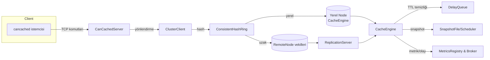
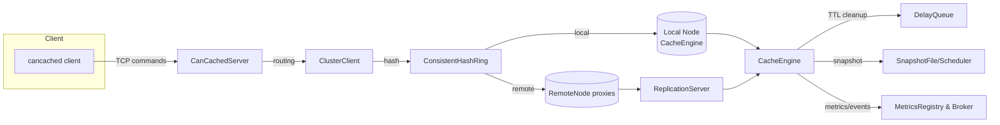

# can-cache

<p align="center">
  
  
  
</p>

<p align="center">
  <a href="#turkish">Türkçe</a> · <a href="#english">English</a>
</p>

<a id="turkish"></a>

> **can-cache**, cancached metin protokolü ile %100 uyumlu, Quarkus 3 tabanlı hafif ama küme ölçekli bir bellek içi anahtar–değer sunucusudur. Tek JVM ile başlayıp saniyeler içinde tutarlı hash halkasına katılan, gecikmeye duyarlı replikasyon ve anlık snapshot alma özellikleriyle modern uygulamaların cache katmanına güç verir.

---

## İçindekiler
- [Animasyonlu Yaşam Döngüsü](#animasyonlu-yaşam-döngüsü)
- [Öne Çıkan Özellikler](#öne-çıkan-özellikler)
- [Neden can-cache?](#neden-can-cache)
- [Mimari Anahat](#mimari-anahat)
- [2 Dakikada Demo](#2-dakikada-demo)
- [Küme Kurulum Örneği](#küme-kurulum-örneği)
- [Yapılandırma Sihirbazı](#yapılandırma-sihirbazı)
- [Proje Yapısı](#proje-yapısı)
- [Yol Haritası](#yol-haritası)
- [Katkı & Geri Bildirim](#katkı--geri-bildirim)
- [Lisans](#lisans)

## Animasyonlu Yaşam Döngüsü

<p align="center">
  
</p>

Animasyon, küçük bir kümenin saniyeler içindeki yolculuğunu üç ayrı döngü halinde gösterir: **küme genişlemesi**, **veri mutasyonları** ve **topoloji daralması**. Böylece hem `set/add` gibi yazma hem de `delete` isteklerinin aynı topolojik olaylar üzerinden nasıl yönetildiğini tek bakışta kavrayabilirsiniz.

### 1) Küme Genişlemesi — Node Ekleme Döngüsü

1. **Node keşfi:** Multicast heartbeat ile Node B tanınır ve tutarlı hash halkasına eklenir.
2. **Bootstrap hazırlığı:** Lider node, `SnapshotScheduler` tarafından üretilen son anlık görüntüyü ve `HintedHandoffService` üzerinde bekleyen ipuçlarını paylaşmaya hazırlanır.
3. **Snapshot aktarımı:** `ReplicationServer`, delta ve snapshot parçalarını stream ederek yeni node'u sıcak yedeğe dönüştürür.
4. **Anti-entropy senkronizasyonu:** Hash halkası üzerindeki segmentler karşılaştırılır; eksik kayıtlar `RemoteNode` vekilleri ile tamamlanır.
5. **Sağlık kontrolü:** Yeni üyenin kalp atışı belirlenen periyot boyunca tutarlı gelirse küme replikasyon faktörünü günceller.

Bu aşamanın sonunda Node B hem yazma hem okuma trafiği alabilecek kadar güncel hale gelir ve animasyonda turuncu/yeşil hatlarla işaretlenen mutasyon döngüsüne katılır.

### 2) Veri Mutasyon Döngüsü — `set/add/delete`

Kümeye katılan her node aynı mutasyon akışını izler. Animasyondaki `set` isteği bunun sekiz karelik rotasını özetler:

1. **İstek kabulü:** `CanCachedServer` protokol satırını ayrıştırır ve `ClusterClient` çağrısını hazırlar.
2. **Replika seçimi:** Hash halkası lideri (Node A) ve takipçiyi (Node B) belirler.
3. **Yerel yazım:** Lider `CacheEngine` segmentine yazar, TTL ve metrikler güncellenir.
4. **Uzak çoğaltma:** `RemoteNode` vekili komutu Node B `ReplicationServer`ına aktarır.
5. **Quorum cevabı:** Yeterli ACK sonrası `STORED` istemciye döner.
6. **Art alan:** TTL temizleme, hinted handoff ve anti-entropy döngüsü sürekli işler.

`add` komutu aynı akışta sadece ön koşul denetimi ekleyerek ilerler; anahtar zaten varsa `NOT_STORED` cevabı verilir. `delete` komutunda ise üçüncü adımda `CacheEngine.remove` tetiklenir, sonrasında replikalara `D` çerçevesi gönderilir ve quorum doğrulaması `DELETED` yanıtı ile tamamlanır. Her iki durumda da art alan süreçleri (TTL süpürme, ipucu yeniden oynatma) tutarlılığı korumak için devrededir.

### 3) Küme Daralması — Node Silme Döngüsü

1. **Kalp atışı kaybı:** `CoordinationService` ardışık timeout'lar sonrası node'u şüpheli olarak işaretler.
2. **Hash halkasından çıkarma:** Sanal düğümler kaldırılır; liderlik görevleri kalan nodelar arasında yeniden dağıtılır.
3. **Hint kuyruğu doldurma:** Ulaşılamayan node'a gönderilemeyen mutasyonlar `HintedHandoffService` kuyruğuna alınır.
4. **Temizlik:** `CacheEngine` üzerindeki replika sayaçları ve metrikler güncellenir, TTL kuyruğu yeni sahiplik bilgisiyle hizalanır.
5. **Geri dönüş senaryosu:** Node yeniden çevrimiçi olursa bootstrap döngüsü tetiklenir; aksi halde ipuçları anti-entropy turunda kalıcı olarak temizlenir.

Bu döngü, animasyonda silinen node'un turuncudan griye dönen kareleriyle gösterilir ve `delete`/`touch` gibi komutlar sırasında da veri güvenliğini sağlar.

## Öne Çıkan Özellikler

### ⚡ Protokol & Performans
- cancached metin protokolünün tüm çekirdek komutlarını (`set/add/replace/append/prepend/cas/get/gets/delete/incr/decr/touch/flush_all/stats/version/quit`) bire bir uygular, 1 MB üzerindeki yükleri reddeder ve 30 günü aşan TTL değerlerini epoch olarak yorumlar.
- CAS sayaçları atomik olarak üretilir; `StoredValueCodec` sayesinde CAS, bayrak ve TTL tek bir Base64 dizesinde taşınır.
- Segmentlenmiş `CacheEngine` ile seçilebilir LRU ya da TinyLFU tahliye politikaları, milisaniye hassasiyetinde TTL temizliği ve yüksek isabet oranı sağlar.

### 🛡️ Dayanıklılık & Tutarlılık
- Sanal düğüm destekli **tutarlı hash halkası** üzerinde çalışan `ClusterClient`, replikasyon faktörü kadar kopyayı deterministik biçimde seçer ve yazmaları çoğunluk quorum'una taşır.
- `HintedHandoffService`, başarısız kopyalar için ipuçlarını kalıcılaştırıp node geri döndüğünde otomatik oynatır; veri kayıplarını en aza indirir.
- `SnapshotScheduler`, RDB benzeri dosya formatıyla periyodik snapshot alır; uygulama yeniden başladığında belleği aynı dosyadan doldurur.

### 🔍 Gözlemlenebilirlik & Operasyon
- `MetricsRegistry` + `MetricsReporter`, mikro saniye hassasiyetinde sayaç ve zamanlayıcı istatistiklerini periyodik olarak raporlar.
- `Broker` yayınla-abone ol modeliyle `keyspace:set` ve `keyspace:del` olaylarını servis eder; `CacheEngine.onRemoval` abonelikleri ile cache yaşam döngüsü izlenebilir.
- Multicast tabanlı `CoordinationService`, yeni JVM örneklerini otomatik keşfeder, zaman aşımına uğrayan node'ları temizler.

## Neden can-cache?
- **Ciddi üretim senaryoları için tasarlandı:** Gecikmeye duyarlı replikasyon, hinted handoff ve anti-entropy döngüleri ile ağ kesintilerini tolere eder.
- **Modern JVM özelliklerinden faydalanır:** Sanal thread'ler, reaktif IO ve Quarkus ekosisteminin hızını kullanır.
- **Basit kurulum, hızlı ölçekleme:** Tek bir komutla ayağa kalkar; yeni node'lar multicast ile kümeye otomatik katılır.
- **Genişletilebilir çekirdek:** Yeni codec'ler, tahliye stratejileri ve gözlemleyiciler kolayca eklenebilir.

## Mimari Anahat



### Katmanlar
- **Komut işleme:** `CanCachedServer`, Quarkus ayaklandığında konfigüre edilen portu dinler, satır bazlı ayrıştırma yapar ve cancached protokolünün kenar durumlarını (CAS çakışması, `noreply`, `flush_all` gecikmesi vb.) bire bir uygular.
- **Kümeleme:** `ConsistentHashRing`, `HashFn` implementasyonu ile sanal düğümler kullanır; `CoordinationService` multicast kalp atışları ile üyeleri güncel tutar.
- **Replikasyon:** `RemoteNode` kısa ömürlü soketlerle `ReplicationServer`'a bağlanır; `'S'/'G'/'D'/'X'/'C'` komutlarıyla veri aktarımı yaparken fingerprint karşılaştırmaları ile tutarlılığı doğrular.
- **Bellek motoru:** `CacheEngine`, segmentler, TTL kuyruğu (`DelayQueue<ExpiringKey>`) ve CAS işlemlerini tek noktada yönetir; `AutoCloseable` aboneliklerle `curr_items` gibi istatistikler güncel tutulur.
- **Kalıcılık & gözlemlenebilirlik:** `SnapshotFile` atomik dosya taşımayla tutarlılığı korur; `MetricsReporter` rapor periyodu > 0 olduğunda saniyeler içinde metrikleri yazdırır.

## 2 Dakikada Demo

> Gereksinimler: Maven Wrapper (`./mvnw`) ve JDK 25.

```bash
# 1) Geliştirme modunda sunucuyu başlatın
./mvnw quarkus:dev

# 2) Temel bir doğrulama yapın
printf 'set foo 0 5 3\r\nbar\r\nget foo\r\n' | nc 127.0.0.1 11211
# Beklenen çıktı: STORED / VALUE foo 0 3
```

Paketleme sonrası çalıştırmak için:

```bash
./mvnw package
java -jar target/quarkus-app/quarkus-run.jar
```

## Küme Kurulum Örneği

Tek JVM'den kümelenmiş bir yapıya geçiş bu kadar kolay:

```bash
# Varsayılan node
./mvnw quarkus:dev

# İkinci node (farklı portlarla)
./mvnw quarkus:dev \
    -Dquarkus.http.port=0 \
    -Dapp.network.port=11212 \
    -Dapp.cluster.replication.port=18081 \
    -Dapp.cluster.discovery.node-id=node-b
```

Multicast koordinasyon, yeni node'u otomatik keşfeder ve tutarlı hash halkasına ekler. Yazmalar quorum tamamlanana kadar bekler; başarısız takipçiler için hinted handoff devreye girer.

## Yapılandırma Sihirbazı

`application.properties` altında sizi bekleyen başlıca anahtarlar:

| Anahtar | Açıklama | Varsayılan |
| --- | --- | --- |
| `app.cache.segments` | Segment sayısı; eşzamanlılık/kapasite dengesini belirler. | 8 |
| `app.cache.max-capacity` | Toplam giriş sınırı. | 10000 |
| `app.cache.cleaner-poll-millis` | TTL temizleyicisinin kuyruğu yoklama aralığı (ms). | 100 |
| `app.cache.eviction-policy` | `LRU` veya `TINY_LFU`. | LRU |
| `app.rdb.path` | Snapshot dosya yolu. | `data.rdb` |
| `app.rdb.snapshot-interval-seconds` | Snapshot periyodu; 0 yalnızca başlangıçta. | 60 |
| `app.cluster.virtual-nodes` | Her fiziksel düğüm için sanal düğüm sayısı. | 64 |
| `app.cluster.replication-factor` | Anahtar başına kopya sayısı. | 1 |
| `app.cluster.discovery.multicast-group/port` | Multicast koordinasyon adresi. | 230.0.0.1 / 45565 |
| `app.cluster.discovery.heartbeat-interval-millis` | Kalp atışı aralığı. | 5000 |
| `app.cluster.discovery.failure-timeout-millis` | Üye zaman aşımı eşiği. | 15000 |
| `app.cluster.discovery.node-id` | Opsiyonel sabit düğüm kimliği. | (boş) |
| `app.cluster.replication.bind-host/advertise-host/port` | Replikasyon sunucusu adres bilgileri. | 0.0.0.0 / 127.0.0.1 / 18080 |
| `app.cluster.replication.connect-timeout-millis` | Uzak düğüme bağlanma zaman aşımı. | 5000 |
| `app.cluster.coordination.hint-replay-interval-millis` | Hinted handoff kuyruğu için yeniden oynatma denemeleri arasındaki minimum süre. | 5000 |
| `app.cluster.coordination.anti-entropy-interval-millis` | Anti-entropy taramalarının periyodu (ms). | 30000 |
| `app.network.host/port/backlog/worker-threads` | cancached TCP sunucusu ayarları. | 0.0.0.0 / 11211 / 128 / 16 |
| `app.memcache.max-item-size-bytes` | Tek bir değerin saklanabileceği maksimum boyut (bayt). | 1048576 |
| `app.memcache.max-cas-retries` | Başarısız CAS işlemleri için tekrar deneme sayısı. | 16 |
| `app.metrics.report-interval-seconds` | Metrik raporlama periyodu; 0 devre dışı. | 5 |

## Proje Yapısı

| Dizin | İçerik |
| --- | --- |
| `src/main/java/com/can/net` | cancached TCP sunucusu ve protokol ayrıştırıcıları. |
| `src/main/java/com/can/cluster` | Tutarlı hash halkası, küme istemcisi ve node arayüzleri. |
| `src/main/java/com/can/cluster/coordination` | Multicast koordinasyonu, uzak node vekilleri ve replikasyon sunucusu. |
| `src/main/java/com/can/core` | Önbellek motoru, segmentler, TTL kuyruğu ve tahliye politikaları. |
| `src/main/java/com/can/codec` | Anahtar/değer codec implementasyonları (UTF-8, Java Serializable). |
| `src/main/java/com/can/rdb` | Snapshot dosyası ve zamanlayıcı bileşenleri. |
| `src/main/java/com/can/metric` | Sayaç, zamanlayıcı ve konsol raporlayıcısı. |
| `src/main/java/com/can/pubsub` | Uygulama içi yayınla-abone ol altyapısı. |
| `src/main/java/com/can/config` | CDI yapılandırması ve tip güvenli konfigürasyon arayüzleri. |
| `integration-tests/` | Docker Compose ile çalışan uçtan uca cancached uyumluluk testleri. |
| `performance-tests/` | JMeter planları ve NFR dokümanları. |
| `scripts/` | Yardımcı komut dosyaları (`run-integration-tests.sh` vb.). |

## Yol Haritası

- [ ] Ek replikasyon stratejileri (örn. aktif-aktif senaryolar için CRDT araştırması)
- [ ] Opsiyonel REST/HTTP yönetim ucu
- [ ] Prometheus metrik ihracı
- [ ] Otomatik benchmark pipeline'ı (JMeter + GitHub Actions)
- [ ] Helm chart ile Kubernetes dağıtımı

> Fikirlerin mi var? [Issue aç](../../issues) veya PR gönder!

## Katkı & Geri Bildirim

1. Depoyu forklayın ve `main` üzerine değişikliklerinizi rebase edin.
2. Kod stilini koruyarak anlamlı commit mesajları yazın.
3. `./mvnw test` ve gerekiyorsa `./scripts/run-integration-tests.sh` ile doğrulayın.
4. Deneyimlerinizi, performans ölçümlerinizi veya yeni kullanım senaryolarınızı paylaşın — proje bu geri bildirimlerle büyüyor.

Sorularınız mı var? Bir [issue](../../issues/new) açabilir veya doğrudan Pull Request ile gelebilirsiniz.

## Lisans

Bu proje, MIT Lisansı veya Apache Lisansı Sürüm 2.0 koşulları altında çift lisanslanmıştır. Ayrıntılar için [LICENSE-MIT](./LICENSE-MIT) ve [LICENSE-APACHE](./LICENSE-APACHE) dosyalarına göz atabilirsiniz.

Bu depoya katkıda bulunan herkes, katkılarının her iki lisansın koşulları altında da kullanılabileceğini kabul eder.

---

<a id="english"></a>
# can-cache (English)

<p align="center">
  
  
  
</p>

> **can-cache** is a lightweight yet cluster-scale in-memory key–value server built on Quarkus 3 that is 100% compatible with the cancached text protocol. It can boot on a single JVM and join the consistent hash ring within seconds, empowering the cache tier of modern applications with latency-aware replication and instant snapshots.

---

## Table of Contents
- [Animated Lifecycle](#animated-lifecycle)
- [Highlights](#highlights)
- [Why can-cache?](#why-can-cache)
- [Architecture Outline](#architecture-outline)
- [Demo in 2 Minutes](#demo-in-2-minutes)
- [Cluster Setup Example](#cluster-setup-example)
- [Configuration Wizard](#configuration-wizard)
- [Project Layout](#project-layout)
- [Roadmap](#roadmap)
- [Contributing & Feedback](#contributing--feedback)
- [License](#license)

## Animated Lifecycle

<p align="center">
  
</p>

The animation presents the journey of a small cluster within seconds across three different loops: **cluster expansion**, **data mutations**, and **topology shrinkage**. This way you can observe how both write operations such as `set/add` and deletions are managed on top of the very same topological events at a glance.

### 1) Cluster Expansion — Node Join Loop

1. **Node discovery:** Node B is identified through multicast heartbeats and added to the consistent hash ring.
2. **Bootstrap preparation:** The leader node gets ready to share the latest snapshot produced by `SnapshotScheduler` along with the hints waiting on `HintedHandoffService`.
3. **Snapshot transfer:** `ReplicationServer` streams delta and snapshot chunks to turn the newcomer into a hot standby.
4. **Anti-entropy synchronization:** Segments on the hash ring are compared; missing records are filled through `RemoteNode` proxies.
5. **Health check:** If the new member keeps a steady heartbeat for the configured period, the cluster updates its replication factor.

At the end of this phase Node B becomes up to date enough to receive both read and write traffic, joining the mutation loop highlighted with orange/green strokes in the animation.

### 2) Data Mutation Loop — `set/add/delete`

Every node that joins the cluster follows the same mutation pipeline. The `set` request in the animation summarises its eight-frame path:

1. **Request admission:** `CanCachedServer` parses the protocol line and prepares the `ClusterClient` call.
2. **Replica selection:** The hash ring picks the leader (Node A) and the follower (Node B).
3. **Local write:** The leader writes to its `CacheEngine` segment while refreshing TTL and metrics.
4. **Remote replication:** The `RemoteNode` proxy forwards the command to Node B's `ReplicationServer`.
5. **Quorum response:** After receiving enough ACKs the server returns `STORED` to the client.
6. **Background maintenance:** TTL sweeping, hinted handoff and anti-entropy loops continue to run.

The `add` command follows the same flow with an extra precondition check; if the key already exists the response is `NOT_STORED`. For `delete` the third step triggers `CacheEngine.remove`, afterwards replicas receive a `D` frame and the quorum verification concludes with a `DELETED` reply. In both cases the background processes (TTL sweeping, replaying hints) remain active to preserve consistency.

### 3) Cluster Shrink — Node Removal Loop

1. **Heartbeat loss:** `CoordinationService` marks the node as suspect after consecutive timeouts.
2. **Removing from the hash ring:** Virtual nodes are dropped and leadership duties are redistributed across the remaining nodes.
3. **Hint queue fill:** Mutations that cannot reach the missing node are stored in the `HintedHandoffService` queue.
4. **Cleanup:** Replica counters and metrics on `CacheEngine` are updated, and the TTL queue realigns with the new ownership.
5. **Return scenario:** If the node comes back online the bootstrap loop is triggered; otherwise the hints are purged during the next anti-entropy round.

The animation shows this loop with the removed node fading from orange to grey, ensuring data safety even during `delete`/`touch` commands.

## Highlights

### ⚡ Protocol & Performance
- Implements every core command of the cancached text protocol (`set/add/replace/append/prepend/cas/get/gets/delete/incr/decr/touch/flush_all/stats/version/quit`), rejects payloads larger than 1 MB, and interprets TTL values over 30 days as epoch timestamps.
- CAS counters are produced atomically; thanks to `StoredValueCodec` CAS, flags, and TTL travel in a single Base64 string.
- Segmented `CacheEngine` enables switchable LRU or TinyLFU eviction policies, millisecond-precision TTL cleanup and high hit rates.

### 🛡️ Durability & Consistency
- `ClusterClient` operates on a **consistent hash ring** with virtual nodes, deterministically picking as many replicas as the replication factor and carrying writes to a majority quorum.
- `HintedHandoffService` persists hints for failed replicas and replays them when the node returns, minimising data loss.
- `SnapshotScheduler` takes periodic snapshots with an RDB-like file format and warms up memory from the same file when the application restarts.

### 🔍 Observability & Operations
- `MetricsRegistry` + `MetricsReporter` periodically emit counter and timer statistics with microsecond precision.
- The `Broker` publish-subscribe model serves `keyspace:set` and `keyspace:del` events; `CacheEngine.onRemoval` subscribers make the cache lifecycle observable.
- Multicast-based `CoordinationService` discovers new JVM instances automatically and cleans up nodes that time out.

## Why can-cache?
- **Built for serious production scenarios:** Latency-aware replication, hinted handoff, and anti-entropy loops tolerate network partitions.
- **Leverages modern JVM capabilities:** Makes use of virtual threads, reactive IO, and the speed of the Quarkus ecosystem.
- **Simple to deploy, quick to scale:** Comes online with a single command; new nodes join the cluster automatically via multicast.
- **Extensible core:** New codecs, eviction strategies, and observers can be added with ease.

## Architecture Outline



### Layers
- **Command processing:** `CanCachedServer` listens on the configured port once Quarkus boots, performs line-based parsing and mirrors the edge cases of the cancached protocol (CAS conflicts, `noreply`, `flush_all` delay, etc.).
- **Clustering:** `ConsistentHashRing` uses a `HashFn` implementation with virtual nodes; `CoordinationService` keeps the membership updated via multicast heartbeats.
- **Replication:** `RemoteNode` connects to `ReplicationServer` with short-lived sockets; `'S'/'G'/'D'/'X'/'C'` commands transfer data while verifying consistency through fingerprint comparisons.
- **In-memory engine:** `CacheEngine` manages segments, the TTL queue (`DelayQueue<ExpiringKey>`), and CAS operations; `AutoCloseable` subscriptions keep stats such as `curr_items` up to date.
- **Persistence & observability:** `SnapshotFile` relies on atomic file moves to stay consistent; `MetricsReporter` prints metrics within seconds when the report period is greater than zero.

## Demo in 2 Minutes

> Requirements: Maven Wrapper (`./mvnw`) and JDK 25.

```bash
# 1) Start the server in development mode
./mvnw quarkus:dev

# 2) Perform a quick validation
printf 'set foo 0 5 3\r\nbar\r\nget foo\r\n' | nc 127.0.0.1 11211
# Expected output: STORED / VALUE foo 0 3
```

To run after packaging:

```bash
./mvnw package
java -jar target/quarkus-app/quarkus-run.jar
```

## Cluster Setup Example

Scaling from a single JVM to a clustered topology is this easy:

```bash
# Default node
./mvnw quarkus:dev

# Second node (with alternate ports)
./mvnw quarkus:dev \
    -Dquarkus.http.port=0 \
    -Dapp.network.port=11212 \
    -Dapp.cluster.replication.port=18081 \
    -Dapp.cluster.discovery.node-id=node-b
```

Multicast coordination automatically discovers the new node and adds it to the consistent hash ring. Writes wait until the quorum completes; hinted handoff takes over for failed followers.

## Configuration Wizard

The most important keys waiting under `application.properties`:

| Key | Description | Default |
| --- | --- | --- |
| `app.cache.segments` | Number of segments; controls the balance between concurrency and capacity. | 8 |
| `app.cache.max-capacity` | Maximum number of entries. | 10000 |
| `app.cache.cleaner-poll-millis` | Poll interval (ms) for the TTL cleaner queue. | 100 |
| `app.cache.eviction-policy` | `LRU` or `TINY_LFU`. | LRU |
| `app.rdb.path` | Snapshot file path. | `data.rdb` |
| `app.rdb.snapshot-interval-seconds` | Snapshot period; 0 means only on startup. | 60 |
| `app.cluster.virtual-nodes` | Number of virtual nodes per physical node. | 64 |
| `app.cluster.replication-factor` | Number of replicas per key. | 1 |
| `app.cluster.discovery.multicast-group/port` | Multicast coordination address. | 230.0.0.1 / 45565 |
| `app.cluster.discovery.heartbeat-interval-millis` | Heartbeat interval. | 5000 |
| `app.cluster.discovery.failure-timeout-millis` | Member timeout threshold. | 15000 |
| `app.cluster.discovery.node-id` | Optional static node identifier. | (empty) |
| `app.cluster.replication.bind-host/advertise-host/port` | Address details for the replication server. | 0.0.0.0 / 127.0.0.1 / 18080 |
| `app.cluster.replication.connect-timeout-millis` | Connection timeout for remote nodes. | 5000 |
| `app.cluster.coordination.hint-replay-interval-millis` | Minimum delay between hint replay attempts. | 5000 |
| `app.cluster.coordination.anti-entropy-interval-millis` | Period (ms) for anti-entropy sweeps. | 30000 |
| `app.network.host/port/backlog/worker-threads` | Settings for the cancached TCP server. | 0.0.0.0 / 11211 / 128 / 16 |
| `app.memcache.max-item-size-bytes` | Maximum size (bytes) for a single value. | 1048576 |
| `app.memcache.max-cas-retries` | Retry count for failed CAS operations. | 16 |
| `app.metrics.report-interval-seconds` | Metrics reporting period; 0 disables the reporter. | 5 |

## Project Layout

| Directory | Contents |
| --- | --- |
| `src/main/java/com/can/net` | cancached TCP server and protocol parsers. |
| `src/main/java/com/can/cluster` | Consistent hash ring, cluster client, and node interfaces. |
| `src/main/java/com/can/cluster/coordination` | Multicast coordination, remote node proxies, and replication server. |
| `src/main/java/com/can/core` | Cache engine, segments, TTL queue, and eviction policies. |
| `src/main/java/com/can/codec` | Key/value codec implementations (UTF-8, Java Serializable). |
| `src/main/java/com/can/rdb` | Snapshot file and scheduler components. |
| `src/main/java/com/can/metric` | Counters, timers, and console reporter. |
| `src/main/java/com/can/pubsub` | In-process publish/subscribe infrastructure. |
| `src/main/java/com/can/config` | CDI configuration and type-safe configuration interfaces. |
| `integration-tests/` | End-to-end cancached compatibility tests powered by Docker Compose. |
| `performance-tests/` | JMeter plans and NFR documentation. |
| `scripts/` | Helper scripts (e.g. `run-integration-tests.sh`). |

## Roadmap

- [ ] Additional replication strategies (e.g., CRDT research for active-active scenarios)
- [ ] Optional REST/HTTP management endpoint
- [ ] Prometheus metrics exporter
- [ ] Automated benchmarking pipeline (JMeter + GitHub Actions)
- [ ] Kubernetes deployment via Helm chart

> Got ideas? [Open an issue](../../issues) or send a PR!

## Contributing & Feedback

1. Fork the repository and rebase your changes onto `main`.
2. Follow the existing code style and write meaningful commit messages.
3. Verify with `./mvnw test` and, if necessary, `./scripts/run-integration-tests.sh`.
4. Share your experiences, performance measurements, or new use cases — the project grows with community feedback.

Have questions? [Open an issue](../../issues/new) or come directly with a Pull Request.

## License

This project is dual-licensed under the terms of the MIT License or the Apache License Version 2.0. See [LICENSE-MIT](./LICENSE-MIT) and [LICENSE-APACHE](./LICENSE-APACHE) for details.

Everyone contributing to this repository agrees that their contributions can be used under both licenses.
