# Cache Book

Sıfırdan Başlayan Bir Yazılım Mühendisi İçin Cache, Algoritmalar, Teknolojiler ve can-cache Rehberi

Bu doküman internet araştırması yapılmadan hazırlanmıştır. İçerik, bu repo içindeki gerçek kod, mevcut mimari dokümanlar ve genel yazılım mühendisliği bilgisinden oluşur.

## Görsel Algoritma Atlası

Bu kitapta anlatılan ana algoritmalar ayrı animasyonlu SVG dosyalarıyla desteklenir. Dosyalar doğrudan tarayıcıda açıldığında CSS animasyonları çalışır.

| Konu | Animasyon |
| --- | --- |
| HashMap, segment ve lock striping | [01-cache-map-segments.svg](docs/assets/cache-book/01-cache-map-segments.svg) |
| TTL, lazy expiration ve active cleaner | [02-ttl-expiration.svg](docs/assets/cache-book/02-ttl-expiration.svg) |
| CAS ve optimistic concurrency | [03-cas-optimistic.svg](docs/assets/cache-book/03-cas-optimistic.svg) |
| LRU eviction | [04-lru-eviction.svg](docs/assets/cache-book/04-lru-eviction.svg) |
| TinyLFU admission | [05-tiny-lfu.svg](docs/assets/cache-book/05-tiny-lfu.svg) |
| FIFO, Random, SLRU, CLOCK gibi eviction alternatifleri | [06-eviction-alternatives.svg](docs/assets/cache-book/06-eviction-alternatives.svg) |
| Cache-aside, read-through, write-through, write-back | [07-cache-patterns.svg](docs/assets/cache-book/07-cache-patterns.svg) |
| Consistent hashing ve virtual node | [08-consistent-hashing.svg](docs/assets/cache-book/08-consistent-hashing.svg) |
| Replication ve quorum | [09-quorum-replication.svg](docs/assets/cache-book/09-quorum-replication.svg) |
| Hinted handoff, read-repair, anti-entropy | [10-repair-entropy-handoff.svg](docs/assets/cache-book/10-repair-entropy-handoff.svg) |
| Round robin ve least connections | [11-load-balancing.svg](docs/assets/cache-book/11-load-balancing.svg) |
| Protocol, connection pool ve backpressure | [12-backpressure-protocol.svg](docs/assets/cache-book/12-backpressure-protocol.svg) |

## İçindekiler

1. Bu kitap neden var?
2. Cache nedir?
3. Cache düşünme modeli
4. Bu projeyi anlamak için repo haritası
5. Temel veri yapıları
6. Bu projede kullanılan cache motoru
7. TTL ve expiration algoritmaları
8. CAS ve optimistic concurrency
9. Eviction nedir?
10. Bu projede kullanılan LRU algoritması
11. Bu projede kullanılan TinyLFU algoritması
12. Sektörde kullanılan diğer eviction algoritmaları
13. Cache yazma ve okuma desenleri
14. Dağıtık cache mantığı
15. Consistent hashing ve alternatifleri
16. Replication, quorum ve tutarlılık
17. Read-repair, anti-entropy ve hinted handoff
18. Agent, load balancing ve proxy mantığı
19. Network, protocol ve backpressure
20. Metrics, gözlemlenebilirlik ve performans
21. Teknoloji seçimi
22. Tuning rehberi
23. Junior mühendisin okuma rotası
24. Terimler sözlüğü

## 1. Bu Kitap Neden Var?

Cache sistemi yazmak basit görünür:

```text
map.put(key, value)
map.get(key)
```

Ama gerçek bir cache sistemi bundan çok daha fazlasıdır. Bir cache sisteminde şu sorulara cevap vermek gerekir:

- Veri ne kadar süre tutulacak?
- Bellek dolarsa hangi veri silinecek?
- Aynı anda 1000 thread aynı key'i okursa ne olacak?
- Veri cluster içindeyse key hangi node'a gidecek?
- Bir node çökerse veri kaybolacak mı?
- Yazma başarılı kabul edilmeden önce kaç replica onay vermeli?
- Drift oluşursa replica'lar nasıl düzelecek?
- Network yavaşlarsa thread, socket ve request kuyruğu büyüyüp sistemi boğacak mı?
- Hit rate nasıl ölçülecek?
- Hangi workload için hangi eviction algoritması daha iyi?

Bu kitap bu soruları en baştan anlatır. Hedef okuyucu cache kavramını yeni öğrenen ama kod okuyup sistem tasarlamaya başlamak isteyen bir yazılım mühendisidir.

## 2. Cache Nedir?

Cache, pahalı veya yavaş erişilen bir verinin daha hızlı erişilen bir yerde geçici olarak tutulmasıdır.

Örnekler:

- Veritabanından okunan kullanıcı profili uygulama belleğinde tutulur.
- Diskten okunan dosya işletim sistemi page cache içinde tutulur.
- HTTP cevabı CDN üzerinde tutulur.
- DNS cevabı resolver cache içinde tutulur.
- CPU, RAM'deki verinin bir kısmını L1/L2/L3 cache içinde tutar.

Cache'in amacı çoğunlukla şudur:

- Gecikmeyi azaltmak.
- Kaynak tüketimini azaltmak.
- Yüksek trafik altında sistemi ayakta tutmak.
- Uzak sistemlere bağımlılığı azaltmak.

Ama cache her zaman bedava değildir. Cache şu riskleri getirir:

- Eski veri gösterme.
- Bellek tüketimi.
- Tutarlılık sorunları.
- Invalidasyon karmaşıklığı.
- Yanlış eviction ile düşük hit rate.
- Stampede ve thundering herd problemleri.

En kısa tanım:

```text
Cache = hız kazanmak için kontrollü belirsizlik kabul etme sanatı.
```

## 3. Cache Düşünme Modeli

Bir cache tasarlarken şu 7 boyut birlikte düşünülür.

### 3.1. Ne cache'leniyor?

- Ham byte array mi?
- JSON response mu?
- Veritabanı row'u mu?
- Hesaplama sonucu mu?
- Session bilgisi mi?
- Feature flag mi?

Bu projede temel model key-value'dur. `CacheEngine<K,V>` generic görünse de uygulama seviyesinde string key ve string value baskındır.

### 3.2. Nerede cache'leniyor?

- Process içi cache.
- Aynı makinedeki local daemon.
- Ayrı cache cluster.
- CDN edge.
- Browser cache.
- Database buffer cache.

Bu projede cache, `can-cache-application` process'i içinde RAM'de tutulur. Birden çok node çalışırsa dağıtık cache davranışı kazanır.

### 3.3. Ne kadar süre cache'leniyor?

Bu karar TTL ile verilir.

```text
TTL = Time To Live
```

Bir key 60 saniye TTL ile yazılırsa 60 saniye sonra geçersiz sayılır. TTL yoksa key manuel silinene veya eviction ile düşene kadar yaşar.

### 3.4. Bellek dolarsa ne olur?

Bellek sonsuz değildir. Cache kapasitesi dolunca bir entry silinmelidir. Buna eviction denir.

Bu projede iki eviction stratejisi vardır:

- `LRU`
- `TINY_LFU`

### 3.5. Veri ne kadar doğru olmalı?

Cache bazen eski veri döndürür. Bu kabul edilebilir mi?

Örnekler:

- Ürün fiyatı: genelde çok eski olmamalı.
- Kullanıcı avatar URL'i: biraz eski olabilir.
- Banka bakiyesi: cache ile gösterilmesi risklidir.
- Feature flag: kısa TTL ile kabul edilebilir.

Dağıtık cache'te bu konu daha önemlidir. Replica'lar aynı anda aynı değeri taşıyor mu? Bir replica geride kaldıysa kim düzeltecek?

### 3.6. Trafik modeli nasıl?

Workload cache algoritmasını belirler:

- Çok az key sürekli okunuyorsa LRU iyi çalışabilir.
- Büyük tarama workload'u varsa LRU kirlenebilir.
- Frekans önemliyse LFU veya TinyLFU daha iyi olabilir.
- Kısa süreli burst varsa window tabanlı algoritmalar avantajlı olabilir.

### 3.7. Operasyonel sınırlar neler?

Sistem sadece doğru çalışmamalı, kontrol altında çalışmalıdır:

- Thread sınırı.
- Socket pool sınırı.
- Queue kapasitesi.
- Rate limit.
- Timeout.
- Metric.

Son eklenen cluster değişiklikleri bu yüzden önemlidir: read-repair, anti-entropy ve remote request yolları bounded hale getirilmiştir.

## 4. Bu Projeyi Anlamak İçin Repo Haritası

Bu repo birkaç modülden oluşur.

```text
can-cache-application
  Ana cache server. Veri burada tutulur.

can-cache-agent
  Edge proxy. Client bağlantısını sağlıklı upstream node'a taşır.

can-cache-integration-tests
  Docker ve çok node senaryolarını test eder.

can-cache-performance-tests
  Performans ve NFR testleri.
```

Önemli uygulama sınıfları:

| Sınıf | Rol |
| --- | --- |
| `CacheEngine` | Segmentli cache motoru |
| `CacheSegment` | Tek segment içindeki map, lock ve eviction uygulaması |
| `LruEvictionPolicy` | Kapasite dolunca en eski erişilen entry'yi seçer |
| `TinyLfuEvictionPolicy` | Frekans tahmini ile aday kabul kararı verir |
| `StoredValueCodec` | Value, flags, CAS ve expireAt bilgisini encode eder |
| `CanCachedServer` | Memcached text protokolünü konuşan server |
| `ClusterClient` | Key'i replica setine yönlendirir, quorum ve repair mantığını yürütür |
| `ConsistentHashRing` | Key -> replica set hesabı |
| `HintedHandoffService` | Ulaşılamayan replica için missed write kuyruğu |
| `AntiEntropyRepairer` | Arka planda replica drift onarımı |
| `CoordinationService` | Membership, heartbeat, bootstrap, anti-entropy scheduling |
| `ReplicationServer` | Node'lar arası binary protocol server |
| `RemoteNode` | Uzak node'u local `Node` arayüzü gibi kullandırır |
| `SocketConnectionPool` | Node'lar arası TCP bağlantı havuzu |

Agent tarafındaki önemli sınıflar:

| Sınıf | Rol |
| --- | --- |
| `TcpProxyServer` | Client bağlantısını upstream'e tüneller |
| `UpstreamRegistry` | Upstream node listesini ve health state'i tutar |
| `HealthService` | Upstream health check yapar |
| `RoundRobinPolicy` | Bağlantıları sırayla dağıtır |
| `LeastConnPolicy` | En az aktif bağlantısı olan upstream'i seçer |

## 5. Temel Veri Yapıları

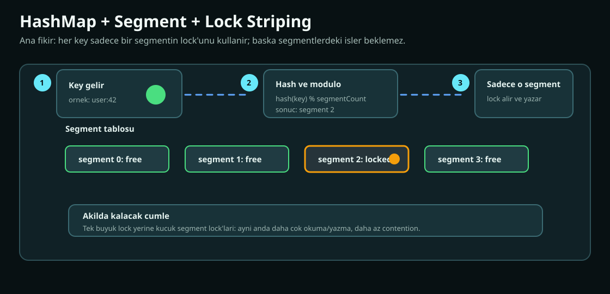

Cache algoritmalarını anlamak için birkaç temel veri yapısını bilmek gerekir.

### 5.1. HashMap

HashMap, key'i hash fonksiyonu ile bir bucket'a yerleştirir.

```text
hash(key) -> bucket index -> entry
```

Avantaj:

- Ortalama O(1) get/put.

Risk:

- Kötü hash dağılımı collision üretir.
- Eşzamanlı erişimde lock veya concurrent yapı gerekir.
- Kapasite kontrolünü tek başına çözmez.

Bu projede `CacheSegment` içinde `LinkedHashMap` kullanılır. Bu map hem key-value saklar hem erişim sırasını tutar.

### 5.2. LinkedHashMap

Java `LinkedHashMap`, HashMap üzerine doubly linked list ekler. Constructor içinde `accessOrder=true` verilirse her `get` edilen entry listenin sonuna taşınır.

Bu LRU için çok kullanışlıdır:

```text
least recently used -> listenin başı
most recently used  -> listenin sonu
```

Bu projede:

```java
new LinkedHashMap<>(16, 0.75f, true)
```

kullanılır. Yani erişim sırası tutulur.

### 5.3. ReentrantLock

Cache map'i güncellerken aynı anda iki thread'in yapıyı bozmasını istemeyiz. Bu projede her segment kendi `ReentrantLock` nesnesine sahiptir.

Basit model:

```text
segment lock al
map'i oku veya yaz
eviction gerekiyorsa uygula
lock bırak
```

Bu global lock'tan daha iyidir çünkü farklı segmentler paralel çalışabilir.

### 5.4. DelayQueue

`DelayQueue`, içinde zamanı gelmemiş elemanları saklar. Elemanın gecikme süresi bittiğinde `poll()` ile alınabilir.

Bu projede TTL temizliği için kullanılır:

```text
key set edildi
expireAt hesaplandı
ExpiringKey DelayQueue'ya eklendi
cleaner periyodik olarak süresi gelenleri poll etti
segmentten removeIfMatches ile sildi
```

### 5.5. AtomicInteger ve AtomicLong

Atomic sınıflar lock almadan thread-safe sayaç güncellemesi sağlar. Örnekler:

- Round robin counter.
- Rate limit zamanı.
- Açık connection sayısı.
- Active request sayısı.

### 5.6. ConcurrentHashMap

Thread-safe map. Bu projede özellikle cluster ve agent tarafında kullanılır:

- `HintedHandoffService` nodeId -> hint queue map'i.
- `UpstreamRegistry` node state map'i.
- Repair dedupe setleri.

## 6. Bu Projede Kullanılan Cache Motoru

`CacheEngine`, cache'in ana beyni gibidir. Ama tek başına büyük bir map kullanmaz. Veriyi segmentlere böler.

### 6.1. Segmentli mimari

Config:

```properties
app.cache.segments=8
app.cache.max-capacity=10000
```

Eğer 8 segment ve 10000 toplam kapasite varsa her segment yaklaşık 1250 entry kapasite alır.

Key'in segmenti:

```text
(key.hashCode() & 0x7FFFFFFF) % segmentCount
```

Neden `& 0x7FFFFFFF`?

Java hashCode negatif olabilir. Segment index negatif olamaz. Bu işlem sign bit'i sıfırlar.

### 6.2. Lock striping

Tek lock:

```text
Thread A key1 yazıyor -> global lock
Thread B key2 okuyor   -> bekler
```

Segment lock:

```text
Thread A segment 1'e yazıyor
Thread B segment 5'ten okuyor
ikisi paralel ilerleyebilir
```

Bu tekniğe lock striping denir.

### 6.3. Set akışı

Basitleştirilmiş akış:

```text
set(key, value, ttl)
  now al
  expireAt hesapla
  segment index bul
  value'u codec ile byte[] yap
  CacheValue oluştur
  segment.put(key, cacheValue)
  TTL varsa DelayQueue'ya ExpiringKey ekle
  keyspace:set event yayınla
```

### 6.4. Get akışı

```text
get(key)
  segment bul
  cacheValue = segment.get(key)
  null ise miss
  expired ise delete + miss
  değilse hit + decode value
```

Burada iki expiration mekanizması birlikte çalışır:

1. Lazy expiration: get sırasında süresi dolmuşsa silinir.
2. Active expiration: background cleaner DelayQueue üzerinden siler.

Bu ikili yaklaşım iyi bir pratiktir. Sadece background cleaner'a güvenilirse expired key bir süre map'te kalabilir. Sadece lazy expiration kullanılırsa hiç okunmayan expired key bellekte kalır.

### 6.5. Delete akışı

```text
delete(key)
  segment bul
  map'ten sil
  varsa keyspace:del event yayınla
```

### 6.6. Force put ve replay

`CacheEngine#replay` persistence veya replication replay gibi durumlar için vardır. `putForce`, normal admission/eviction kararını bypass ederek kapasite doluysa en eski entry'leri silip değeri yerleştirir.

Bu, normal client set davranışından farklıdır. Çünkü replay sırasında amaç geçmişte kabul edilmiş bir operasyonu tekrar uygulamaktır.

## 7. TTL ve Expiration Algoritmaları

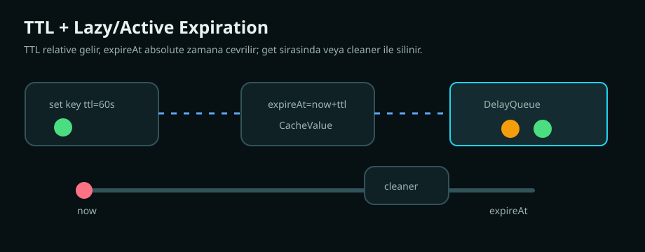

TTL cache sisteminin en önemli kavramlarından biridir.

### 7.1. Relative TTL ve absolute expireAt

Client çoğunlukla şunu söyler:

```text
bu key 60 saniye yaşasın
```

Sistem bunu absolute zamana çevirir:

```text
expireAt = now + ttlMillis
```

Bu projede `CacheValue` içinde `expireAtMillis` tutulur.

```java
public record CacheValue(byte[] value, long expireAtMillis)
```

`expireAtMillis <= 0` ise TTL yok kabul edilir.

### 7.2. Lazy expiration

Okuma sırasında:

```text
if value.expired(now):
  delete(key)
  return miss
```

Avantaj:

- Basit.
- Okunan key hiçbir zaman expired olarak dönmez.

Dezavantaj:

- Hiç okunmayan expired key bellekte kalabilir.

### 7.3. Active expiration

Background cleaner periyodik çalışır:

```text
while DelayQueue.poll() entry döndürüyorsa:
  segment.removeIfMatches(key, expireAt)
```

`removeIfMatches` önemlidir. Çünkü aynı key daha sonra yeni TTL ile tekrar yazılmış olabilir. Eski `ExpiringKey` kuyruğa kalmışsa yanlışlıkla yeni değeri silmemelidir.

Örnek:

```text
t=0   set user:1 ttl=10s -> expireAt=10
t=5   set user:1 ttl=100s -> expireAt=105
t=10  eski ExpiringKey gelir
      removeIfMatches(user:1, 10) başarısız olur
      yeni değer korunur
```

### 7.4. TTL overflow koruması

Çok büyük TTL verilirse `now + ttl` overflow olabilir. Kodda:

```text
expireAt <= 0 ise Long.MAX_VALUE
```

gibi bir koruma vardır. Bu, negatif zamana düşen hatalı expireAt'i engeller.

### 7.5. Sektörde TTL stratejileri

Yaygın TTL stratejileri:

| Strateji | Açıklama |
| --- | --- |
| Sabit TTL | Her key aynı süre yaşar |
| Dinamik TTL | Veri tipine göre TTL değişir |
| Randomized TTL | Aynı anda çok key expire olmasın diye jitter eklenir |
| Sliding TTL | Her erişimde TTL uzatılır |
| Absolute TTL | Belirli bir timestamp'te biter |
| Soft TTL | Eski veri kısa süre dönebilir, arka planda refresh yapılır |
| Hard TTL | Süre bittiğinde veri kesinlikle dönmez |

Bu projede temel model hard TTL + lazy/active expiration birleşimidir.

## 8. CAS ve Optimistic Concurrency

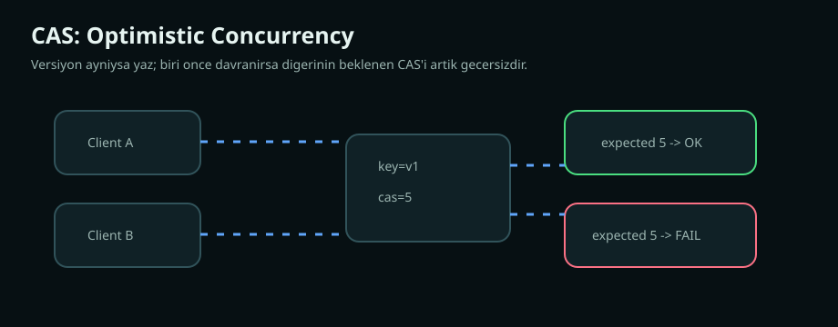

CAS, Compare-And-Swap demektir.

Mantık:

```text
Ben bu değeri CAS=123 iken okudum.
Şimdi sadece hala CAS=123 ise yeni değeri yaz.
Başka biri değiştirdiyse yazma.
```

Bu, distributed lock kullanmadan çakışmaları azaltır.

### 8.1. CAS neden gerekir?

Örnek:

```text
Thread A gets counter -> value=10, cas=5
Thread B gets counter -> value=10, cas=5
Thread A cas counter 11 expected=5 -> success, new cas=6
Thread B cas counter 11 expected=5 -> fail
```

CAS olmasa Thread B, Thread A'nın güncellemesini ezebilirdi.

### 8.2. Bu projede CAS metadata'sı

`StoredValueCodec` şu alanları encode eder:

```text
[cas:8 byte][flags:4 byte][expireAt:8 byte][payload]
```

Sonra Base64 string olarak saklanır.

Neden metadata value içinde?

- Memcached text protokolünde flags ve CAS bilgisi client'a dönmelidir.
- Replication sırasında aynı metadata taşınmalıdır.
- Read-repair TTL ve expire bilgisini koruyabilmelidir.

### 8.3. Optimistic ve pessimistic yaklaşım

Pessimistic locking:

```text
önce lock al
kimse değiştiremesin
sonra yaz
```

Optimistic locking:

```text
değişmeyeceğini varsay
yazarken versiyonu kontrol et
```

Cache gibi yüksek trafikli sistemlerde optimistic yaklaşım çoğu zaman daha hafiftir.

## 9. Eviction Nedir?

Eviction, cache kapasitesi dolduğunda hangi entry'nin çıkarılacağına karar verme problemidir.

İyi eviction algoritması:

- Gelecekte tekrar kullanılma ihtimali düşük entry'yi çıkarır.
- Düşük CPU ve memory overhead ile çalışır.
- Scan workload'larında cache'i kirletmez.
- Hot key'leri korur.
- Uygulaması thread-safe ve basit kalır.

Kötü eviction:

- Hot key'i yanlışlıkla siler.
- Tek seferlik büyük taramalarda cache'i tamamen bozar.
- Çok fazla metadata tutar.
- Lock contention üretir.

## 10. Bu Projede Kullanılan LRU Algoritması

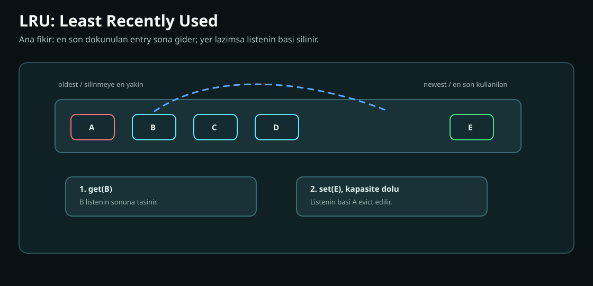

LRU, Least Recently Used demektir. En uzun süredir erişilmeyen entry silinir.

### 10.1. LRU sezgisi

Eğer bir veri yakın zamanda kullanıldıysa tekrar kullanılma ihtimali yüksektir.

Bu varsayıma recency denir.

### 10.2. LRU nasıl çalışır?

Liste gibi düşün:

```text
sol = en eski erişim
sağ = en yeni erişim

[A] [B] [C] [D]
```

`B` okunursa:

```text
[A] [C] [D] [B]
```

Kapasite dolu ve yeni `E` gelirse en soldaki `A` silinir:

```text
[C] [D] [B] [E]
```

### 10.3. Bu projedeki LRU

`CacheSegment` içinde `LinkedHashMap` access order ile kullanılır.

`LruEvictionPolicy` kapasite dolduğunda:

```text
map.entrySet().iterator().next()
```

ile eldest entry'yi bulur.

Bu entry, access-order map'te en az yakın zamanda kullanılan entry'dir.

### 10.4. LRU avantajları

- Basit.
- Anlaması kolay.
- O(1)'e yakın çalışır.
- Web ve API cache'lerinde genelde iyi başlangıçtır.

### 10.5. LRU dezavantajları

LRU scan pollution'a açıktır.

Örnek:

```text
Cache kapasitesi 3
Hot set: A B C sürekli okunuyor
Sonra tek seferlik tarama: X Y Z
```

LRU sonunda A/B/C'yi atabilir:

```text
[X Y Z]
```

Oysa X/Y/Z tekrar kullanılmayacaktır.

### 10.6. LRU ne zaman seçilir?

Seç:

- Workload recency ağırlıklıysa.
- Basitlik önemliyse.
- Metadata overhead düşük kalsın istiyorsan.
- Hit rate aşırı kritik değilse.

Dikkat et:

- Büyük scan workload'u varsa.
- Hot key'ler kısa süre görünmeyince atılmamalıysa.

## 11. Bu Projede Kullanılan TinyLFU Algoritması

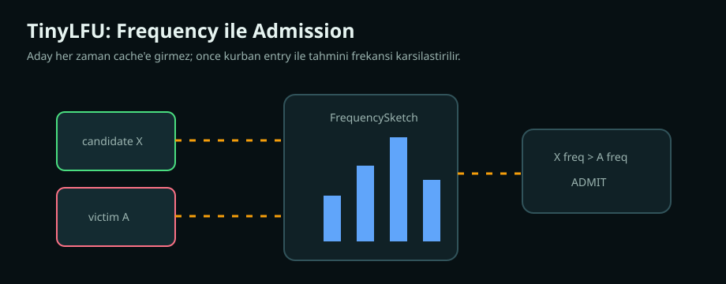

TinyLFU, frequency bilgisiyle admission kararı veren modern bir cache yaklaşımıdır.

Bu projedeki implementation, tam Caffeine W-TinyLFU kopyası değildir. Daha sade bir TinyLFU yaklaşımı uygular:

- Access frekanslarını bir sketch içinde tahmin eder.
- Yeni aday key ile mevcut kurban key'in frekansını karşılaştırır.
- Aday daha sık kullanılmış görünüyorsa kabul eder.
- Aksi halde yeni key'i reddeder.

### 11.1. LFU ne demek?

LFU, Least Frequently Used demektir. En az kullanılan entry silinir.

LRU recency sorar:

```text
En son ne zaman kullanıldı?
```

LFU frequency sorar:

```text
Kaç kere kullanıldı?
```

### 11.2. Neden TinyLFU?

Klasik LFU her key için sayaç tutar. Çok key varsa memory overhead büyür.

TinyLFU, frekansı yaklaşık olarak tutar. Bu yaklaşık tutma, genellikle Count-Min Sketch benzeri yapılara dayanır.

Bu projedeki `FrequencySketch`:

- int array tablo tutar.
- Bir hash için birkaç farklı seed ile index üretir.
- Increment sırasında tüm ilgili sayaçları artırır.
- Estimate sırasında minimum sayacı döndürür.

Neden minimum?

Count-Min Sketch mantığında collision sayacı olduğundan frekans olduğundan yüksek tahmin edilebilir, düşük tahmin edilmez. Minimum almak over-estimation etkisini azaltır.

### 11.3. Bu projedeki sample ring

`TinyLfuEvictionPolicy` içinde `samples` dizisi vardır. Erişimler bu diziye circular şekilde yazılır.

Akış:

```text
recordAccess(key)
  hash = spread(key.hashCode())
  eğer samples doluysa eski hash decrement edilir
  yeni hash sample slot'a yazılır
  sketch increment edilir
```

Bu sliding window etkisi üretir. Çok eski erişimlerin etkisi zamanla azalır.

### 11.4. Admission kararı

Kapasite doluyken yeni key gelirse:

```text
victim = LRU eldest
candidateFreq = sketch.estimate(candidate)
victimFreq = sketch.estimate(victim)

if candidateFreq > victimFreq:
  victim'i çıkar, candidate'ı al
else:
  candidate'ı reddet
```

Bu çok önemli bir farktır:

LRU her yeni entry'yi kabul eder.

TinyLFU her yeni entry'yi kabul etmez. Önce "bu aday mevcut kurbandan daha değerli mi?" diye sorar.

### 11.5. TinyLFU avantajları

- Scan pollution'a karşı LRU'dan daha dayanıklıdır.
- Hot key'leri koruma ihtimali yüksektir.
- Metadata overhead klasik LFU'ya göre küçüktür.
- Frekans tabanlı karar verdiği için tekrar kullanılmayacak veriyi reddedebilir.

### 11.6. TinyLFU dezavantajları

- LRU'dan karmaşıktır.
- Approximate olduğu için bazen yanlış karar verebilir.
- Çok yeni ama gelecekte hot olacak key'i başta reddedebilir.
- Parametreleri workload'a bağlıdır.

### 11.7. TinyLFU ne zaman seçilir?

Seç:

- Workload'da hot key'ler belirginse.
- Scan veya one-hit-wonder çoksa.
- Hit rate önemliyse.

Dikkat et:

- Workload çok küçük ve basitse LRU yeterli olabilir.
- Çok düşük latency hedefinde policy overhead ölçülmelidir.

## 12. Sektörde Kullanılan Diğer Eviction Algoritmaları

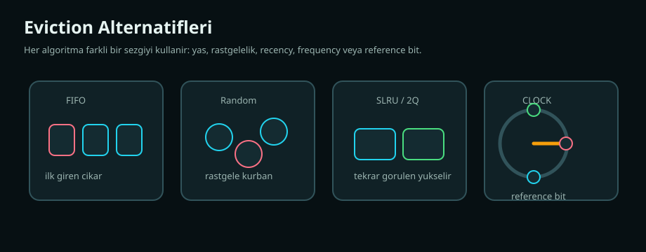

Bu bölümde anlatılanların hepsi bu projede yoktur. Ama bir cache mühendisi bu alternatifleri bilmelidir.

### 12.1. FIFO

First In First Out.

En önce giren entry en önce çıkar.

Avantaj:

- Çok basit.
- Metadata azdır.

Dezavantaj:

- Hot key eskiyse silinebilir.
- Erişim bilgisini kullanmaz.

Genelde production cache için tek başına zayıftır.

### 12.2. Random eviction

Rastgele entry silinir.

Avantaj:

- Çok basit.
- Lock ve metadata maliyeti düşük olabilir.
- Bazı workload'larda şaşırtıcı şekilde kabul edilebilir.

Dezavantaj:

- Hot key silinebilir.
- Tahmin edilebilir değildir.

### 12.3. MRU

Most Recently Used.

En son kullanılan entry silinir.

Garip görünür ama bazı scan workload'larında işe yarayabilir. Örneğin eski veriye geri dönülen cyclic access pattern'larında MRU mantıklı olabilir.

### 12.4. Klasik LFU

Her key için frekans sayacı tutar. En düşük sayaçlı key silinir.

Problem:

- Eski popüler key sonsuza kadar cache'te kalabilir.
- Sayaç aging yapılmazsa geçmiş bugün üzerinde aşırı etkili olur.

Çözüm:

- Periyodik counter decay.
- Windowed LFU.
- TinyLFU gibi approximate yapı.

### 12.5. Segmented LRU, SLRU

Cache iki bölüme ayrılır:

- Probation segment.
- Protected segment.

Yeni gelen entry probation'a girer. Tekrar erişilirse protected'a yükselir.

Avantaj:

- Tek seferlik entry'ler protected hot set'i bozmaz.
- LRU'dan daha iyi hit rate verebilir.

### 12.6. 2Q

2Q, LRU'yu iki veya üç queue ile geliştirir:

- Yeni gelenler kısa queue'ya girer.
- Tekrar görülenler uzun süreli queue'ya geçer.

Amaç:

- One-hit-wonder entry'lerin ana cache'i kirletmesini önlemek.

### 12.7. ARC

Adaptive Replacement Cache.

İki tür bilgiyi dengeler:

- Recency.
- Frequency.

ARC, workload'a göre bu iki tarafın boyutunu adaptif ayarlar. Güçlüdür ama patent ve uygulama karmaşıklığı gibi pratik konular nedeniyle her yerde tercih edilmez.

### 12.8. CLOCK

LRU'ya daha düşük overhead'li alternatif.

Entry'ler circular list üzerinde tutulur. Her entry'nin reference bit'i vardır.

Eviction sırasında saat ibresi döner:

```text
bit=1 ise bit=0 yap ve geç
bit=0 ise victim seç
```

OS page cache dünyasında benzer fikirler çok kullanılır.

### 12.9. CLOCK-Pro

CLOCK algoritmasını hot/cold ayrımıyla geliştirir. LRU benzeri davranışı daha düşük overhead ile hedefler.

### 12.10. W-TinyLFU

Window TinyLFU.

Modern Java cache kütüphanelerinde sık görülen güçlü bir yaklaşımdır. Genellikle şu bileşenleri birleştirir:

- Küçük admission window.
- TinyLFU frequency sketch.
- Segmented main cache.

Window kısmı yeni key'lere şans verir. TinyLFU kısmı ana cache'e kabul kararını iyileştirir.

Bu projedeki TinyLFU daha sade bir modeldir. Window ve segmented main cache ayrımı tam olarak yoktur.

### 12.11. Redis tarzı approximate LRU/LFU

Büyük in-memory sistemler tam LRU tutmak yerine sampling yapabilir:

```text
Rastgele N key seç
Aralarından en kötü görüneni sil
```

Avantaj:

- Büyük keyspace'te metadata ve lock maliyeti düşer.

Dezavantaj:

- Tam doğru LRU/LFU değildir.

### 12.12. Memcached slab LRU

Memcached memory'yi slab class'lara ayırır. Benzer boyuttaki item'lar aynı class içinde tutulur. Eviction çoğu zaman slab class içinde LRU mantığıyla yapılır.

Bu fikir şunu çözer:

- Farklı boyuttaki object'ler memory fragmentation üretmesin.

Bu projede slab allocator yoktur. Değerler JVM heap içinde tutulur.

## 13. Cache Yazma ve Okuma Desenleri

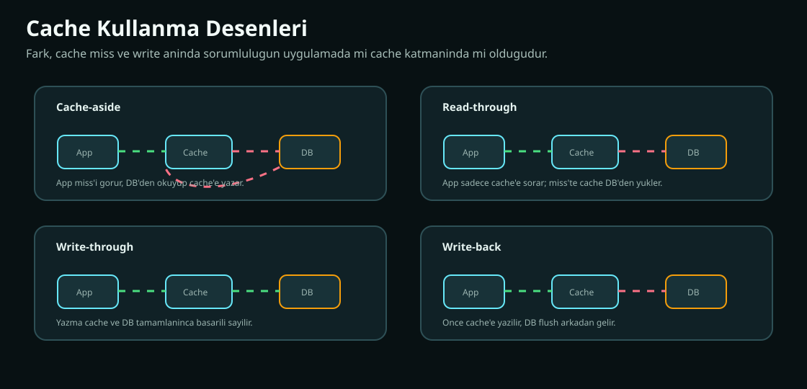

Eviction algoritması kadar cache kullanım deseni de önemlidir.

### 13.1. Cache-aside

En yaygın desen.

```text
value = cache.get(key)
if value == null:
  value = db.get(key)
  cache.set(key, value, ttl)
return value
```

Avantaj:

- Basit.
- Uygulama kontrol eder.

Dezavantaj:

- Cache miss anında DB yükü artar.
- Stampede olabilir.

### 13.2. Read-through

Uygulama cache'e sorar. Cache miss olursa backend'den kendisi yükler.

Avantaj:

- Uygulama kodu sadeleşir.

Dezavantaj:

- Cache sistemi backend bilgisi taşır.

### 13.3. Write-through

Yazma hem cache'e hem kalıcı store'a senkron yazılır.

Avantaj:

- Cache ve store daha tutarlı kalır.

Dezavantaj:

- Write latency artar.

### 13.4. Write-back

Önce cache'e yazılır, sonra arka planda kalıcı store'a flush edilir.

Avantaj:

- Yazma hızlıdır.

Dezavantaj:

- Cache çökünce veri kaybı riski vardır.
- Flush ordering zordur.

### 13.5. Write-around

Yazma cache'i bypass edip doğrudan store'a gider. Cache miss olduğunda yeni veri yüklenir.

Avantaj:

- Bir kez yazılıp okunmayacak veri cache'i kirletmez.

Dezavantaj:

- Yazmadan hemen sonra okuma miss olabilir.

### 13.6. Refresh-ahead

TTL bitmeden önce hot key arka planda yenilenir.

Avantaj:

- Hot key expire olduğunda büyük miss dalgası yaşanmaz.

Dezavantaj:

- Gereksiz refresh yapılabilir.

### 13.7. Negative caching

Sadece bulunan değerleri değil, bulunamayan sonuçları da cache'lemek.

Örnek:

```text
user:999 yok
```

Bu bilgi kısa TTL ile cache'lenirse sürekli DB'ye "var mı?" sorulmaz.

Risk:

- Sonradan oluşturulan veri kısa süre görünmeyebilir.

### 13.8. Request coalescing, singleflight

Aynı anda 100 request aynı missing key'i isterse hepsi DB'ye gitmemeli.

Singleflight:

```text
ilk request backend'e gider
diğerleri aynı sonucu bekler
```

Bu projede genel cache-aside loader yoktur, bu yüzden singleflight uygulama tarafında gerekir.

## 14. Dağıtık Cache Mantığı

Tek node cache basittir. Dağıtık cache'te yeni problemler çıkar.

### 14.1. Sharding

Key'leri node'lara dağıtma işlemidir.

Basit modulo:

```text
nodeIndex = hash(key) % nodeCount
```

Problem:

Node sayısı değişince neredeyse tüm key'lerin yeri değişir.

### 14.2. Replication

Her key birden fazla node'da tutulur.

Amaç:

- Node kaybında veri kaybını azaltmak.
- Okuma availability'sini artırmak.
- Bakım sırasında servis devamlılığı sağlamak.

Bu projede `app.cluster.replication-factor` ile belirlenir.

### 14.3. Membership

Cluster hangi node'ların canlı olduğunu bilmelidir.

Bu projede:

- Multicast heartbeat.
- Join handshake.
- Failure timeout.
- Ring'e node ekleme/çıkarma.

### 14.4. Bootstrap

Yeni node boş başlar. Cluster'a girince veri alması gerekir.

Bu projede yeni node stream alır ama her key'i kabul etmez. Key'in güncel ring'deki replica seti hesaplanır. Local node o setin parçasıysa değer yazılır, değilse atlanır.

Bu çok kritik bir detaydır. Aksi halde yeni node kendisine ait olmayan verileri de taşır.

## 15. Consistent Hashing ve Alternatifleri

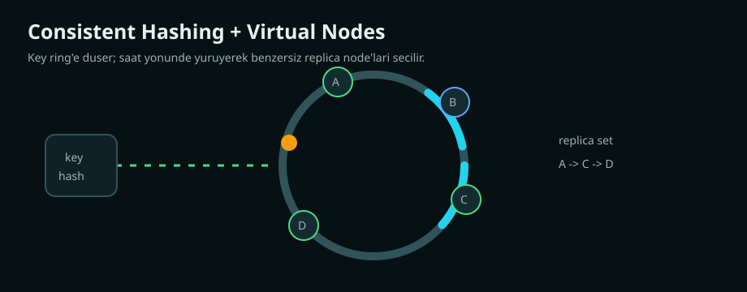

### 15.1. Consistent hashing nedir?

Node ve key aynı hash uzayına yerleştirilir. Key'in sahibi, ring üzerinde saat yönünde karşılaşılan ilk node olur.

Replica seçmek için yürümeye devam edilir.

Bu projede:

```text
ring.tailMap(keyHash)
benzersiz node'ları topla
yetmezse ring başına sar
```

### 15.2. Virtual node

Tek node ring'e tek nokta olarak konursa dağılım dengesiz olabilir. Virtual node ile her fiziksel node ring'e birçok nokta olarak yerleşir.

Örnek:

```text
node-a#0
node-a#1
node-a#2
...
```

Avantaj:

- Daha dengeli dağılım.
- Node ekleme/çıkarma etkisi daha pürüzsüz.

### 15.3. Rendezvous hashing

Alternatif algoritma.

Her key için tüm node'larla skor hesaplanır:

```text
score = hash(key, node)
en yüksek score sahibi olur
```

Avantaj:

- Basit.
- Ring veri yapısı gerekmez.
- Node değişiminde az hareket.

Dezavantaj:

- Her key için tüm node'lar skorlanırsa node sayısı büyükken maliyet artar.

### 15.4. Jump consistent hash

Google tarafından popülerleştirilen, bucket sayısı ile çalışan hızlı bir algoritma olarak bilinir.

Avantaj:

- Çok hızlı.
- Az memory.

Dezavantaj:

- Weighted node ve replica seçimi ring kadar doğrudan değildir.

### 15.5. Ketama hashing

Memcached client dünyasında consistent hashing için bilinen yaklaşımlardan biridir. Node'ları birçok sanal nokta ile ring'e koyar.

Bu projedeki virtual node fikri bu aileye yakındır.

### 15.6. Basit modulo hashing neden riskli?

3 node varken:

```text
hash(key) % 3
```

4 node'a çıkınca:

```text
hash(key) % 4
```

Key'lerin çoğunun yeri değişir. Bu, büyük cache miss fırtınası üretir.

Consistent hashing bu hareketi azaltır.

## 16. Replication, Quorum ve Tutarlılık

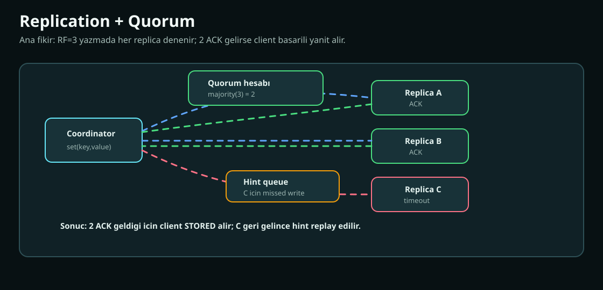

### 16.1. Quorum nedir?

Quorum, bir operasyonu başarılı kabul etmek için gereken minimum onay sayısıdır.

Bu projede majority:

```text
quorum = (replicaCount / 2) + 1
```

RF=3 ise quorum=2.

### 16.2. Yazma quorum'u

`ClusterClient#set`:

```text
replicas = ring.getReplicas(key)
for each replica:
  set(key,value,ttl)
başarı sayısı >= quorum ise true
```

Başarısız replica için hint yazılır.

### 16.3. Read path

Read-repair kapalıysa:

```text
replica'ları sırayla dene
ilk non-null value dön
```

Read-repair açıksa:

- FAST mode ilk değeri hızlı döner, onarımı arkaya atar.
- QUORUM mode değerleri sayar, çoğunluk değerini seçer.

### 16.4. Strict ve degraded quorum

QUORUM read-repair için iki policy vardır:

```text
STRICT:
  quorum tam replica set boyutuna göre hesaplanır

DEGRADED:
  quorum sadece ulaşılabilen replica sayısına göre hesaplanır
```

Örnek:

```text
RF=3
A unreachable
B value=v1
C unreachable
```

Strict:

```text
majority(3)=2
v1 count=1
sonuç yok
```

Degraded:

```text
reachable=1
majority(1)=1
v1 dönebilir
```

Trade-off:

- Strict daha tutarlı ama daha az available.
- Degraded daha available ama daha zayıf tutarlılık verir.

### 16.5. CAP'i pratik anlamak

CAP theorem çoğu zaman yanlış ezberlenir. Pratikte soru şudur:

```text
Network partition olduğunda sistem yazmayı/okumayı kabul edecek mi?
Yoksa tutarlılık için reddedecek mi?
```

Cache sistemlerinde çoğu zaman availability ve düşük latency önceliklidir. Ama bu veri tipine bağlıdır.

## 17. Read-Repair, Anti-Entropy ve Hinted Handoff

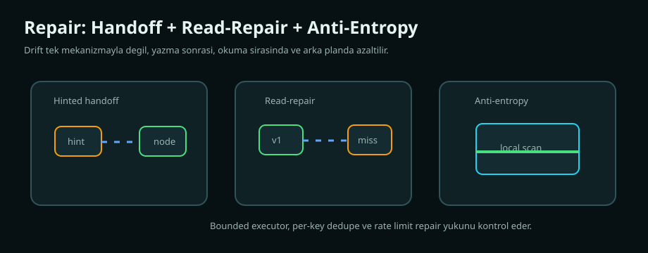

Dağıtık sistemde replica'lar zamanla drift yaşayabilir.

Drift nedenleri:

- Node write sırasında unreachable idi.
- Network timeout oldu.
- Bootstrap yarım kaldı.
- TTL farklı hesaplandı.
- Eski value kaldı.

Bu projede üç onarım mekanizması vardır.

### 17.1. Hinted handoff

Yazma sırasında replica unreachable ise koordinatör hint saklar.

```text
recordSet(nodeId, key, value, ttl)
```

Node geri görülünce:

```text
replay(nodeId, remoteNode)
```

Bu eventual consistency sağlar.

### 17.2. Read-repair

Okuma sırasında fark edilen eksik replica onarılır.

FAST:

```text
ilk value döner
diğer replica'lar arka planda kontrol edilir
eksikse set edilir
```

QUORUM:

```text
reachable replica değerleri sayılır
çoğunluk value bulunur
missing replica onarılır
conflict varsa overwrite yapılmaz
```

Yeni korumalar:

- Bounded executor.
- Per-key dedupe.
- Rate limit.
- Rejected task loglama.

### 17.3. Anti-entropy

Okuma olmasa da arka planda local snapshot taranır.

```text
for each local entry:
  replica seti hesapla
  local node bu replica setinde değilse skip
  remote missing veya expired ise repair
  remote farklıysa conflict metriği
```

Yeni korumalar:

- `antiEntropyMaxRepairsPerRun`
- `antiEntropyRepairRatePerSecond`
- Single-flight anti-entropy run
- Coordination executor queue limit

### 17.4. Merkle tree alternatifi

Sektörde anti-entropy için Merkle tree kullanılır.

Fikir:

```text
keyspace parçalara ayrılır
her parçanın hash'i hesaplanır
hash aynıysa altına bakmaya gerek yok
hash farklıysa daha küçük parçalara inilerek fark bulunur
```

Avantaj:

- Tüm veriyi göndermeden fark bulunabilir.

Dezavantaj:

- Uygulaması daha karmaşıktır.
- Tree maintenance maliyeti vardır.

Bu projede şu an daha basit snapshot tarama ve repair modeli vardır.

## 18. Agent, Load Balancing ve Proxy Mantığı

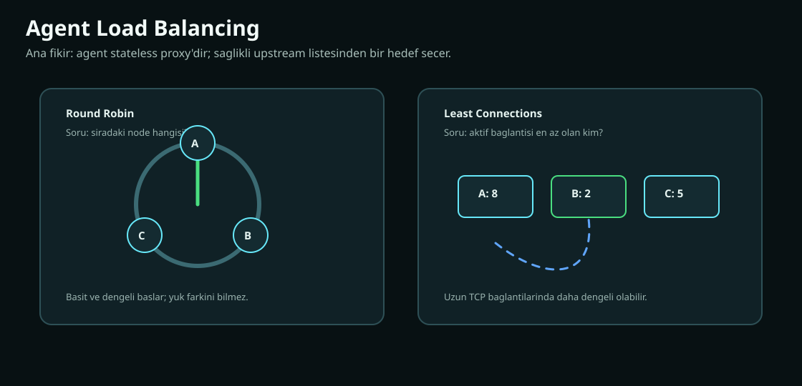

`can-cache-agent`, cache node ile client arasında proxy görevi görür.

### 18.1. Neden agent?

Client'a tüm node listesini vermek zor olabilir. Agent şu işleri yapar:

- Sağlıklı upstream seçer.
- Down node'a trafik göndermez.
- Round robin veya least connections uygular.
- Client için tek endpoint sağlar.

### 18.2. Round robin

Sırayla node seçer.

```text
request 1 -> node A
request 2 -> node B
request 3 -> node C
request 4 -> node A
```

Avantaj:

- Basit.
- Dengeli başlar.

Dezavantaj:

- Node'ların gerçek yükünü bilmez.
- Uzun bağlantılarda dengesiz olabilir.

### 18.3. Least connections

Aktif bağlantı sayısı en düşük node seçilir.

Avantaj:

- Uzun süreli TCP bağlantılarında daha iyi dağıtım.

Dezavantaj:

- Connection sayısı her zaman CPU veya memory yükünü temsil etmez.

### 18.4. Diğer load balancing alternatifleri

| Algoritma | Mantık |
| --- | --- |
| Random | Rastgele sağlıklı node seç |
| Power of Two Choices | Rastgele iki node seç, daha az yüklüyü kullan |
| Weighted Round Robin | Güçlü node'a daha çok trafik ver |
| Consistent Hash LB | Aynı key veya client aynı node'a gitsin |
| EWMA Latency | Daha düşük gecikmeli node'u seç |
| Adaptive LB | Latency, error rate ve queue bilgisiyle seçim yap |

Cache dünyasında key-aware routing önemlidir. Agent şu an byte proxy olduğu için Memcached komutunu parse edip key'e göre consistent route yapmaz. Bu tasarım agent'ı basit ve hızlı tutar.

## 19. Network, Protocol ve Backpressure


Cache performansında network yolu çok önemlidir.

### 19.1. Memcached text protocol

Client tarafında text protocol kullanılır. Örnek:

```text
set user:1 0 60 5\r\n
hello\r\n
```

Avantaj:

- İnsan tarafından okunabilir.
- Memcached client ekosistemine yakındır.

Dezavantaj:

- Parse maliyeti binary protokole göre daha yüksektir.

### 19.2. Node'lar arası binary protocol

Node replication tarafında özel binary protocol kullanılır.

Örnek SET frame:

```text
[CMD_SET][keyLen][valueLen][expireAt][keyBytes][valueBytes]
```

Avantaj:

- Daha az parse maliyeti.
- Uzunluklar net olduğu için parçalı TCP paketleri state-machine ile okunabilir.

### 19.3. Connection pool

Her request için yeni TCP connection açmak pahalıdır.

Pool mantığı:

```text
acquire socket
request gönder
response al
release socket
```

Bu projede `RemoteNode` ve `SocketConnectionPool` bu rolü üstlenir.

### 19.4. Backpressure

Backpressure, sistemin kaldırabileceğinden fazla işi içeri almamasıdır.

Kötü örnek:

```text
her request için yeni thread
sınırsız queue
sınırsız socket
```

Sonuç:

- Memory artar.
- GC baskısı artar.
- Latency patlar.
- Sistem çökmeden önce çok yavaşlar.

İyi örnek:

```text
bounded executor
bounded queue
socket pool
timeout
rate limit
rejection
```

Son değişiklikler bu yöndedir.

### 19.5. Timeout

Timeout yoksa uzak node cevapsız kaldığında request sonsuza kadar bekleyebilir.

Timeout sadece hata yönetimi değildir. Aynı zamanda kapasite yönetimidir.

## 20. Metrics, Gözlemlenebilirlik ve Performans

Cache sistemi metrics olmadan yönetilemez.

### 20.1. Temel cache metrikleri

| Metrik | Anlam |
| --- | --- |
| hit count | Cache'ten dönen başarılı okuma |
| miss count | Cache'te bulunamayan okuma |
| hit rate | hit / (hit + miss) |
| eviction count | Kapasite veya TTL nedeniyle silinen entry |
| get latency | Okuma gecikmesi |
| set latency | Yazma gecikmesi |
| size | Toplam entry sayısı |

### 20.2. Cluster metrikleri

| Metrik | Anlam |
| --- | --- |
| read repair attempts | Onarım denemesi |
| read repair repairs | Gerçek onarım sayısı |
| read repair conflicts | Farklı değer conflict sayısı |
| anti-entropy runs | Arka plan tarama sayısı |
| anti-entropy repairs | Anti-entropy onarım sayısı |
| hinted handoff enqueued | Kuyruğa alınan missed write |
| hinted handoff replay failures | Replay başarısızlığı |

### 20.3. Hit rate nasıl yorumlanır?

Yüksek hit rate her zaman iyi demek değildir.

Örnek:

- Çok eski veri dönüyorsan hit rate yüksek ama doğruluk kötü olabilir.
- Gereksiz büyük TTL hit rate'i artırır ama stale riskini büyütür.
- Çok küçük cache'te hit rate düşük olabilir, ama latency yine kabul edilebilir olabilir.

Hit rate'i şu metriklerle birlikte oku:

- p95/p99 latency.
- Backend load.
- Eviction rate.
- Memory usage.
- Error rate.
- Stale data toleransı.

### 20.4. Performans testi yaparken

Dikkat edilmesi gerekenler:

- Warm-up süresi.
- Key dağılımı.
- Value boyutu.
- Read/write oranı.
- TTL dağılımı.
- Hot key oranı.
- Cluster node sayısı.
- Replication factor.
- Network latency.

Sadece "ops/sec" yeterli değildir. Latency dağılımı ve tail latency daha önemlidir.

## 21. Teknoloji Seçimi

Bu proje birkaç önemli teknoloji kullanır.

### 21.1. Java

Java burada şu yüzden uygundur:

- Güçlü concurrency primitive'leri.
- JVM observability.
- Vert.x ve Quarkus ekosistemi.
- Virtual thread desteği.
- GC tuning imkanları.

Risk:

- Heap içinde büyük cache tutmak GC baskısı oluşturabilir.
- Object overhead, C/C++ tabanlı cache sistemlerine göre daha yüksek olabilir.

### 21.2. Quarkus

Quarkus, CDI, config mapping, build ve runtime entegrasyonu sağlar.

Bu projede:

- `@ConfigMapping`
- `@Singleton`
- `@Produces`
- Quarkus test altyapısı
- Micrometer entegrasyonu

gibi özellikler vardır.

### 21.3. Vert.x

Vert.x network tarafında kullanılır:

- TCP server.
- TCP client.
- Event loop.
- Worker executor.
- Timer.

Event loop bloklanmamalıdır. CPU veya blocking iş worker/virtual thread tarafına verilmelidir.

### 21.4. Micrometer

Metrics toplama için kullanılır. Prometheus endpoint ile operasyonel görünürlük sağlar.

### 21.5. Maven

Multi-module build yapısı vardır:

```text
parent pom
  can-cache-application
  can-cache-agent
  can-cache-integration-tests
  can-cache-performance-tests
```

## 22. Tuning Rehberi

### 22.1. Segment sayısı

Az segment:

- Daha az memory overhead.
- Daha fazla lock contention.

Çok segment:

- Daha iyi paralellik.
- Kapasite segmentlere bölündüğü için bazı segmentler daha erken dolar.

Başlangıç:

```properties
app.cache.segments=8
```

CPU ve workload'a göre test edilmelidir.

### 22.2. Max capacity

Capacity küçükse:

- Eviction artar.
- Hit rate düşer.

Capacity büyükse:

- Memory ve GC baskısı artar.
- Daha çok stale data tutulabilir.

### 22.3. Eviction policy seçimi

LRU seç:

- Basit workload.
- Recency önemli.
- Scan az.

TINY_LFU seç:

- Hot key belirgin.
- Scan çok.
- Hit rate kritik.

### 22.4. TTL seçimi

Kısa TTL:

- Daha taze veri.
- Daha çok miss.
- Daha çok backend yükü.

Uzun TTL:

- Daha yüksek hit rate.
- Daha fazla stale risk.
- Daha fazla memory kullanımı.

Jitter eklemek sektörde iyi pratiktir:

```text
ttl = baseTtl + random(-10%, +10%)
```

Bu projede otomatik jitter yoktur. Uygulama tarafı verebilir.

### 22.5. Replication factor

RF=1:

- Daha hızlı.
- Daha az network.
- Node kaybında veri kaybı veya miss yüksek.

RF=3:

- Daha dayanıklı.
- Quorum mümkün.
- Daha fazla network ve write maliyeti.

### 22.6. Read-repair ayarları

Önemli config'ler:

```properties
app.cluster.read-repair.enabled=true
app.cluster.read-repair.mode=FAST
app.cluster.read-repair.quorum-policy=DEGRADED
app.cluster.read-repair.max-threads=4
app.cluster.read-repair.queue-capacity=1024
app.cluster.read-repair.rate-limit-per-second=500
```

Latency önemliyse FAST iyi başlangıçtır.

Tutarlılık daha önemliyse QUORUM + STRICT değerlendirilebilir.

### 22.7. Anti-entropy ayarları

```properties
app.cluster.coordination.anti-entropy-interval-millis=30000
app.cluster.coordination.anti-entropy-max-repairs-per-run=1000
app.cluster.coordination.anti-entropy-repair-rate-per-second=100
```

Kısa interval:

- Drift daha hızlı kapanır.
- Background load artar.

Uzun interval:

- Daha az load.
- Drift daha uzun yaşar.

### 22.8. Pool ve timeout

Remote node tarafında:

- Pool küçükse request bekler.
- Pool büyükse socket ve memory artar.
- Timeout kısa ise yanlış failure artabilir.
- Timeout uzun ise kaynaklar daha uzun tutulur.

## 23. Junior Mühendisin Okuma Rotası

Bu projeyi öğrenmek için şu sırayı izle:

### Gün 1: Local cache

1. `CacheValue`
2. `ExpiringKey`
3. `CacheSegment`
4. `LruEvictionPolicy`
5. `CacheEngine#set/get/delete`

Kendine sor:

- Key hangi segmente gidiyor?
- TTL nasıl hesaplanıyor?
- Expired key ne zaman siliniyor?
- LRU victim nasıl seçiliyor?

### Gün 2: Metadata ve CAS

1. `StoredValueCodec`
2. `CanCachedProtocol`
3. `CacheEngine#compareAndSwap`
4. `CanCachedServer` içindeki storage command akışı

Kendine sor:

- CAS nerede saklanıyor?
- ExpireAt value içinde neden tekrar var?
- Legacy raw value nasıl decode ediliyor?

### Gün 3: Eviction

1. `EvictionPolicy`
2. `EvictionPolicyType`
3. `LruEvictionPolicy`
4. `TinyLfuEvictionPolicy`

Kendine sor:

- Admission ve eviction farkı ne?
- TinyLFU neden bazı yeni key'leri reddediyor?
- FrequencySketch neden approximate?

### Gün 4: Cluster routing

1. `Node`
2. `ConsistentHashRing`
3. `ClusterClient#set`
4. `ClusterClient#get`

Kendine sor:

- Replica set nasıl seçiliyor?
- Quorum nasıl hesaplanıyor?
- Leader failure nasıl ele alınıyor?

### Gün 5: Repair mekanizmaları

1. `HintedHandoffService`
2. `ReadRepairMode`
3. `QuorumPolicy`
4. `AntiEntropyRepairer`

Kendine sor:

- Hinted handoff ne zaman devreye giriyor?
- Read-repair conflict görünce neden overwrite etmiyor?
- Anti-entropy neden local node replica setinde değilse key'i atlıyor?

### Gün 6: Coordination ve protocol

1. `CoordinationService`
2. `ReplicationServer`
3. `RemoteNode`
4. `SocketConnectionPool`

Kendine sor:

- Heartbeat packet hangi bilgileri taşıyor?
- Join handshake neyi doğruluyor?
- Bootstrap stream neden replica filtresi yapıyor?
- Remote request path nerede backpressure uyguluyor?

### Gün 7: Agent

1. `UpstreamRegistry`
2. `HealthService`
3. `RoundRobinPolicy`
4. `LeastConnPolicy`
5. `TcpProxyServer`

Kendine sor:

- Agent neden stateless?
- Least connections ne zaman round robin'den daha iyi?
- Agent key-aware routing yapıyor mu?

## 24. Terimler Sözlüğü

### Admission

Yeni gelen entry'nin cache'e kabul edilip edilmeyeceği kararı.

### Anti-entropy

Replica'lar arasındaki farkları arka planda bulup azaltma süreci.

### Backpressure

Sistemin kapasitesinden fazla işi içeri almaması için uygulanan sınırlar.

### CAS

Compare-And-Swap. Beklenen versiyon uyuyorsa yazma başarılı olur.

### Cache-aside

Uygulamanın cache miss olduğunda backend'den okuyup cache'e yazdığı desen.

### Consistent hashing

Node sayısı değiştiğinde key hareketini azaltan dağıtım algoritması.

### Eviction

Kapasite dolduğunda bir entry'nin cache'ten çıkarılması.

### Expiration

TTL süresi dolduğu için entry'nin geçersiz hale gelmesi.

### Hit

Cache'te istenen key'in bulunması.

### Miss

Cache'te istenen key'in bulunmaması.

### Hinted handoff

Ulaşılamayan replica için yazmayı kuyruklayıp node geri gelince tekrar oynatma.

### LRU

Least Recently Used. En uzun süredir kullanılmayan entry çıkarılır.

### LFU

Least Frequently Used. En az kullanılan entry çıkarılır.

### Quorum

Operasyonu başarılı kabul etmek için gereken minimum onay sayısı.

### Read-repair

Okuma sırasında fark edilen replica eksikliğini onarma.

### Replica

Aynı key'in başka node üzerinde tutulan kopyası.

### Ring

Consistent hashing'de node ve key'lerin yerleştirildiği mantıksal hash halkası.

### Segment

Cache map'inin lock contention azaltmak için bölündüğü parça.

### Stampede

Bir key expire olduğunda çok sayıda request'in aynı anda backend'e yüklenmesi.

### TinyLFU

Approximate frekans bilgisiyle admission kararı veren cache algoritması ailesi.

### TTL

Time To Live. Bir entry'nin ne kadar süre geçerli kalacağı.

### Virtual node

Fiziksel node'un consistent hash ring üzerinde birden fazla nokta ile temsil edilmesi.

## 25. Son Söz

Cache sistemi yazmak bir Map sarmalamak değildir. İyi bir cache sistemi şu dengeleri aynı anda kurar:

- Hız ve doğruluk.
- Basitlik ve hit rate.
- Memory ve latency.
- Availability ve consistency.
- Background repair ve foreground traffic.
- Sınırsız istek alma isteği ve kontrollü backpressure.

Bu projede kullanılan ana fikirler modern cache sistemlerinin küçük ama öğretici bir kesitini oluşturur:

- Segmentli in-memory store.
- TTL ve active/lazy expiration.
- LRU ve TinyLFU eviction.
- CAS metadata.
- Memcached uyumlu text protocol.
- Node'lar arası binary replication protocol.
- Consistent hashing ve virtual node.
- Quorum write.
- Hinted handoff.
- Read-repair.
- Anti-entropy.
- Bounded executor, rate limit ve connection pool backpressure.
- Agent tabanlı proxy ve upstream health modeli.

Bir junior mühendis için en iyi öğrenme yolu şudur: önce tek node cache'i tamamen anla, sonra eviction kararını simüle et, sonra distributed routing'e geç, en son repair ve backpressure konularına bak. Bu sırayla gidince sistem karmaşık bir yığın olmaktan çıkar ve birbirine bağlı küçük kararlar bütünü haline gelir.
