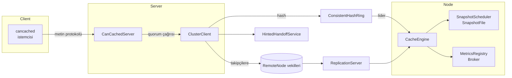
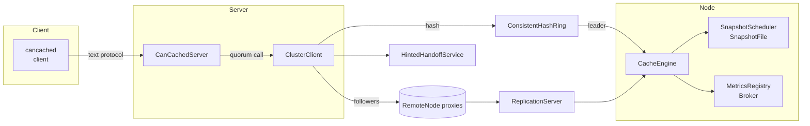
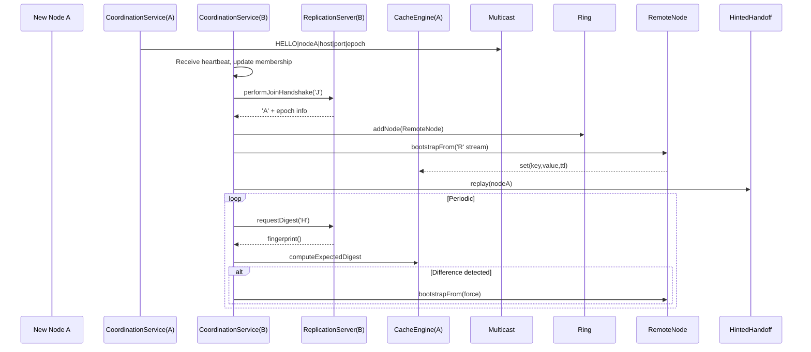

# Help

  <a href="#help-tr">Türkçe</a> · <a href="#help-en">English</a>

## Mimari Dokümanı

### 1. Başlangıç Seviyesi: Can-Cache'e Giriş
Can-Cache, Memcached metin protokolüyle uyumlu çalışan, yatay olarak ölçeklenebilir ve hatalara dayanıklı bir dağıtık önbellek uygulamasıdır. Amaç; mevcut Memcached istemcilerini değiştirmeden modern Java (Quarkus) ekosisteminde çalışabilen, hem bellek içi performansı hem de kalıcılığı bir arada sunan bir altyapı sağlamaktır. Sistem; tek düğümlü senaryolardan, onlarca replikanın bulunduğu kümelere kadar aynı mimari ilkelerle çalışacak şekilde tasarlanmıştır.

### 2. Başlangıç Seviyesi: Temel Bileşenler ve Veri Yolu
Bu bölüm, bileşenler arasındaki ilişkiyi kavramak için yüksek seviyede bir resim sunar.
İstemciler TCP üzerinden `CanCachedServer` ile konuşur.
Sunucu, Quarkus'un yerleşik Vert.x `NetServer` bileşeniyle Netty tabanlı event loop'lar üzerinde çalışır; böylece kabul edilen bağlantılar bloklamayan soketler ve paylaşımlı event loop thread'leri aracılığıyla sürdürülür.
Komutlar ayrıştırıldıktan sonra `ClusterClient` ile kümeye iletilir.
Okuma/yazma işlemleri hedef düğümlerin `CacheEngine` örneklerine ulaşır, TTL ve tahliye politikaları burada yürütülür.
Opsiyonel snapshot ve metrik bileşenleri sistemi kalıcı ve gözlemlenebilir kılar.

### Vert.x'e Genel Bakış ve Projedeki Yeri

#### Vert.x nedir?
- Vert.x, JVM üzerinde çalışan, Netty tabanlı, olay güdümlü ve reaktif bir uygulama çatısıdır. Tüm ağ işlemleri tekil "event loop" iş parçacıkları üzerinde koordine edilir ve non-blocking API'ler sayesinde yüksek bağlantı sayıları için ölçeklenebilirlik sağlar.
- Araç takımı; TCP/HTTP sunucuları ve istemcileri, zamanlayıcılar, paylaşımlı worker havuzları, asenkron akış yardımcıları gibi bileşenleri bir arada sunar. Farklı diller için bağlayıcılar olsa da Quarkus ile birlikte doğrudan Java API'leri kullanılmaktadır.
- Event loop modeli bloklama kodu tolere etmediğinden, Vert.x `executeBlocking` veya paylaşımlı worker havuzları üzerinden bloklayıcı işleri izole ederek tutarlı performans sağlar.

#### Quarkus entegrasyonu ve yapılandırma
- Quarkus, iç yapısında Vert.x kullanır; proje içinde `AppConfig.vertx()` ile uygulamaya özel bir `Vertx` örneği üretip event loop / worker havuzu boyutlarını konfigürasyon dosyalarından okuyarak özelleştiriyoruz. Linux üzerinde mevcutsa Epoll/IOUring gibi yerel Netty taşıyıcıları tercih edilecek şekilde `VertxOptions` ayarlanır.【F:src/main/java/com/can/config/AppConfig.java†L43-L85】
- Aynı yapılandırma sınıfı `vertx.createSharedWorkerExecutor("can-cache-worker", ...)` çağrısıyla tüm bileşenlerin paylaşabildiği bir `WorkerExecutor` üretir. Bu havuz, event loop'u bloklamaması gereken ağır işler için ortak kullanım sağlar.【F:src/main/java/com/can/config/AppConfig.java†L101-L113】
- Vert.x'in yanında, uzun soluklu koordinasyon ve istemci görevlerini sanal thread tabanlı yürütücülere taşıyoruz; `CoordinationService`, `RemoteNode` ve `Broker` gibi bileşenler `Thread.ofVirtual()` ile oluşturulan `newThreadPerTaskExecutor` kullanarak Vert.x worker havuzunu yormadan yüksek eşzamanlılık sağlıyor.【F:src/main/java/com/can/cluster/coordination/CoordinationService.java†L90-L215】【F:src/main/java/com/can/cluster/coordination/RemoteNode.java†L71-L196】【F:src/main/java/com/can/pubsub/Broker.java†L25-L76】

#### Projedeki başlıca Vert.x kullanımları
- **Memcached uyumlu TCP katmanı:** `CanCachedServer`, `vertx.createNetServer` ile gelen bağlantıları kabul eder, istekleri `Buffer` üzerinde ayrıştırır ve bloklayıcı küme çağrılarını `vertx.executeBlocking` üzerinden worker havuzuna taşıyarak event loop'un serbest kalmasını sağlar.【F:src/main/java/com/can/net/CanCachedServer.java†L39-L195】【F:src/main/java/com/can/net/CanCachedServer.java†L828-L915】
- **Replikasyon sunucusu:** `ReplicationServer`, Vert.x `NetServer` kullanarak diğer düğümlerden gelen binary komutları okur; her bağlantı için komut sıralarını korur ve `WorkerExecutor.executeBlocking` ile önbellek işlemlerini gerçekleştirir.【F:src/main/java/com/can/cluster/coordination/ReplicationServer.java†L1-L208】
- **Uzak düğüm istemcisi:** `RemoteNode`, Vert.x `NetClient` ile TCP bağlantılarını havuzlar, asenkron olarak komut gönderip yanıtları `Promise`/`Future` zincirleriyle bekler; `Node` arayüzünün bloklayıcı sözleşmesini korumak için her isteği `Thread.ofVirtual()` temelli yürütücüye sararak sonuçları beklerken sanal thread'lerden yararlanır.【F:src/main/java/com/can/cluster/coordination/RemoteNode.java†L71-L196】
- **Zamanlayıcılar ve periyodik görevler:** `CacheEngine.startCleaner()` içinde `vertx.setPeriodic` + `executeBlocking` kullanılarak TTL kuyruğu düzenli aralıklarla temizlenir; koordinasyon servisi heartbeat, reap ve anti-entropy döngülerini Vert.x zamanlayıcılarıyla planlar fakat iş mantığını kendi sanal thread yürütücüsüne devreder; metrik raporlayıcı ve snapshot zamanlayıcısı da `setPeriodic` çağrılarından dönen tetikleyicileri `WorkerExecutor.executeBlocking` ile kalıcı işlemlere dönüştürür.【F:src/main/java/com/can/core/CacheEngine.java†L101-L118】【F:src/main/java/com/can/cluster/coordination/CoordinationService.java†L107-L128】【F:src/main/java/com/can/cluster/coordination/CoordinationService.java†L214-L522】【F:src/main/java/com/can/metric/MetricsReporter.java†L24-L96】【F:src/main/java/com/can/rdb/SnapshotScheduler.java†L31-L110】
- **Arka plan iş yüklerinin izolesi:** Komut yürütmeleri ile snapshot/metric görevleri Vert.x `WorkerExecutor` üzerinden koşturulurken (`CanCachedServer`, `ReplicationServer`, `SnapshotScheduler`, `MetricsReporter`), koordinasyon, ipucu tekrarları ve yayın mekanizması `Thread.ofVirtual()` tabanlı yürütücülerle ayrıştırılır; böylece ağır IO veya yönetim işleri Vert.x worker havuzunu bloke etmeden ilerler.【F:src/main/java/com/can/net/CanCachedServer.java†L828-L915】【F:src/main/java/com/can/cluster/coordination/ReplicationServer.java†L169-L208】【F:src/main/java/com/can/rdb/SnapshotScheduler.java†L70-L110】【F:src/main/java/com/can/metric/MetricsReporter.java†L53-L96】【F:src/main/java/com/can/cluster/coordination/CoordinationService.java†L103-L215】【F:src/main/java/com/can/cluster/coordination/CoordinationService.java†L214-L522】【F:src/main/java/com/can/pubsub/Broker.java†L25-L76】

#### Eşzamanlılık modeli ve geri basınç
- Her `NetSocket` bağlantısı tek bir event loop thread'i üzerinde çalışır; bağlantı başına oluşturulan `ConnectionContext` veya `ReplicationConnection` nesneleri `processing` bayraklarıyla komut yürütme sırasında gelen yeni veriyi tamponlayıp işlemenin bitmesini bekler. Bu sayede pipelined komutlarda bile sıralı yürütme ve düşük bellek kullanımı korunur.【F:src/main/java/com/can/net/CanCachedServer.java†L768-L915】【F:src/main/java/com/can/cluster/coordination/ReplicationServer.java†L124-L220】
- TTL kuyruğu temizleme ile snapshot/metric görevleri Vert.x worker havuzu üzerinde `executeBlocking` aracılığıyla yürütülür; koordinasyon servisi ve yayın sistemi ise `Thread.ofVirtual()` tabanlı havuzlar üzerinden hint replay ve anti-entropy gibi yönetim işlerini gerçekleştirerek event loop ile worker havuzu arasındaki yük paylaşımını dengeler.【F:src/main/java/com/can/core/CacheEngine.java†L101-L158】【F:src/main/java/com/can/rdb/SnapshotScheduler.java†L70-L110】【F:src/main/java/com/can/metric/MetricsReporter.java†L53-L96】【F:src/main/java/com/can/cluster/coordination/CoordinationService.java†L103-L215】【F:src/main/java/com/can/cluster/coordination/CoordinationService.java†L214-L522】【F:src/main/java/com/can/pubsub/Broker.java†L25-L76】

### 3. Orta Seviye: Bileşenlerin Derinlemesine İncelemesi

#### 3.1 Komut & Protokol Katmanı
- **Temel Rolü:** `CanCachedServer`, Quarkus uygulaması başladıktan sonra Vert.x `NetServer` ile belirtilen portu dinler; gelen her TCP bağlantısının soketi `ConnectionContext` adlı hafif bir durum nesnesine bağlanır. Komutlar satır bazında ayrıştırılır ve Memcached protokolündeki yanıt formatları birebir korunur, böylece istemciler ek adaptasyon gerektirmez.
- **İş Parçacığı Modeli:** Ağ tarafı tamamen Vert.x event loop thread'leri üzerinde yürür. Kabul edilen her `NetSocket` aynı event loop üzerinde veri alır; uygulama kodu ayrıca `ThreadPoolExecutor` yönetmez. Komut yürütme aşamasında bloklama ihtimali bulunan kümeye yazma/okuma çağrıları `vertx.executeBlocking(..., false, ...)` ile Vert.x'in paylaşımlı worker havuzuna taşınır. `ConnectionContext` içindeki `processing` bayrağı sayesinde aynı bağlantıda komutlar sıralı kalırken, event loop thread'i yeni veri okumak için serbest bırakılır.
- **Akış Kontrolü ve Komut Ayrıştırma:** Her bağlantıdan gelen baytlar Vert.x `Buffer` nesnesinde biriktirilir. `indexOfCrlf` ile satır sonu tespit edilene kadar veri okunur; storage komutları için `PendingStorageCommand` gövdenin tamamını (değer + CRLF) alana dek bekletilir. Bu yaklaşım, kısmi paketlerle gelen verileri doğru şekilde toparlar ve istemcilerin birden fazla komutu ardışık olarak pipeline etmesine imkan tanır.
- **Yanıt Semantiği:** Komut sonuçları `CommandResult` ile modellenir; yanıt gerekmiyorsa `continueWithoutResponse`, bağlantı kapatılacaksa `terminate` döner. Hazırlanan yanıtlar Vert.x `Buffer` nesneleriyle event loop üzerinden sokete yazılır. `noreply` seçeneği, gereksiz ağ yükünü önlemek için bu katmanda değerlendirilir. Bağlantı/komut sayaçları (`curr_connections`, `total_connections`, `cmd_get`, `cmd_set`) atomik sayaçlarla tutulmaya devam eder.
- **Hata Yönetimi:** Satır formatı, sayısal alanlar veya payload uzunluğu ile ilgili tutarsızlıklar `CLIENT_ERROR` yanıtlarıyla raporlanır. Çalışma zamanı istisnaları `executeBlocking` içerisinden yakalanıp bağlantı kapatılır; event loop üzerinde beklenmedik bloklama oluşmadan istemci tutarlı bir son durum görür.

#### 3.2 Kümelenme Katmanı
- **Ana Görev:** `ClusterClient`, kümeyi temsil eden merkezi bileşendir. `ConsistentHashRing` üzerinden anahtarın lider ve takipçi düğümlerini seçer. Böylece yeni düğümler eklendiğinde anahtar dağılımı minimal yeniden dağıtımla gerçekleşir.
- **Quorum Mantığı:** Yazmalarda ve okumalarda çoğunluk (majority) beklenir. Replikasyon faktörü `n` ise `(n/2)+1` yanıt alınmadan işlem başarılı sayılmaz. Liderden gelen hata doğrudan istemciye kabarcıklanır; takipçideki hatalar ise ipucuna dönüşebilir.
- **Hinted Handoff:** Takipçi düğümler geçici olarak ulaşılamıyorsa `HintedHandoffService` kuyruğuna "ipucu" bırakılır. Koordinasyon katmanının sanal thread yürütücüsü, üyelik paketlerini işlerken uygun gördüğünde `replay` çağrılarını tetikleyerek düğüm geri döndüğünde yazmaları yeniden oynatır; kuyruk ve tekrar denemeler metriklerle (`enqueued`, `replayed`, `failures`) izlenir.【F:src/main/java/com/can/cluster/coordination/CoordinationService.java†L205-L286】
- **Uzak Çağrılar:** `RemoteNode`, TCP üzerinden `ReplicationServer` ile konuşur. Her çağrı kısa ömürlü soket bağlantısı açar ve tek baytlık komut kimlikleri (`'S'`, `'G'`, `'D'`, `'X'`, `'C'`, `'J'`, `'R'`, `'H'`) kullanır. Bu sayede metin protokolü yerine küçük binary paketlerle ağ yükü azaltılır.

#### 3.3 Bellek Motoru ve Veri Yaşam Döngüsü
- **Segment Mimarisi:** `CacheEngine`, anahtarları `hashCode`'a göre N adet `CacheSegment`'e dağıtır. Her segment `ReentrantLock` ile korunur ve `LinkedHashMap` benzeri LRU listesi içerir. Segment boyutları yapılandırılabilir; `TinyLFU` gibi alternatif tahliye stratejileri plugin mantığıyla seçilebilir.
- **TTL Yönetimi:** `DelayQueue<ExpiringKey>`, süresi dolan kayıtları tutar. Arka planda `vertx.setPeriodic` ile tetiklenen ve `executeBlocking` üzerinden çalışan temizleyici görev kuyruğu tarayıp süresi dolan anahtarları ilgili segmentten siler. `touch` komutları ve CAS güncellemeleri TTL'i yeniden hesaplayarak kuyruğa tekrar yazar.【F:src/main/java/com/can/core/CacheEngine.java†L101-L118】
- **Değer Kodlaması:** `StoredValueCodec`, bayraklar, CAS kimliği ve expireAt zaman damgasını Base64 formatında tek string'e paketler. Ağ katmanı (`CanCachedServer`) ve `CacheEngine` aynı formatı paylaştığından veri kopyalama ve dönüşüm maliyeti azalır.
- **Metrikler & Olaylar:** `CacheEngine`, isteğe bağlı `MetricsRegistry` ile `cache_hits`, `cache_misses`, `cache_evictions` sayaçlarını günceller; `Broker` üzerinden `keyspace:set` ve `keyspace:del` olaylarını yayınlar. `onRemoval` abonelikleri sayesinde sunucu, yerel `curr_items` sayaçlarını güncel tutar.

#### 3.4 Kalıcılık ve Gözlemlenebilirlik
- **Snapshot Altyapısı:** `SnapshotScheduler`, uygulama başlarken snapshot dosyasını okuyup `CacheEngine.replay` ile belleği doldurur. Belirlenen aralıklarla `SnapshotFile.write` çağrısı yaparak RDB benzeri dosyayı atomik olarak günceller. Hatalı kayıtlar atlanır, geri kalanlar en yeni değerlerle yazılır.
- **Metrik Raporlama:** `MetricsReporter`, Vert.x `setPeriodic` tetikleyicisini kullanıp işi `WorkerExecutor.executeBlocking` içerisine taşıyarak `MetricsRegistry` değerlerini okur ve konsola raporlar; görev iptal edildiğinde timer da kapatılır.【F:src/main/java/com/can/metric/MetricsReporter.java†L24-L96】
- **Yayın/Abonelik:** `Broker`, `CopyOnWriteArrayList` üzerinde abonelik listesi tutar. Her yayın tüm abonelere iletilir; abonelikler `AutoCloseable` döndürerek yaşam döngüsünde deterministik temizlik sağlar.

### 4. Orta Seviye: Komut İşleme ve İş Kuralları
Bu bölüm, Memcached protokolündeki komutların Can-Cache içindeki karşılıklarını ve uygulanırken gözetilen kuralları anlatır.

#### 4.1 Depolama Komutları (`set`, `add`, `replace`, `append`, `prepend`)
- **Başlangıç Mantığı:** Sunucu, komut satırından bayrak (flags), TTL (expire time) ve byte sayısını okur. Byte sayısı 1 MB üzerindeyse `CLIENT_ERROR` döner. `noreply` soneki varsa istemciye yanıt gönderilmez.
- **TTL Yorumlaması:** TTL değeri `0` ise kayıt kalıcıdır; negatif değerler silme anlamına gelir. 30 günden büyük değerler "epoch saniyesi" olarak yorumlanır ve güncel zamana göre delta hesaplanır. Bu davranış Memcached uyumluluğu için kritik.
- **Veri Kodlama:** Komut gövdesi okunduktan sonra `StoredValueCodec.encode`, yeni CAS değeri üreterek (global `AtomicLong casCounter`) bayraklar ve expireAt bilgisiyle birlikte Base64 string oluşturur. Bu string `ClusterClient` üzerinden quorum yazmasıyla kümeye gönderilir.
- **Komut Bazlı Farklar:**
  - `set`: Var olan veriyi üzerine yazar.
  - `add`: Anahtar mevcutsa `NOT_STORED` döner.
  - `replace`: Anahtar yoksa `NOT_STORED` döner.
  - `append/prepend`: Mevcut değeri okur, CAS döngüsüyle yeni gövdeleri uç uca ekler. En fazla 16 deneme yapılır; bu sınır aşılırsa `SERVER_ERROR` raporlanır.
- **Sayaç Yönetimi:** Yeni bir anahtar başarıyla eklendiğinde `curr_items` ve `total_items` sayaçları artar. Segment tahliyesi veya manuel `delete`, `onRemoval` aboneliğiyle `curr_items`'i azaltır.

#### 4.2 CAS Komutu (`cas`)
- İstemcinin gönderdiği `cas unique` değeri, mevcut değerin CAS kimliğiyle eşleşmezse `EXISTS` yanıtı verilir. Eşleşirse `compareAndSwap` quorum çağrısı yapılır.
- `ClusterClient.compareAndSwap`, liderin sonucunu bekler; takipçi hataları ipucu olarak kuyruğa alınır. Başarısız CAS denemesinde güncel değer yeniden okunur ve istemciye uygun yanıt döner.

#### 4.3 Okuma ve İstatistik Komutları
- `get/gets`: Anahtar listesi için `ClusterClient.get` çağrısı yapılır. Süresi dolmuş kayıtlar tespit edilirse `delete` ile temizlenir. `gets` yanıtında CAS değeri de döner. `get_hits`/`get_misses` sayaçları güncellenir.
- `stats`: Çalışma süresi (`uptime`), bağlantı sayaçları (`curr_connections`, `total_connections`) ve komut sayaçları (`cmd_get`, `cmd_set`, `cmd_touch`, `cmd_flush`) raporlanır.
- `version`: Uygulama sürüm bilgisini döner.

#### 4.4 Mutasyon Komutları
- `delete`: Quorum silme çağrısı yapar. Başarılıysa `curr_items` azaltılır.
- `incr/decr`: Yalnızca ASCII sayı içeren yüklerde çalışır. Negatif sonuç `0`'a sabitlenir. CAS döngüsü ile güncellenir. Büyük sayılar için `BigInteger` kullanılarak taşma engellenir.
- `touch`: TTL'i yeniden hesaplayıp CAS ile günceller. TTL `0` ise kayıt silinir.
- `flush_all`: Komut parametrelerine göre ya anında tüm düğümleri temizler ya da gelecekte bir tarih için flush planlar. Her yeni komutta `maybeApplyDelayedFlush` gecikmiş flush tarihinin gelip gelmediğini kontrol eder.

### 5. İleri Seviye: Dağıtık Sistem Mekanizmaları

#### 5.1 Consistent Hashing
- `ConsistentHashRing`, her düğüm için birden fazla sanal düğüm üretir. Bu, yükün dengeli dağılmasını ve düğüm ekleme/çıkarma sırasında minimum yeniden dağıtım sağlanmasını garantiler. Halka yapısı, `TreeMap` benzeri bir veri yapısıyla uygulanır.

#### 5.2 Quorum Okuma/Yazma
- Replikasyon faktörü `n` olan bir kümeye yazı yapıldığında lider + takipçiler çağrılır. Çoğunluk yanıt vermeden işlem başarılı sayılmaz. Okumalarda da aynı mantık, "en güncel lider" prensibiyle çalışır; lider yanıtı alınamazsa ve çoğunluk sağlanamazsa `ERROR` döner.

#### 5.3 Hinted Handoff
- Yazma sırasında erişilemeyen takipçiler için ipuçları kuyruklanır. Kuyruk, düğüm kimliği, anahtar, değer, TTL ve operasyon türünü saklar. `HintedHandoffService`, koordinasyon servisinin sanal thread yürütücüsünden tetiklenen `replay` çağrılarıyla kuyruğu tüketir; düğüm tekrar erişilebilir olduğunda yazmalar yeniden uygulanır ve başarısız denemeler metriklerde izlenir.【F:src/main/java/com/can/cluster/coordination/CoordinationService.java†L205-L286】

#### 5.4 Anti-Entropy ve Tutarlılık
- `fingerprint()` fonksiyonu, her segment için deterministik özet üretir. Koordinasyon servisi digest isteği (`'H'`) ile düğümlerin özetlerini toplar, farklılık varsa bootstrap akışı (`'R'`) başlatılır. Bu mekanizma; uzun süreli ağ bölünmeleri sonrası veri tutarlılığını yeniden sağlar.

### 6. İleri Seviye: Koordinasyon, Üyelik ve Replikasyon Akışı

- **Üyelik Keşfi:** Multicast `HELLO` paketleri, düğümlerin birbirini bulmasını sağlar. Paketler; node kimliği, adres, port ve epoch bilgisi içerir.
- **Join Handshake:** Var olan düğümler `'J'` komutuyla yeni düğümün hazır olup olmadığını kontrol eder. Yanıt `A` (accept) ise yeni düğüm halka yapısına eklenir.
- **Bootstrap Akışı:** `'R'` komutuyla lider düğüm, anahtarları ve TTL'leri yeni düğüme stream eder. Bu stream sırasında `CacheEngine.set` çağrıları doğrudan yapılır.
- **Digest Denetimi:** Periyodik `'H'` istekleri; segment fingerprint'lerini karşılaştırarak farklılık tespit eder. Fark varsa zorunlu bootstrap (force) tetiklenir.

### 7. Uzman Seviyesi: Performans, Kaynak Yönetimi ve Hata Senaryoları

- **Vert.x Event Loop ve Worker Etkileşimi:** Ağ katmanı, Quarkus'un Vert.x event loop thread'leri üzerinde çalışır. Her bağlantı `ConnectionContext` aracılığıyla event loop'ta veri biriktirir; komut yürütmesi `vertx.executeBlocking` ile Vert.x worker havuzuna taşınır. Bu sayede Netty'nin tekil event loop thread'i bloklanmaz, ancak `processing` bayrağı sayesinde bağlantı başına komut sıralaması korunur.
- **Sanal Thread Kullanımı:** `CoordinationService` üyelik/anti-entropy mantığını, `RemoteNode` istemci çağrılarını ve `Broker` yayın fan-out'unu `Thread.ofVirtual()` tabanlı yürütücülerde çalıştırarak yönetimsel ve istemci yüklerini Vert.x worker havuzundan bağımsız ölçekler.【F:src/main/java/com/can/cluster/coordination/CoordinationService.java†L103-L522】【F:src/main/java/com/can/cluster/coordination/RemoteNode.java†L71-L196】【F:src/main/java/com/can/pubsub/Broker.java†L25-L76】
- **Backpressure ve Akış Kontrolü:** Artık `ThreadPoolExecutor` kuyruğu yerine her `ConnectionContext` komut çalışırken `processBuffer` döngüsünü durdurur. Event loop, worker sonucunu beklerken yeni veri parçalarını sadece buffer'a ekler; komut tamamlandığında biriken veri tekrar işlenir. Bu mekanizma, pipelined isteklerde bile bellek tahsisini sınırlı tutar ve bağlantı başına düzen sağlar.
- **Hata İzolasyonu:** Lider node hatası durumunda yazma başarısız olur ve istemciye hata döner; böylece sessiz veri kaybı engellenir. Takipçi hataları ipucuna dönüştürüldüğü için veri tutarlılığı nihayetinde sağlanır.
- **Snapshot Tutarlılığı:** Snapshot alınırken `CacheEngine` segmentleri üzerinde `forEach` yapılarak mevcut değerler atomik biçimde dosyaya yazılır. Yazma sırasında geçici dosya (`.tmp`) kullanılır, işlem başarıyla bittiğinde atomik rename ile son dosya güncellenir.
- **Gözlemlenebilirlik Entegrasyonları:** Metrik raporları ve yayınlanan olaylar, dış sistemlere (Prometheus, ELK, Kafka vb.) kolay entegrasyon için tasarlanmıştır. `Broker` üzerinden anahtar alanı değişikliklerini dinlemek, önbelleğe bağlı türev sistemler için temel oluşturur.

### 8. Yapılandırma ve Çalıştırma Parametreleri
- **AppProperties:** YAML/Properties üzerinden gelen yapılandırmayı tip güvenli hale getirir. Ağ ayarları (host, port, backlog, workerThreads), segment sayısı, kapasite, tahliye politikası, snapshot yolları/periyotları, replikasyon faktörü, sanal düğüm sayısı, multicast adresleri gibi kritik parametreler burada tutulur.
- **AppConfig:** Bu değerleri kullanarak `CacheEngine`, `SnapshotFile`, `SnapshotScheduler`, `ConsistentHashRing`, yerel `Node` adaptörü, `ClusterState` ve `ClusterClient` gibi bean'leri üretir. Uygulama başlatıldığında snapshot'ı yükler, kapatılırken thread havuzlarını ve soketleri temiz biçimde kapatır.
- **Dağıtım Notları:**
  - Kümeye yeni düğüm eklerken ağ katmanının multicast trafiğine izin verdiğinden emin olun.
  - Snapshot dosyasının bulunduğu disk yolunun dayanıklı (örn. SSD) ve yeterli alan sunduğunu doğrulayın.
  - Hinted handoff kuyruğu disk üzerinde kalıcı değildir; uzun süreli kesintilerde quorum sağlamak kritik önem taşır.

### 9. Sistemi Genişletme İçin Öneriler
- Yeni komutlar eklerken `CanCachedServer` içindeki `parseCommand` karar yapısına ilgili komutu ekleyin; gerekirse yeni `CommandAction` türleri oluşturarak Memcached yanıt semantiğini koruyun.
- Bellek motoruna yeni tahliye politikaları eklemek için `EvictionPolicyType` arayüzünü uygulayın ve `CacheSegment` ile entegre edin.
- Gözlemlenebilirlik ihtiyaçları arttığında `MetricsReporter` yerine Prometheus push/pull entegrasyonu eklemek mümkündür; `MetricsRegistry` zaten soyut bir katman sağlar.

Bu mimari doküman, Can-Cache'in temel iş kurallarını, dağıtık davranışını ve kalıcılık/izleme mekanizmalarını, başlangıç seviyesinden uzman seviyesine kadar kademeli olarak anlatarak, sistemi geliştirecek ekipler için kapsamlı bir başvuru kaynağı sunar.

---

# Help (English)

## Architecture Document

### 1. Beginner Level: Introduction to Can-Cache
Can-Cache is a horizontally scalable and fault-tolerant distributed cache that speaks the Memcached text protocol. Its goal is to deliver infrastructure that can run with existing Memcached clients without modification while operating inside the modern Java (Quarkus) ecosystem, offering in-memory performance and persistence together. The system is designed to uphold the same architectural principles from single-node setups to clusters with dozens of replicas.

### 2. Beginner Level: Core Components and Data Path
This section offers a high-level picture of how the components relate to one another.
Clients communicate with `CanCachedServer` over TCP.
The server runs on Quarkus' built-in Vert.x `NetServer` component, which operates on Netty-based event loops; accepted connections are maintained through non-blocking sockets and shared event loop threads.
After the commands are parsed they are forwarded to the cluster via `ClusterClient`.
Read/write operations reach the `CacheEngine` instances of the target nodes where TTL and eviction policies are enforced.
Optional snapshot and metrics components keep the system persistent and observable.

### Overview of Vert.x and Its Role in the Project

#### What is Vert.x?
- Vert.x is an event-driven and reactive application toolkit running on the JVM and built on top of Netty. All network operations are coordinated on single event loop threads and non-blocking APIs enable scalability for high connection counts.
- The toolkit bundles components such as TCP/HTTP servers and clients, schedulers, shared worker pools, and asynchronous stream helpers. While bindings exist for different languages, the project uses the Java APIs directly alongside Quarkus.
- Because the event loop model does not tolerate blocking code, Vert.x provides `executeBlocking` or shared worker pools to isolate blocking tasks and keep performance predictable.

#### Quarkus integration and configuration
- Quarkus uses Vert.x internally; within the project we create an application-specific `Vertx` instance via `AppConfig.vertx()`, customising event loop and worker pool sizes with configuration values. `VertxOptions` is tuned to prefer native Netty transports such as Epoll/IOUring when available on Linux.【F:src/main/java/com/can/config/AppConfig.java†L43-L85】
- The same configuration class creates a shared `WorkerExecutor` through `vertx.createSharedWorkerExecutor("can-cache-worker", ...)` so that all components can share it. The pool is used for heavy tasks that should not block the event loop.【F:src/main/java/com/can/config/AppConfig.java†L101-L113】
- Alongside Vert.x we move long-lived coordination and client duties to virtual-thread executors; components like `CoordinationService`, `RemoteNode`, and `Broker` use `Thread.ofVirtual()` with `newThreadPerTaskExecutor` to deliver high concurrency without exhausting the Vert.x worker pool.【F:src/main/java/com/can/cluster/coordination/CoordinationService.java†L90-L215】【F:src/main/java/com/can/cluster/coordination/RemoteNode.java†L71-L196】【F:src/main/java/com/can/pubsub/Broker.java†L25-L76】

#### Major Vert.x usages in the project
- **Memcached-compatible TCP layer:** `CanCachedServer` accepts connections with `vertx.createNetServer`, parses requests on `Buffer`s, and pushes blocking cluster calls into the worker pool via `vertx.executeBlocking` so the event loop remains free.【F:src/main/java/com/can/net/CanCachedServer.java†L39-L195】【F:src/main/java/com/can/net/CanCachedServer.java†L828-L915】
- **Replication server:** `ReplicationServer` consumes binary commands from other nodes through Vert.x `NetServer`; it preserves command order for each connection and runs cache operations with `WorkerExecutor.executeBlocking`.【F:src/main/java/com/can/cluster/coordination/ReplicationServer.java†L1-L208】
- **Remote node client:** `RemoteNode` pools TCP connections using Vert.x `NetClient`, sends commands asynchronously, and waits for responses with `Promise`/`Future` chains; to honour the blocking `Node` contract it wraps each call into executors backed by `Thread.ofVirtual()` so results can be awaited on virtual threads.【F:src/main/java/com/can/cluster/coordination/RemoteNode.java†L71-L196】
- **Schedulers and periodic tasks:** `CacheEngine.startCleaner()` mixes `vertx.setPeriodic` with `executeBlocking` to sweep the TTL queue regularly; the coordination service plans heartbeat, reap, and anti-entropy loops with Vert.x timers yet executes the business logic on its virtual-thread executor. Metrics and snapshot schedulers follow a similar pattern.【F:src/main/java/com/can/core/CacheEngine.java†L101-L118】【F:src/main/java/com/can/cluster/coordination/CoordinationService.java†L107-L128】【F:src/main/java/com/can/cluster/coordination/CoordinationService.java†L214-L522】【F:src/main/java/com/can/metric/MetricsReporter.java†L24-L96】【F:src/main/java/com/can/rdb/SnapshotScheduler.java†L31-L110】
- **Isolating background workloads:** Command execution along with snapshot/metric jobs run on the Vert.x `WorkerExecutor` (`CanCachedServer`, `ReplicationServer`, `SnapshotScheduler`, `MetricsReporter`) while coordination, hint replays, and the publish mechanism are handled by virtual-thread executors. This separation keeps heavy I/O or management tasks from blocking the worker pool.【F:src/main/java/com/can/net/CanCachedServer.java†L828-L915】【F:src/main/java/com/can/cluster/coordination/ReplicationServer.java†L169-L208】【F:src/main/java/com/can/rdb/SnapshotScheduler.java†L70-L110】【F:src/main/java/com/can/metric/MetricsReporter.java†L53-L96】【F:src/main/java/com/can/cluster/coordination/CoordinationService.java†L103-L215】【F:src/main/java/com/can/cluster/coordination/CoordinationService.java†L214-L522】【F:src/main/java/com/can/pubsub/Broker.java†L25-L76】

#### Concurrency model and backpressure
- Each `NetSocket` connection runs on a single event loop thread; per-connection `ConnectionContext` or `ReplicationConnection` instances use `processing` flags to buffer new data while a command is executing. This preserves ordering and low memory usage even with pipelined commands.【F:src/main/java/com/can/net/CanCachedServer.java†L768-L915】【F:src/main/java/com/can/cluster/coordination/ReplicationServer.java†L124-L220】
- TTL cleanup, snapshot, and metric jobs run on the Vert.x worker pool via `executeBlocking`; coordination services and the publish system rely on `Thread.ofVirtual()` executors to perform management work such as hint replay and anti-entropy without overloading the event loop or worker pool.【F:src/main/java/com/can/core/CacheEngine.java†L101-L158】【F:src/main/java/com/can/rdb/SnapshotScheduler.java†L70-L110】【F:src/main/java/com/can/metric/MetricsReporter.java†L53-L96】【F:src/main/java/com/can/cluster/coordination/CoordinationService.java†L103-L215】【F:src/main/java/com/can/cluster/coordination/CoordinationService.java†L214-L522】【F:src/main/java/com/can/pubsub/Broker.java†L25-L76】

### 3. Intermediate Level: In-Depth Component Review

#### 3.1 Command & Protocol Layer
- **Primary role:** Once the Quarkus application starts, `CanCachedServer` listens on the configured port with Vert.x `NetServer`; every TCP connection is tied to a lightweight `ConnectionContext`. Commands are parsed line by line and Memcached response formats are preserved so clients do not require adapters.
- **Threading model:** The networking side lives entirely on Vert.x event loop threads. Each accepted `NetSocket` receives data on the same event loop; the application does not manage additional `ThreadPoolExecutor`s. During command execution any potentially blocking read/write to the cluster is transferred to the Vert.x shared worker pool via `vertx.executeBlocking(..., false, ...)`. The `processing` flag in `ConnectionContext` keeps commands ordered per connection while freeing the event loop to read more data.
- **Flow control and parsing:** Bytes from each connection are stored in a Vert.x `Buffer`. Using `indexOfCrlf` it keeps reading until the end of the line is found; for storage commands a `PendingStorageCommand` waits for the entire body (value + CRLF). Validation mirrors Memcached edge cases (size limits, TTL parsing, `noreply`, etc.).
- **Quorum logic:** Both write and read paths wait for a majority. With replication factor `n`, operations are successful only after `(n/2)+1` responses. Errors from the leader bubble straight to the client; follower errors can be turned into hints.
- **Hinted Handoff:** If follower nodes are temporarily unreachable the mutation is enqueued in `HintedHandoffService`. The coordination layer uses its virtual-thread executor to trigger `replay` calls when appropriate so writes are replayed once the node comes back; counters (`enqueued`, `replayed`, `failures`) help observe the queue.【F:src/main/java/com/can/cluster/coordination/CoordinationService.java†L205-L286】
- **Remote calls:** `RemoteNode` talks to `ReplicationServer` over TCP. Each call opens a short-lived socket and uses single-byte command identifiers (`'S'`, `'G'`, `'D'`, `'X'`, `'C'`, `'J'`, `'R'`, `'H'`). This keeps network overhead low compared to the text protocol.

#### 3.3 Memory Engine and Data Lifecycle
- **Segment architecture:** `CacheEngine` distributes keys across N `CacheSegment`s based on `hashCode`. Every segment is protected with a `ReentrantLock` and contains an LRU-style `LinkedHashMap`. Segment sizes are configurable; alternative eviction strategies like `TinyLFU` can be plugged in.
- **TTL management:** A `DelayQueue<ExpiringKey>` keeps the keys whose time has expired. A background task triggered by `vertx.setPeriodic` and run through `executeBlocking` scans the queue and deletes keys from their segment. `touch` commands and CAS updates recompute TTL and reinsert into the queue.【F:src/main/java/com/can/core/CacheEngine.java†L101-L118】
- **Value encoding:** `StoredValueCodec` packages flags, CAS ID, and expireAt timestamp into a single Base64 string. Since both the network layer (`CanCachedServer`) and `CacheEngine` use the same format there is minimal data copying or conversion overhead.
- **Metrics & events:** `CacheEngine` optionally updates `MetricsRegistry` counters (`cache_hits`, `cache_misses`, `cache_evictions`) and publishes `keyspace:set` / `keyspace:del` events via `Broker`. `onRemoval` subscriptions keep local stats such as `curr_items` in sync.

#### 3.4 Persistence and Observability
- **Snapshot infrastructure:** `SnapshotScheduler` loads the snapshot file at startup with `CacheEngine.replay`. At configured intervals it calls `SnapshotFile.write` to refresh the RDB-like file atomically. Corrupted entries are skipped and remaining data is written with the most recent values.
- **Metric reporting:** `MetricsReporter` uses `vertx.setPeriodic` and `WorkerExecutor.executeBlocking` to read values from `MetricsRegistry` and print them to the console; when the job is cancelled the timer is closed as well.【F:src/main/java/com/can/metric/MetricsReporter.java†L24-L96】
- **Publish/subscribe:** `Broker` holds subscriber lists on a `CopyOnWriteArrayList`. Each publication is sent to all subscribers; subscriptions return `AutoCloseable` so consumers can perform deterministic cleanup.

### 4. Intermediate Level: Command Processing and Business Rules
This section explains how the Memcached protocol commands map to Can-Cache and the rules enforced while implementing them.

#### 4.1 Storage Commands (`set`, `add`, `replace`, `append`, `prepend`)
- **Initial handling:** The server reads flags, TTL, and byte count from the command line. If the byte count exceeds 1 MB it returns `CLIENT_ERROR`. When the `noreply` suffix is used no response is sent to the client.
- **TTL interpretation:** TTL `0` means the record is persistent; negative values translate into a delete. Values greater than 30 days are treated as epoch seconds, computing the delta relative to current time — crucial for Memcached compatibility.
- **Value encoding:** After reading the body `StoredValueCodec.encode` generates a new CAS value (from the global `AtomicLong casCounter`) and creates a Base64 string with flags and expireAt. The string is written to the cluster with a quorum via `ClusterClient`.
- **Command-specific rules:**
  - `set`: Overwrites existing data.
  - `add`: Returns `NOT_STORED` if the key already exists.
  - `replace`: Returns `NOT_STORED` if the key is missing.
  - `append/prepend`: Reads the current value, stitches new bodies via CAS loops, and allows up to 16 attempts; exceeding the limit yields `SERVER_ERROR`.
- **Counter management:** When a new key is stored successfully `curr_items` and `total_items` counters are incremented. Evictions or manual `delete` operations decrement `curr_items` through the `onRemoval` subscription.

#### 4.2 CAS Command (`cas`)
- If the `cas unique` value sent by the client does not match the current CAS ID the server responds with `EXISTS`. Otherwise `compareAndSwap` is executed with quorum semantics. `ClusterClient.compareAndSwap` waits for the leader result; follower failures may be converted into hints. After a failed CAS attempt the latest value is read again so the client receives an up-to-date response.

#### 4.3 Read and Statistics Commands
- `get/gets`: Call `ClusterClient.get` for the list of keys. If expired records are detected they are cleaned with `delete`. `gets` responses include the CAS value. `get_hits`/`get_misses` counters are updated accordingly.
- `stats`: Reports runtime (`uptime`), connection counters (`curr_connections`, `total_connections`), and command counters (`cmd_get`, `cmd_set`, `cmd_touch`, `cmd_flush`).
- `version`: Returns the application version information.

#### 4.4 Mutation Commands
- `delete`: Issues a quorum delete call. On success it decrements `curr_items`.
- `incr/decr`: Work only on ASCII numeric payloads. Negative results clamp at `0`. Updates happen through CAS loops; large numbers use `BigInteger` to avoid overflow.
- `touch`: Recomputes TTL with CAS. TTL `0` deletes the record.
- `flush_all`: Depending on parameters either wipes all nodes immediately or schedules a future flush. Each new command checks `maybeApplyDelayedFlush` to see whether the planned flush time has arrived.

### 5. Advanced Level: Distributed System Mechanisms

#### 5.1 Consistent Hashing
- `ConsistentHashRing` generates multiple virtual nodes for each physical node. This keeps load balanced and minimises redistribution during node joins and removals. The ring is implemented with a `TreeMap`-like data structure.

#### 5.2 Quorum Reads/Writes
- When writing to a cluster with replication factor `n`, the leader and followers are contacted. The operation only succeeds after a majority responds. Reads use the same principle, favouring the "most up-to-date leader"; if the leader fails and the majority cannot be reached the server responds with `ERROR`.

#### 5.3 Hinted Handoff
- Writes targeting unavailable followers enqueue hints. The queue stores node ID, key, value, TTL, and operation type. `HintedHandoffService` consumes the queue via `replay` calls triggered by the coordination service's virtual-thread executor; when the node becomes reachable again the writes are replayed and failures are tracked through metrics.【F:src/main/java/com/can/cluster/coordination/CoordinationService.java†L205-L286】

#### 5.4 Anti-Entropy and Consistency
- The `fingerprint()` function produces deterministic digests for each segment. The coordination service collects node digests with the `'H'` request; if differences are detected the bootstrap flow (`'R'`) is launched. This mechanism restores consistency after long network partitions.

### 6. Advanced Level: Coordination, Membership, and Replication Flow

- **Membership discovery:** Multicast `HELLO` packets allow nodes to discover one another. Packets include the node ID, address, port, and epoch.
- **Join handshake:** Existing nodes use the `'J'` command to check whether the newcomer is ready. If the response is `A` (accept) the new node is added to the ring.
- **Bootstrap flow:** The leader streams keys and TTLs to the new node via `'R'`. During the stream `CacheEngine.set` calls are issued directly.
- **Digest validation:** Periodic `'H'` requests compare segment fingerprints. When a mismatch is observed a forced bootstrap is triggered.

### 7. Expert Level: Performance, Resource Management, and Failure Scenarios

- **Vert.x event loop and worker interaction:** The network layer runs on Quarkus' Vert.x event loop threads. Each connection accumulates data on the event loop via `ConnectionContext`; command execution is transferred to the Vert.x worker pool with `vertx.executeBlocking`. This keeps the single Netty event loop thread from blocking while the `processing` flag preserves per-connection command ordering.
- **Virtual thread usage:** `CoordinationService` handles membership/anti-entropy logic, `RemoteNode` client calls, and `Broker` fan-out on executors backed by `Thread.ofVirtual()`, scaling management and client loads independently from the Vert.x worker pool.【F:src/main/java/com/can/cluster/coordination/CoordinationService.java†L103-L522】【F:src/main/java/com/can/cluster/coordination/RemoteNode.java†L71-L196】【F:src/main/java/com/can/pubsub/Broker.java†L25-L76】
- **Backpressure and flow control:** Instead of relying on a `ThreadPoolExecutor` queue, each `ConnectionContext` stops the `processBuffer` loop while a command is running. The event loop only appends new chunks to the buffer while waiting for the worker result; once finished, the accumulated data is processed. This keeps memory allocations constrained and maintains order per connection even with pipelined requests.
- **Failure isolation:** If the leader node fails, the write is aborted and the client receives an error, preventing silent data loss. Because follower errors become hints, data consistency is eventually restored.
- **Snapshot consistency:** While taking a snapshot `CacheEngine` iterates over segments with `forEach`, writing current values atomically to disk. A temporary file (`.tmp`) is used during the write and the final file is updated with an atomic rename once the operation succeeds.
- **Observability integrations:** Metric reports and published events are designed for easy integration with external systems (Prometheus, ELK, Kafka, etc.). Listening to keyspace changes via `Broker` lays the groundwork for cache-aware downstream systems.

### 8. Configuration and Runtime Parameters
- **AppProperties:** Makes configuration from YAML/properties type-safe. It stores critical parameters such as network settings (host, port, backlog, workerThreads), segment count, capacity, eviction policy, snapshot paths/intervals, replication factor, number of virtual nodes, multicast addresses, and more.
- **AppConfig:** Uses these values to produce beans like `CacheEngine`, `SnapshotFile`, `SnapshotScheduler`, `ConsistentHashRing`, the local `Node` adapter, `ClusterState`, and `ClusterClient`. It loads the snapshot at startup and shuts down thread pools and sockets cleanly on termination.
- **Deployment notes:**
  - Ensure the network layer permits multicast traffic before adding new nodes to the cluster.
  - Verify that the disk path containing the snapshot file is durable (e.g., SSD) and provides sufficient space.
  - The hinted handoff queue is not persisted on disk; maintaining quorum is critical during long outages.

### 9. Recommendations for Extending the System
- When adding new commands, update the `parseCommand` decision tree inside `CanCachedServer`; if needed, introduce new `CommandAction` types to keep Memcached response semantics intact.
- To add new eviction policies to the memory engine, implement the `EvictionPolicyType` interface and integrate it with `CacheSegment`.
- As observability requirements grow, consider adding a Prometheus push/pull integration in place of `MetricsReporter`; `MetricsRegistry` already provides an abstraction layer.

This architecture document provides a comprehensive reference for teams building on Can-Cache, walking through the core business rules, distributed behaviour, and persistence/monitoring mechanisms from beginner to expert level.
