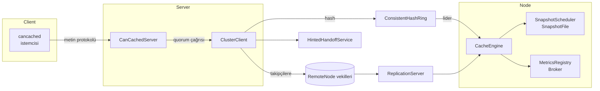

# Help

## Mimari Dokümanı

### 1. Başlangıç Seviyesi: Can-Cache'e Giriş
Can-Cache, Memcached metin protokolüyle uyumlu çalışan, yatay olarak ölçeklenebilir ve hatalara dayanıklı bir dağıtık önbellek uygulamasıdır. Amaç; mevcut Memcached istemcilerini değiştirmeden modern Java (Quarkus) ekosisteminde çalışabilen, hem bellek içi performansı hem de kalıcılığı bir arada sunan bir altyapı sağlamaktır. Sistem; tek düğümlü senaryolardan, onlarca replikanın bulunduğu kümelere kadar aynı mimari ilkelerle çalışacak şekilde tasarlanmıştır.

### 2. Başlangıç Seviyesi: Temel Bileşenler ve Veri Yolu
Bu bölüm, bileşenler arasındaki ilişkiyi kavramak için yüksek seviyede bir resim sunar.
İstemciler TCP üzerinden `CanCachedServer` ile konuşur.
Sunucu, Quarkus'un yerleşik Vert.x `NetServer` bileşeniyle Netty tabanlı event loop'lar üzerinde çalışır; böylece kabul edilen bağlantılar bloklamayan soketler ve paylaşımlı event loop thread'leri aracılığıyla sürdürülür.
Komutlar ayrıştırıldıktan sonra `ClusterClient` ile kümeye iletilir.
Okuma/yazma işlemleri hedef düğümlerin `CacheEngine` örneklerine ulaşır, TTL ve tahliye politikaları burada yürütülür.
Opsiyonel snapshot ve metrik bileşenleri sistemi kalıcı ve gözlemlenebilir kılar.

### 3. Orta Seviye: Bileşenlerin Derinlemesine İncelemesi

#### 3.1 Komut & Protokol Katmanı
- **Temel Rolü:** `CanCachedServer`, Quarkus uygulaması başladıktan sonra Vert.x `NetServer` ile belirtilen portu dinler; gelen her TCP bağlantısının soketi `ConnectionContext` adlı hafif bir durum nesnesine bağlanır. Komutlar satır bazında ayrıştırılır ve Memcached protokolündeki yanıt formatları birebir korunur, böylece istemciler ek adaptasyon gerektirmez.
- **İş Parçacığı Modeli:** Ağ tarafı tamamen Vert.x event loop thread'leri üzerinde yürür. Kabul edilen her `NetSocket` aynı event loop üzerinde veri alır; uygulama kodu ayrıca `ThreadPoolExecutor` yönetmez. Komut yürütme aşamasında bloklama ihtimali bulunan kümeye yazma/okuma çağrıları `vertx.executeBlocking(..., false, ...)` ile Vert.x'in paylaşımlı worker havuzuna taşınır. `ConnectionContext` içindeki `processing` bayrağı sayesinde aynı bağlantıda komutlar sıralı kalırken, event loop thread'i yeni veri okumak için serbest bırakılır.
- **Akış Kontrolü ve Komut Ayrıştırma:** Her bağlantıdan gelen baytlar Vert.x `Buffer` nesnesinde biriktirilir. `indexOfCrlf` ile satır sonu tespit edilene kadar veri okunur; storage komutları için `PendingStorageCommand` gövdenin tamamını (değer + CRLF) alana dek bekletilir. Bu yaklaşım, kısmi paketlerle gelen verileri doğru şekilde toparlar ve istemcilerin birden fazla komutu ardışık olarak pipeline etmesine imkan tanır.
- **Yanıt Semantiği:** Komut sonuçları `CommandResult` ile modellenir; yanıt gerekmiyorsa `continueWithoutResponse`, bağlantı kapatılacaksa `terminate` döner. Hazırlanan yanıtlar Vert.x `Buffer` nesneleriyle event loop üzerinden sokete yazılır. `noreply` seçeneği, gereksiz ağ yükünü önlemek için bu katmanda değerlendirilir. Bağlantı/komut sayaçları (`curr_connections`, `total_connections`, `cmd_get`, `cmd_set`) atomik sayaçlarla tutulmaya devam eder.
- **Hata Yönetimi:** Satır formatı, sayısal alanlar veya payload uzunluğu ile ilgili tutarsızlıklar `CLIENT_ERROR` yanıtlarıyla raporlanır. Çalışma zamanı istisnaları `executeBlocking` içerisinden yakalanıp bağlantı kapatılır; event loop üzerinde beklenmedik bloklama oluşmadan istemci tutarlı bir son durum görür.

#### 3.2 Kümelenme Katmanı
- **Ana Görev:** `ClusterClient`, kümeyi temsil eden merkezi bileşendir. `ConsistentHashRing` üzerinden anahtarın lider ve takipçi düğümlerini seçer. Böylece yeni düğümler eklendiğinde anahtar dağılımı minimal yeniden dağıtımla gerçekleşir.
- **Quorum Mantığı:** Yazmalarda ve okumalarda çoğunluk (majority) beklenir. Replikasyon faktörü `n` ise `(n/2)+1` yanıt alınmadan işlem başarılı sayılmaz. Liderden gelen hata doğrudan istemciye kabarcıklanır; takipçideki hatalar ise ipucuna dönüşebilir.
- **Hinted Handoff:** Takipçi düğümler geçici olarak ulaşılamıyorsa `HintedHandoffService` kuyruğuna "ipucu" bırakılır. Servis, koordinasyon katmanından gelen üyelik güncellemelerini dinleyerek düğüm geri döndüğünde yazmaları tekrar oynatır. Kuyruk ve yeniden oynatma metrikleri (`enqueued`, `replayed`, `failures`) ile ölçülür.
- **Uzak Çağrılar:** `RemoteNode`, TCP üzerinden `ReplicationServer` ile konuşur. Her çağrı kısa ömürlü soket bağlantısı açar ve tek baytlık komut kimlikleri (`'S'`, `'G'`, `'D'`, `'X'`, `'C'`, `'J'`, `'R'`, `'H'`) kullanır. Bu sayede metin protokolü yerine küçük binary paketlerle ağ yükü azaltılır.

#### 3.3 Bellek Motoru ve Veri Yaşam Döngüsü
- **Segment Mimarisi:** `CacheEngine`, anahtarları `hashCode`'a göre N adet `CacheSegment`'e dağıtır. Her segment `ReentrantLock` ile korunur ve `LinkedHashMap` benzeri LRU listesi içerir. Segment boyutları yapılandırılabilir; `TinyLFU` gibi alternatif tahliye stratejileri plugin mantığıyla seçilebilir.
- **TTL Yönetimi:** `DelayQueue<ExpiringKey>`, süresi dolan kayıtları tutar. Arka planda sanal thread tabanlı `ScheduledExecutorService`, kuyruğu tarayıp, süresi dolan anahtarları ilgili segmentten siler. `touch` komutları ve CAS güncellemeleri TTL'i yeniden hesaplayarak kuyruğa tekrar yazar.
- **Değer Kodlaması:** `StoredValueCodec`, bayraklar, CAS kimliği ve expireAt zaman damgasını Base64 formatında tek string'e paketler. Ağ katmanı (`CanCachedServer`) ve `CacheEngine` aynı formatı paylaştığından veri kopyalama ve dönüşüm maliyeti azalır.
- **Metrikler & Olaylar:** `CacheEngine`, isteğe bağlı `MetricsRegistry` ile `cache_hits`, `cache_misses`, `cache_evictions` sayaçlarını günceller; `Broker` üzerinden `keyspace:set` ve `keyspace:del` olaylarını yayınlar. `onRemoval` abonelikleri sayesinde sunucu, yerel `curr_items` sayaçlarını güncel tutar.

#### 3.4 Kalıcılık ve Gözlemlenebilirlik
- **Snapshot Altyapısı:** `SnapshotScheduler`, uygulama başlarken snapshot dosyasını okuyup `CacheEngine.replay` ile belleği doldurur. Belirlenen aralıklarla `SnapshotFile.write` çağrısı yaparak RDB benzeri dosyayı atomik olarak günceller. Hatalı kayıtlar atlanır, geri kalanlar en yeni değerlerle yazılır.
- **Metrik Raporlama:** `MetricsReporter`, sanal thread zamanlayıcısı üzerinden periyodik olarak `MetricsRegistry` içerisindeki sayaç ve zamanlayıcıları okur, konsola insan okunabilir formatta döker. Bu çıktı; Prometheus benzeri bir toplayıcıya yönlendirilebilir.
- **Yayın/Abonelik:** `Broker`, `CopyOnWriteArrayList` üzerinde abonelik listesi tutar. Her yayın tüm abonelere iletilir; abonelikler `AutoCloseable` döndürerek yaşam döngüsünde deterministik temizlik sağlar.

### 4. Orta Seviye: Komut İşleme ve İş Kuralları
Bu bölüm, Memcached protokolündeki komutların Can-Cache içindeki karşılıklarını ve uygulanırken gözetilen kuralları anlatır.

#### 4.1 Depolama Komutları (`set`, `add`, `replace`, `append`, `prepend`)
- **Başlangıç Mantığı:** Sunucu, komut satırından bayrak (flags), TTL (expire time) ve byte sayısını okur. Byte sayısı 1 MB üzerindeyse `CLIENT_ERROR` döner. `noreply` soneki varsa istemciye yanıt gönderilmez.
- **TTL Yorumlaması:** TTL değeri `0` ise kayıt kalıcıdır; negatif değerler silme anlamına gelir. 30 günden büyük değerler "epoch saniyesi" olarak yorumlanır ve güncel zamana göre delta hesaplanır. Bu davranış Memcached uyumluluğu için kritik.
- **Veri Kodlama:** Komut gövdesi okunduktan sonra `StoredValueCodec.encode`, yeni CAS değeri üreterek (global `AtomicLong casCounter`) bayraklar ve expireAt bilgisiyle birlikte Base64 string oluşturur. Bu string `ClusterClient` üzerinden quorum yazmasıyla kümeye gönderilir.
- **Komut Bazlı Farklar:**
  - `set`: Var olan veriyi üzerine yazar.
  - `add`: Anahtar mevcutsa `NOT_STORED` döner.
  - `replace`: Anahtar yoksa `NOT_STORED` döner.
  - `append/prepend`: Mevcut değeri okur, CAS döngüsüyle yeni gövdeleri uç uca ekler. En fazla 16 deneme yapılır; bu sınır aşılırsa `SERVER_ERROR` raporlanır.
- **Sayaç Yönetimi:** Yeni bir anahtar başarıyla eklendiğinde `curr_items` ve `total_items` sayaçları artar. Segment tahliyesi veya manuel `delete`, `onRemoval` aboneliğiyle `curr_items`'i azaltır.

#### 4.2 CAS Komutu (`cas`)
- İstemcinin gönderdiği `cas unique` değeri, mevcut değerin CAS kimliğiyle eşleşmezse `EXISTS` yanıtı verilir. Eşleşirse `compareAndSwap` quorum çağrısı yapılır.
- `ClusterClient.compareAndSwap`, liderin sonucunu bekler; takipçi hataları ipucu olarak kuyruğa alınır. Başarısız CAS denemesinde güncel değer yeniden okunur ve istemciye uygun yanıt döner.

#### 4.3 Okuma ve İstatistik Komutları
- `get/gets`: Anahtar listesi için `ClusterClient.get` çağrısı yapılır. Süresi dolmuş kayıtlar tespit edilirse `delete` ile temizlenir. `gets` yanıtında CAS değeri de döner. `get_hits`/`get_misses` sayaçları güncellenir.
- `stats`: Çalışma süresi (`uptime`), bağlantı sayaçları (`curr_connections`, `total_connections`) ve komut sayaçları (`cmd_get`, `cmd_set`, `cmd_touch`, `cmd_flush`) raporlanır.
- `version`: Uygulama sürüm bilgisini döner.

#### 4.4 Mutasyon Komutları
- `delete`: Quorum silme çağrısı yapar. Başarılıysa `curr_items` azaltılır.
- `incr/decr`: Yalnızca ASCII sayı içeren yüklerde çalışır. Negatif sonuç `0`'a sabitlenir. CAS döngüsü ile güncellenir. Büyük sayılar için `BigInteger` kullanılarak taşma engellenir.
- `touch`: TTL'i yeniden hesaplayıp CAS ile günceller. TTL `0` ise kayıt silinir.
- `flush_all`: Komut parametrelerine göre ya anında tüm düğümleri temizler ya da gelecekte bir tarih için flush planlar. Her yeni komutta `maybeApplyDelayedFlush` gecikmiş flush tarihinin gelip gelmediğini kontrol eder.

### 5. İleri Seviye: Dağıtık Sistem Mekanizmaları

#### 5.1 Consistent Hashing
- `ConsistentHashRing`, her düğüm için birden fazla sanal düğüm üretir. Bu, yükün dengeli dağılmasını ve düğüm ekleme/çıkarma sırasında minimum yeniden dağıtım sağlanmasını garantiler. Halka yapısı, `TreeMap` benzeri bir veri yapısıyla uygulanır.

#### 5.2 Quorum Okuma/Yazma
- Replikasyon faktörü `n` olan bir kümeye yazı yapıldığında lider + takipçiler çağrılır. Çoğunluk yanıt vermeden işlem başarılı sayılmaz. Okumalarda da aynı mantık, "en güncel lider" prensibiyle çalışır; lider yanıtı alınamazsa ve çoğunluk sağlanamazsa `ERROR` döner.

#### 5.3 Hinted Handoff
- Yazma sırasında erişilemeyen takipçiler için ipuçları kuyruklanır. Kuyruk, düğüm kimliği, anahtar, değer, TTL ve operasyon türünü saklar. `HintedHandoffService`, sanal thread havuzu üzerinden periyodik olarak kuyruğu tüketir ve düğüm tekrar erişilebilir olduğunda yazmayı gerçekleştirir. Başarısız tekrarlar için geriye dönük metrikler tutulur.

#### 5.4 Anti-Entropy ve Tutarlılık
- `fingerprint()` fonksiyonu, her segment için deterministik özet üretir. Koordinasyon servisi digest isteği (`'H'`) ile düğümlerin özetlerini toplar, farklılık varsa bootstrap akışı (`'R'`) başlatılır. Bu mekanizma; uzun süreli ağ bölünmeleri sonrası veri tutarlılığını yeniden sağlar.

### 6. İleri Seviye: Koordinasyon, Üyelik ve Replikasyon Akışı

- **Üyelik Keşfi:** Multicast `HELLO` paketleri, düğümlerin birbirini bulmasını sağlar. Paketler; node kimliği, adres, port ve epoch bilgisi içerir.
- **Join Handshake:** Var olan düğümler `'J'` komutuyla yeni düğümün hazır olup olmadığını kontrol eder. Yanıt `A` (accept) ise yeni düğüm halka yapısına eklenir.
- **Bootstrap Akışı:** `'R'` komutuyla lider düğüm, anahtarları ve TTL'leri yeni düğüme stream eder. Bu stream sırasında `CacheEngine.set` çağrıları doğrudan yapılır.
- **Digest Denetimi:** Periyodik `'H'` istekleri; segment fingerprint'lerini karşılaştırarak farklılık tespit eder. Fark varsa zorunlu bootstrap (force) tetiklenir.

### 7. Uzman Seviyesi: Performans, Kaynak Yönetimi ve Hata Senaryoları

- **Vert.x Event Loop ve Worker Etkileşimi:** Ağ katmanı, Quarkus'un Vert.x event loop thread'leri üzerinde çalışır. Her bağlantı `ConnectionContext` aracılığıyla event loop'ta veri biriktirir; komut yürütmesi `vertx.executeBlocking` ile Vert.x worker havuzuna taşınır. Bu sayede Netty'nin tekil event loop thread'i bloklanmaz, ancak `processing` bayrağı sayesinde bağlantı başına komut sıralaması korunur.
- **Sanal Thread Kullanımı:** Koordinasyon servisleri (`CoordinationService`, `ReplicationServer`), `CacheEngine` temizleyicisi, snapshot ve metrik zamanlayıcıları gibi arka plan işler hâlâ `Thread.ofVirtual()` temelli havuzlarla çalışır. Event loop modeli ağ yoğunluğunu taşırken, virtual thread'ler IO ağırlıklı yönetim görevlerinde yüksek eşzamanlılık sağlar.
- **Backpressure ve Akış Kontrolü:** Artık `ThreadPoolExecutor` kuyruğu yerine her `ConnectionContext` komut çalışırken `processBuffer` döngüsünü durdurur. Event loop, worker sonucunu beklerken yeni veri parçalarını sadece buffer'a ekler; komut tamamlandığında biriken veri tekrar işlenir. Bu mekanizma, pipelined isteklerde bile bellek tahsisini sınırlı tutar ve bağlantı başına düzen sağlar.
- **Hata İzolasyonu:** Lider node hatası durumunda yazma başarısız olur ve istemciye hata döner; böylece sessiz veri kaybı engellenir. Takipçi hataları ipucuna dönüştürüldüğü için veri tutarlılığı nihayetinde sağlanır.
- **Snapshot Tutarlılığı:** Snapshot alınırken `CacheEngine` segmentleri üzerinde `forEach` yapılarak mevcut değerler atomik biçimde dosyaya yazılır. Yazma sırasında geçici dosya (`.tmp`) kullanılır, işlem başarıyla bittiğinde atomik rename ile son dosya güncellenir.
- **Gözlemlenebilirlik Entegrasyonları:** Metrik raporları ve yayınlanan olaylar, dış sistemlere (Prometheus, ELK, Kafka vb.) kolay entegrasyon için tasarlanmıştır. `Broker` üzerinden anahtar alanı değişikliklerini dinlemek, önbelleğe bağlı türev sistemler için temel oluşturur.

### 8. Yapılandırma ve Çalıştırma Parametreleri
- **AppProperties:** YAML/Properties üzerinden gelen yapılandırmayı tip güvenli hale getirir. Ağ ayarları (host, port, backlog, workerThreads), segment sayısı, kapasite, tahliye politikası, snapshot yolları/periyotları, replikasyon faktörü, sanal düğüm sayısı, multicast adresleri gibi kritik parametreler burada tutulur.
- **AppConfig:** Bu değerleri kullanarak `CacheEngine`, `SnapshotFile`, `SnapshotScheduler`, `ConsistentHashRing`, yerel `Node` adaptörü, `ClusterState` ve `ClusterClient` gibi bean'leri üretir. Uygulama başlatıldığında snapshot'ı yükler, kapatılırken thread havuzlarını ve soketleri temiz biçimde kapatır.
- **Dağıtım Notları:**
  - Kümeye yeni düğüm eklerken ağ katmanının multicast trafiğine izin verdiğinden emin olun.
  - Snapshot dosyasının bulunduğu disk yolunun dayanıklı (örn. SSD) ve yeterli alan sunduğunu doğrulayın.
  - Hinted handoff kuyruğu disk üzerinde kalıcı değildir; uzun süreli kesintilerde quorum sağlamak kritik önem taşır.

### 9. Sistemi Genişletme İçin Öneriler
- Yeni komutlar eklerken `CanCachedServer` içindeki `parseCommand` karar yapısına ilgili komutu ekleyin; gerekirse yeni `CommandAction` türleri oluşturarak Memcached yanıt semantiğini koruyun.
- Bellek motoruna yeni tahliye politikaları eklemek için `EvictionPolicyType` arayüzünü uygulayın ve `CacheSegment` ile entegre edin.
- Gözlemlenebilirlik ihtiyaçları arttığında `MetricsReporter` yerine Prometheus push/pull entegrasyonu eklemek mümkündür; `MetricsRegistry` zaten soyut bir katman sağlar.

Bu mimari doküman, Can-Cache'in temel iş kurallarını, dağıtık davranışını ve kalıcılık/izleme mekanizmalarını, başlangıç seviyesinden uzman seviyesine kadar kademeli olarak anlatarak, sistemi geliştirecek ekipler için kapsamlı bir başvuru kaynağı sunar.
