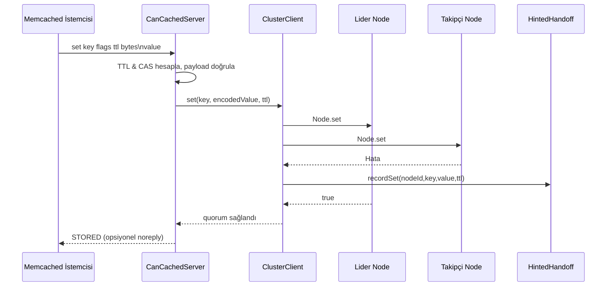
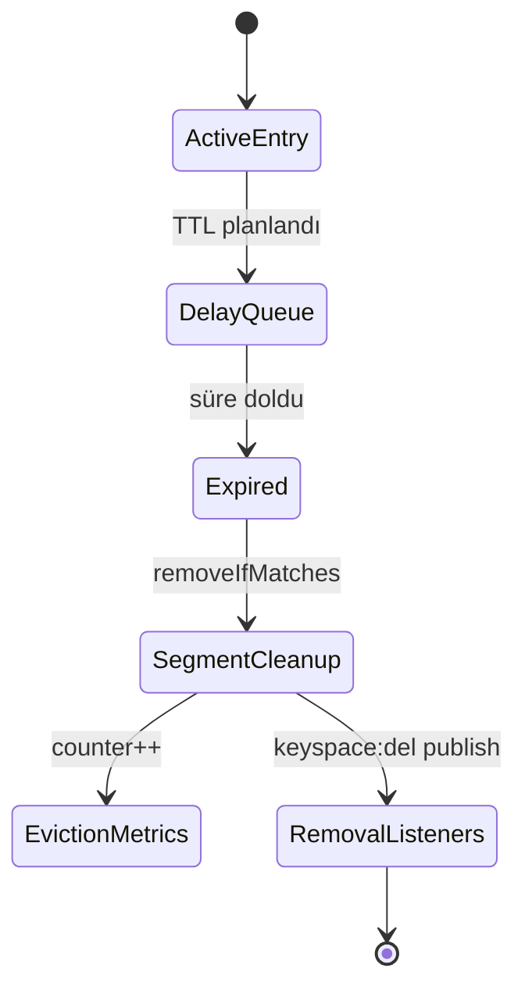
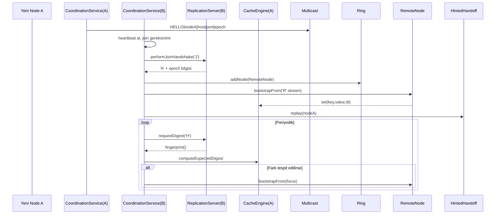

# Help

## Mimari Dokümanı

### 1. Sistem Bileşenlerine Genel Bakış
- **Komut & Protokol Katmanı:** `CanCachedServer`, cancached metin protokolünü konuşan TCP sunucusudur. Her bağlantıyı `ThreadPoolExecutor` üzerinde sanal-thread dostu işleyicilere dağıtır, komutları satır bazında ayrıştırır ve `ClusterClient` ile kümeye yönlendirir. Gecikmeli `flush_all` zamanlamasını her komutta `maybeApplyDelayedFlush()` ile kontrol eder, bağlantı ve komut metriklerini yerel sayaçlarda tutar.【F:src/main/java/com/can/net/CanCachedServer.java†L28-L172】【F:src/main/java/com/can/net/CanCachedServer.java†L707-L742】
- **Kümelenme Katmanı:** `ClusterClient`, `ConsistentHashRing` üzerinden anahtar başına replikaları seçer, çoğunluk quorum'u ile yazma/okuma yapar ve başarısız takipçiler için `HintedHandoffService`'e ipucu bırakır. `RemoteNode` TCP ile diğer JVM'lerdeki `ReplicationServer`'a tek baytlık komutlar gönderir; `CoordinationService` multicast kalp atışlarıyla üyeleri keşfedip halkayı günceller, bootstrap/digest protokolünü tetikler.【F:src/main/java/com/can/cluster/ClusterClient.java†L17-L162】【F:src/main/java/com/can/cluster/coordination/RemoteNode.java†L15-L156】【F:src/main/java/com/can/cluster/coordination/CoordinationService.java†L18-L311】
- **Bellek Motoru:** `CacheEngine`, yapılandırılabilir segmentler (`CacheSegment`) ve seçilebilir tahliye politikaları (LRU/TinyLFU) ile verileri bellekte tutar. `DelayQueue<ExpiringKey>` TTL süresi dolan kayıtları temizler, metrikler ve `Broker` aracılığıyla olay yayınlar.【F:src/main/java/com/can/core/CacheEngine.java†L12-L146】【F:src/main/java/com/can/core/CacheSegment.java†L1-L118】【F:src/main/java/com/can/core/ExpiringKey.java†L1-L17】
- **Kalıcılık & Gözlemlenebilirlik:** `SnapshotFile`/`SnapshotScheduler` RDB benzeri dosyaya periyodik snapshot alır; `MetricsRegistry` + `MetricsReporter` sayaç/zamanlayıcıları konsola döker; `Broker` anahtar alanı olaylarını fan-out eder.【F:src/main/java/com/can/rdb/SnapshotFile.java†L1-L85】【F:src/main/java/com/can/rdb/SnapshotScheduler.java†L1-L84】【F:src/main/java/com/can/metric/MetricsReporter.java†L1-L81】【F:src/main/java/com/can/pubsub/Broker.java†L1-L58】

```mermaid
flowchart LR
    subgraph Client
        CLI[cancached istemcisi]
    end
    CLI -- metin protokolü --> S[CanCachedServer]
    S -- quorum çağrısı --> CC[ClusterClient]
    CC -- hash --> Ring[ConsistentHashRing]
    Ring -- lider --> LN[Yerel Node\n(CacheEngine)]
    Ring -- takipçi --> RN[(RemoteNode vekilleri)]
    RN --> RS[ReplicationServer]
    RS --> CE[CacheEngine]
    CE --> TTL[DelayQueue\n+ Eviction]
    CE --> Snap[SnapshotScheduler\nSnapshotFile]
    CE --> Obs[MetricsRegistry & Broker]
    CC --> HH[HintedHandoffService]
```

### 2. Komut İşleme ve İş Kuralları
#### 2.1 Depolama Komutları (`set/add/replace/append/prepend`)
- Sunucu gelen satırı ayrıştırır, bayrak, TTL ve bayt sayısı doğrulamalarını yapar, 1 MB üzerindeki yükleri reddeder ve `noreply` semantiğini uygular.【F:src/main/java/com/can/net/CanCachedServer.java†L180-L266】
- TTL değeri 0 ise kalıcı, negatifse silme anlamına gelir; 30 günü aşan değerler epoch saniyeleri olarak yorumlanıp bugüne göre farkı hesaplanır.【F:src/main/java/com/can/net/CanCachedServer.java†L824-L858】
- Yeni değerler `StoredValueCodec` ile CAS, bayrak ve sona erme zamanını birlikte Base64 olarak kodlanıp `ClusterClient` üzerinden quorum yazması yapılır. `add` var olanı reddeder, `replace` yoksa hata döner, `append/prepend` CAS döngüsüyle 16 denemeye kadar birleştirir; tahliye limitine takılırsa `SERVER_ERROR` döner.【F:src/main/java/com/can/net/CanCachedServer.java†L268-L359】【F:src/main/java/com/can/core/StoredValueCodec.java†L13-L87】
- Başarıyla eklenen yeni anahtarlar `curr_items` ve `total_items` sayaçlarını artırır, yerel kaldırmalar `onRemoval` aboneliğiyle sayaçtan düşürülür.【F:src/main/java/com/can/net/CanCachedServer.java†L335-L344】【F:src/main/java/com/can/net/CanCachedServer.java†L789-L804】

#### 2.2 CAS Komutu (`cas`)
- İstemciden gelen `cas unique` değeri mevcut değerle uyuşmazsa `EXISTS` döner. Uyuşursa yeni kayıt yeni CAS numarasıyla encode edilip quorum CAS çağrısı yapılır; başarısız olursa güncel değer okunup `EXISTS/NOT_FOUND` yanıtı verilir.【F:src/main/java/com/can/net/CanCachedServer.java†L360-L412】
- `ClusterClient.compareAndSwap`, liderden alınan istisnayı fırlatarak güçlü tutarlılık sağlar, takipçi başarısızlıklarını ipucu olarak kaydeder.【F:src/main/java/com/can/cluster/ClusterClient.java†L108-L150】

#### 2.3 Okuma ve İstatistik Komutları
- `get/gets` için anahtar listesi taranır, TTL süresi geçmiş kayıtlar `delete` ile temizlenir. `gets` CAS değerini de döner; `get_hits/misses` sayaçları güncellenir.【F:src/main/java/com/can/net/CanCachedServer.java†L413-L447】
- `stats` sürecinde çalışma süresi, bağlantı sayaçları ve komut sayaçları raporlanır; `version` uygulama paket sürümünü verir.【F:src/main/java/com/can/net/CanCachedServer.java†L640-L707】

#### 2.4 Mutasyon Komutları
- `delete` quorum silme çağrısı yapar ve başarılıysa sayaçtan düşer.【F:src/main/java/com/can/net/CanCachedServer.java†L448-L475】
- `incr/decr` yalnızca ASCII sayısal yüklerde çalışır; negatif sonuç sıfıra sabitlenir ve CAS döngüsüyle yazılır.【F:src/main/java/com/can/net/CanCachedServer.java†L476-L566】
- `touch` yeni TTL hesaplayarak CAS ile günceller; TTL sıfırsa değer silinir.【F:src/main/java/com/can/net/CanCachedServer.java†L567-L618】
- `flush_all` anında tüm düğümleri temizler veya geleceğe dönük son tarih planlar; her komut girişinde `maybeApplyDelayedFlush` bu son tarihi kontrol eder.【F:src/main/java/com/can/net/CanCachedServer.java†L619-L707】【F:src/main/java/com/can/net/CanCachedServer.java†L158-L172】



### 3. Bellek Motoru ve Veri Yaşam Döngüsü
- Her anahtar `segIndex` fonksiyonu ile belirlenen `CacheSegment`'e gider; segmentler `ReentrantLock` korumasında LRU erişim sıralı `LinkedHashMap` tutar. Tahliye politikası yeni girişleri kabul etmeden önce kurban seçer, gerekirse `notifyRemoval` ile abonelere haber verir.【F:src/main/java/com/can/core/CacheEngine.java†L61-L123】【F:src/main/java/com/can/core/CacheSegment.java†L1-L118】
- `DelayQueue<ExpiringKey>` TTL süresi dolan kayıtları segment bazında çıkarır, isteğe bağlı TinyLFU stratejisi sıcak verileri korur. Temizlik görevi sanal thread zamanlayıcıyla periyodik çalışır.【F:src/main/java/com/can/core/CacheEngine.java†L32-L74】
- `StoredValueCodec` değerleri CAS, bayrak ve expireAt ile tek Base64 dizisinde taşır; bu sayede ağ katmanı ve bellek motoru aynı gösterimi paylaşır, CAS çakışmalarında tutarlılık sağlanır.【F:src/main/java/com/can/core/StoredValueCodec.java†L13-L87】
- `CacheEngine.get/delete/compareAndSwap` metrik sayaç ve zamanlayıcılarını günceller, `Broker` aracılığıyla `keyspace:del` olayını yayınlar. `fingerprint()` küme anti-entropy karşılaştırmaları için deterministik özet üretir.【F:src/main/java/com/can/core/CacheEngine.java†L126-L267】【F:src/main/java/com/can/core/CacheEngine.java†L224-L250】



### 4. Kümelenme, Replikasyon ve Anti-Entropy
- `ConsistentHashRing` sanal düğümlerle anahtar yükünü dengeler; `ClusterClient` replikasyon faktörüne göre lider+takipçileri seçer ve çoğunluk hesabı (`(n/2)+1`) ile yanıt arar.【F:src/main/java/com/can/cluster/ConsistentHashRing.java†L11-L68】【F:src/main/java/com/can/cluster/ClusterClient.java†L40-L79】
- Hata toleransı için lider yazması başarısızsa istisna kabarcıklanır, takipçi hataları `HintedHandoffService`'e kuyruklanır. Kuyruklar periyodik olarak `CoordinationService` veya katılım sırasında `replay` edilir, metrikler `enqueued/replayed/failures` sayaçlarıyla izlenir.【F:src/main/java/com/can/cluster/ClusterClient.java†L80-L150】【F:src/main/java/com/can/cluster/HintedHandoffService.java†L15-L102】
- `RemoteNode` her çağrıda kısa ömürlü soket açar, `'S'/'G'/'D'/'X'/'C'` komutlarıyla hedef `ReplicationServer`'ı sürer. Sunucu tarafı komutu `CacheEngine`'e uygular, `'J'` (join) el sıkışması ve `'R'` (stream) ile bootstrap sağlar, `'H'` (digest) ile anti-entropy tetikler.【F:src/main/java/com/can/cluster/coordination/RemoteNode.java†L21-L156】【F:src/main/java/com/can/cluster/coordination/ReplicationServer.java†L17-L184】
- `CoordinationService` multicast `HELLO` paketleriyle düğümleri keşfeder, join handshake sonucuna göre `ConsistentHashRing`'e ekler, epoch sürümünü `ClusterState` ile günceller ve digest farklılıklarında `bootstrapFrom` ile onarım yapar.【F:src/main/java/com/can/cluster/coordination/CoordinationService.java†L37-L311】【F:src/main/java/com/can/cluster/ClusterState.java†L7-L62】



### 5. Kalıcılık, Gözlemlenebilirlik ve Olaylar
- `SnapshotScheduler` ilk açılışta ve yapılandırılan aralıkta `SnapshotFile.write` çağırarak atomik dosya güncellemesi yapar; okunurken hatalı satırlar atlanır ve `CacheEngine.replay` ile bellek doldurulur.【F:src/main/java/com/can/rdb/SnapshotScheduler.java†L17-L79】【F:src/main/java/com/can/rdb/SnapshotFile.java†L21-L80】
- `MetricsReporter` metrik kayıt defterini sanal thread zamanlayıcı üzerinden tarayıp mikro saniye çözünürlüğünde rapor üretir; `MetricsRegistry` sayaç/zamanlayıcı örneklerini lazy oluşturur.【F:src/main/java/com/can/metric/MetricsReporter.java†L1-L81】【F:src/main/java/com/can/metric/MetricsRegistry.java†L1-L20】
- `Broker` her yayını `CopyOnWriteArrayList` üzerinde abonelere dağıtır, abonelikler `AutoCloseable` döndürür ve yaşam döngüsü `@Startup` anotasyonu ile Quarkus tarafından yönetilir.【F:src/main/java/com/can/pubsub/Broker.java†L1-L58】

### 6. Yapılandırma ve Çalıştırma Parametreleri
- `AppProperties` yapılandırma haritası metrik periyodu, snapshot yolu/periyodu, segment sayısı, kapasite, tahliye politikası, sanal düğüm sayısı, replikasyon faktörü, multicast adresleri ve ağ portlarını tip güvenli sağlar.【F:src/main/java/com/can/config/AppProperties.java†L1-L95】
- `AppConfig` bu değerleri okuyup `CacheEngine`, `SnapshotFile`, `ConsistentHashRing`, yerel `Node` adaptörü, `ClusterState` ve `ClusterClient` bean'lerini üretir; uygulama açıldığında snapshot yükler, kapanışta kaynakları kapatır.【F:src/main/java/com/can/config/AppConfig.java†L18-L123】

### 7. Kritik Teknik Kavramlar
- **Quorum Yazma/Okuma:** `ClusterClient` lider+takipçi çoğunluğunu bekleyerek hatalara dayanıklı hale gelir; lider hatasında istisna fırlatıp uygulamaya gerçek hata bildirir.【F:src/main/java/com/can/cluster/ClusterClient.java†L56-L115】
- **Hinted Handoff:** Geçici ağ kesintilerinde yazma/kaldırma ipuçlarını kuyruklar, üyelik sinyalleriyle tekrar dener; başarısız tekrarlar için metrik tutar.【F:src/main/java/com/can/cluster/HintedHandoffService.java†L33-L102】
- **TTL Semantiği:** Memcached uyumluluğu için 30 gün üzeri TTL'ler epoch saniye olarak yorumlanır, TTL sıfır veya negatifse kayıt silinir; `DelayQueue` temizlik ve `touch` komutu TTL uzatmayı yönetir.【F:src/main/java/com/can/net/CanCachedServer.java†L824-L858】【F:src/main/java/com/can/core/CacheEngine.java†L32-L74】
- **CAS ve Çakışma Yönetimi:** Global `casCounter` ile benzersiz kimlik üretilir, `append/prepend/incr/decr/touch` gibi mutasyonlar optimistik CAS döngüsüyle tutarlılığı korur.【F:src/main/java/com/can/net/CanCachedServer.java†L200-L618】
- **Virtual Thread Kullanımı:** Hem replikasyon hem koordinasyon hem de zamanlayıcı iş yükleri `Thread.ofVirtual()` ile başlatılır, böylece IO ağırlıklı işlemlerde yüksek eşzamanlılık sağlar.【F:src/main/java/com/can/cluster/coordination/CoordinationService.java†L80-L116】【F:src/main/java/com/can/cluster/coordination/ReplicationServer.java†L43-L89】【F:src/main/java/com/can/core/CacheEngine.java†L51-L74】

Bu mimari doküman, can-cache'in temel iş kurallarını, dağıtık davranışını ve kalıcılık/izleme mekanizmalarını uçtan uca özetleyerek mühendislik ekibinin sistemi genişletirken başvurabileceği referans niteliğinde bir kaynak sunar.
