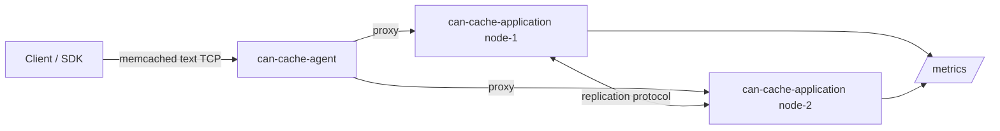
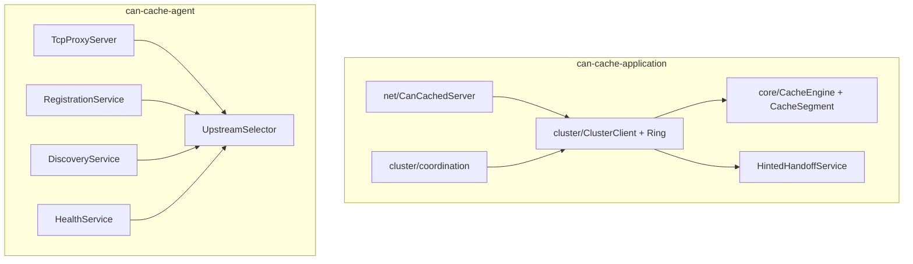
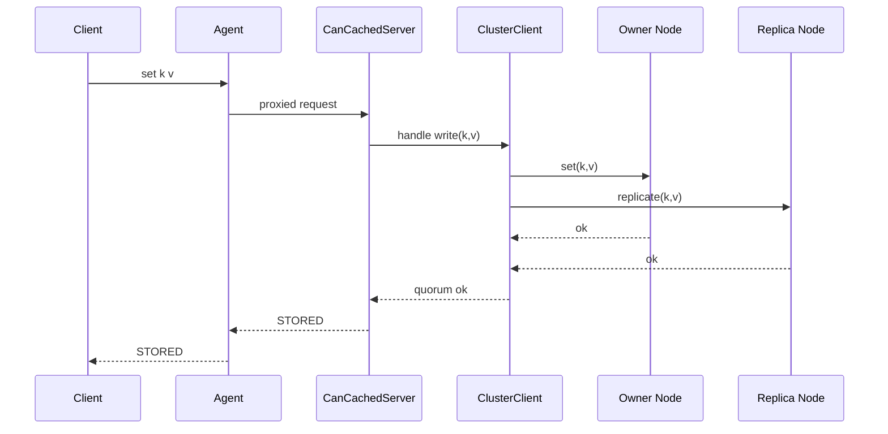
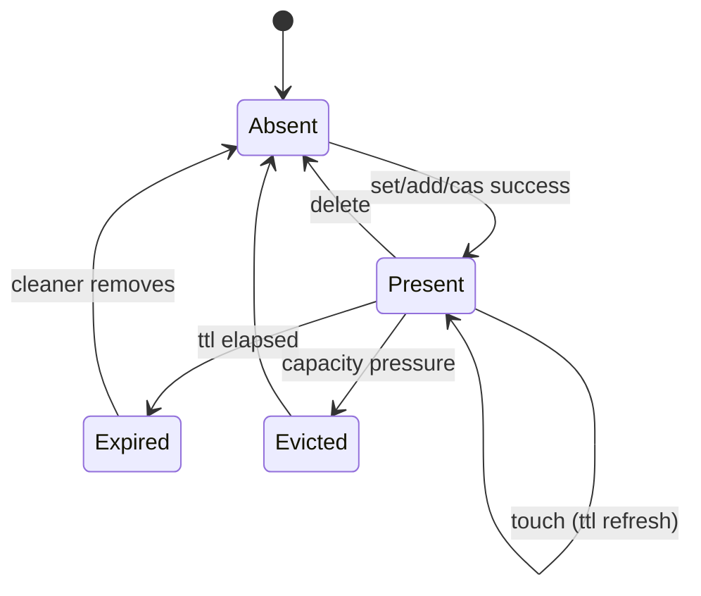
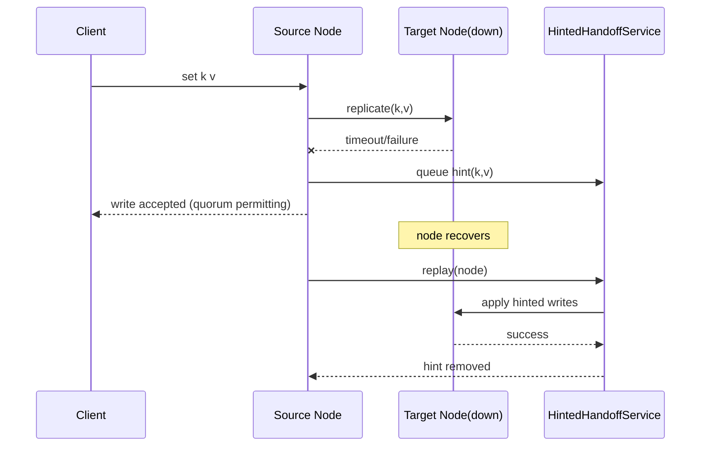
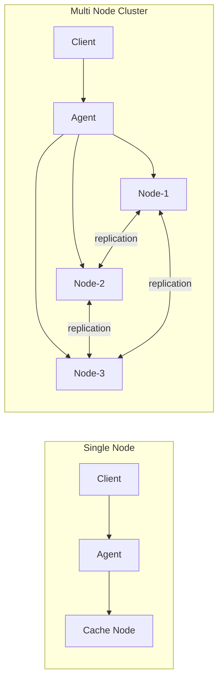

# can-cache Yardım ve Mimari Rehberi

Bu doküman, projeyi **ilk kez gören bir geliştiricinin** tek başına sistemi anlayıp çalıştırabilmesi için sıfırdan yazılmıştır.

---

## 1) Proje Amacı

### Hangi problemi çözüyor?
`can-cache`, memcached text protokolünü konuşan istemcilere düşük gecikmeli bir key/value cache sağlar. Sistem iki katmandan oluşur:

- **Cache sunucusu (`can-cache-application`)**: Veriyi bellekte tutar, TTL/CAS kurallarını uygular, cluster içinde çoğaltır.
- **Edge/proxy (`can-cache-agent`)**: İstemcileri sağlıklı cache node’larına yönlendirir.

### Çözüm yaklaşımı neden böyle?
- Bellek içi tasarım: en düşük gecikme için.
- Segmentli cache: eşzamanlı erişimde lock çakışmasını azaltmak için.
- Consistent hashing + replication: ölçekleme ve kısmi node kaybında servis devamlılığı için.
- Agent katmanı: istemci konfigürasyonunu sadeleştirmek (tek endpoint) için.

---

## 2) Modül Haritası

- `can-cache-application`
  - `net`: memcached komut ayrıştırma ve yanıt üretimi (`CanCachedServer`).
  - `core`: `CacheEngine`, TTL queue, eviction policy, CAS.
  - `cluster`: ring yönlendirme, replication, hinted handoff, koordinasyon.
  - `config`: CDI bean üretimi ve runtime wiring.
- `can-cache-agent`
  - TCP proxy, upstream discovery, registration, health check, seçim politikaları.
- `can-cache-integration-tests`
  - Docker ortamında protokol + metrik + cluster doğrulaması.
- `can-cache-performance-tests`
  - JMeter tabanlı NFR senaryoları.

### System Context Diagram

```mermaid
flowchart LR
    C[Client / SDK] -->|memcached text TCP| A[can-cache-agent]
    A -->|proxy| N1[can-cache-application node-1]
    A -->|proxy| N2[can-cache-application node-2]
    N1 <-->|replication protocol| N2
    N1 --> M[/metrics/]
    N2 --> M
```

### Container/Module Diagram

```mermaid
flowchart TB
    subgraph app[can-cache-application]
      NET[net/CanCachedServer]
      CORE[core/CacheEngine + CacheSegment]
      CL[cluster/ClusterClient + Ring]
      COORD[cluster/coordination]
      HH[HintedHandoffService]
      NET --> CL --> CORE
      COORD --> CL
      CL --> HH
    end

    subgraph agent[can-cache-agent]
      PX[TcpProxyServer]
      REG[RegistrationService]
      DISC[DiscoveryService]
      HL[HealthService]
      SEL[UpstreamSelector]
      PX --> SEL
      REG --> SEL
      DISC --> SEL
      HL --> SEL
    end
```

---

## 3) Uçtan Uca Request Yaşam Döngüsü

### Normal akış (SET/GET)
1. Client, agent’a TCP bağlantısı açar.
2. Agent, sağlıklı upstream seçer (`RR` veya `LEAST_CONN`).
3. Uygulama node’u komutu parse eder.
4. `ClusterClient`, key’in owner node’unu ring üzerinden bulur.
5. Yazma ise replication factor kadar node’a gönderir; quorum sağlanırsa başarı döner.
6. Okuma ise owner/replica’dan değer döner.

```mermaid
sequenceDiagram
    participant C as Client
    participant A as Agent
    participant S as CanCachedServer
    participant CC as ClusterClient
    participant O as Owner Node
    participant R as Replica Node

    C->>A: set k v
    A->>S: proxied request
    S->>CC: handle write(k,v)
    CC->>O: set(k,v)
    CC->>R: replicate(k,v)
    O-->>CC: ok
    R-->>CC: ok
    CC-->>S: quorum ok
    S-->>A: STORED
    A-->>C: STORED
```

---

## 4) Veri Modeli

- **Key**: metin anahtar.
- **Value**: byte[]/string payload.
- **TTL**: `exptime` alanı ile hesaplanır; süre dolunca silinir.
- **CAS**: yarışan yazmalarda optimistic concurrency sağlar.
- **Eviction**: kapasite dolduğunda LRU veya TinyLFU devreye girer.

### Data Lifecycle Diagram

```mermaid
stateDiagram-v2
    [*] --> Absent
    Absent --> Present: set/add/cas success
    Present --> Present: get/gets
    Present --> Present: touch (ttl refresh)
    Present --> Absent: delete
    Present --> Expired: ttl elapsed
    Expired --> Absent: cleaner removes
    Present --> Evicted: capacity pressure
    Evicted --> Absent
```

---

## 5) Cluster Davranışı

- **Discovery**: multicast heartbeat ile node üyeliği.
- **Ring**: virtual node’larla key dağılımını dengeler.
- **Replication**: `replication-factor` kadar kopya yazılır.
- **Failure handling**:
  - hedef node down ise hint kuyruğu tutulur,
  - node geri geldiğinde hint replay edilir.

```mermaid
sequenceDiagram
    participant C as Client
    participant S as Source Node
    participant T as Target Node(down)
    participant H as HintedHandoffService

    C->>S: set k v
    S->>T: replicate(k,v)
    T--xS: timeout/failure
    S->>H: queue hint(k,v)
    S-->>C: write accepted (quorum permitting)
    Note over T: node recovers
    S->>H: replay(node)
    H->>T: apply hinted writes
    T-->>H: success
    H-->>S: hint removed
```

---

## 6) Operasyon Rehberi

### Local geliştirme
- Uygulama: `./gradlew :can-cache-application:quarkusDev`
- Agent: `./gradlew :can-cache-agent:quarkusDev`
- Hazır script: `./local-setup.sh start|status|stop`

### Health ve gözlem
- Agent status endpoint’i: `agent.status.port`.
- Metrics endpoint’i: `/metrics`.
- Loglar: Quarkus console + file log.

### Deployment Diagram

```mermaid
flowchart LR
    subgraph single[Single Node]
      C1[Client] --> A1[Agent]
      A1 --> S1[Cache Node]
    end

    subgraph multi[Multi Node Cluster]
      C2[Client] --> A2[Agent]
      A2 --> N1[Node-1]
      A2 --> N2[Node-2]
      A2 --> N3[Node-3]
      N1 <-->|replication| N2
      N2 <-->|replication| N3
      N1 <-->|replication| N3
    end
```

### Troubleshooting kısa notları
- Çok `NOT_STORED`: yanlış command semantiği (`add/replace/cas`) veya yarışan yazma.
- Yüksek miss oranı: TTL çok kısa veya eviction baskısı yüksek.
- Dengesiz dağılım: virtual node sayısını artırın.

---

## 7) Performans Notları

- Sıcak noktalar: parse maliyeti, network hop sayısı, replication factor.
- Tuning:
  - `app.cache.segments`: çekirdek sayısına göre artırılabilir.
  - `app.cache.max-capacity`: eviction basıncını yönetir.
  - `app.network.event-loop-threads` ve `worker-threads`: I/O yoğunlukta kritik.
- Agent selection policy:
  - `RR`: homojen yükte stabil.
  - `LEAST_CONN`: bağlantı süresi değişkense daha dengeli olabilir.

---

## 8) Güvenilirlik / Riskler

- Kalıcılık yok: süreç restart sonrası veri kaybı beklenen davranıştır.
- Quorum/replication ayarları yanlışsa yazma başarısı ile tutarlılık dengesi bozulabilir.
- Multicast discovery bazı ağlarda kısıtlı olabilir (özellikle bulut CNI politikalarında).

Trade-off:
- Düşük gecikme için bellek içi tasarım seçildi; bunun doğal bedeli process-level durability olmamasıdır.

---

## 9) SSS

**S: Veriler diskte tutuluyor mu?**  
C: Hayır. Sistem bellek içi çalışır.

**S: Neden agent kullanmalıyım?**  
C: İstemciyi tek endpoint’e bağlarsınız; health + upstream seçim merkezi olur.

**S: TTL nasıl işliyor?**  
C: Yazımda expire zamanı hesaplanır, arka plan cleaner süre dolan anahtarları kaldırır.

**S: CAS neyi çözer?**  
C: Aynı key’e yarışan update’lerde “benim gördüğüm versiyon hâlâ güncel mi?” kontrolünü sağlar.

---

## 10) Terimler Sözlüğü

- **TTL (Time-To-Live)**: Verinin geçerlilik süresi.
- **CAS (Compare-And-Swap)**: Koşullu yazma mekanizması.
- **Eviction**: Kapasite baskısında öğe çıkarma.
- **Consistent Hashing**: Key->node dağılımını minimum yeniden dağıtımla yapan yöntem.
- **Quorum**: Bir işlemin başarılı sayılması için gereken minimum onay sayısı.
- **Hinted Handoff**: Geçici olarak ulaşılamayan node için yazıyı kuyruklayıp sonra aktarma tekniği.
