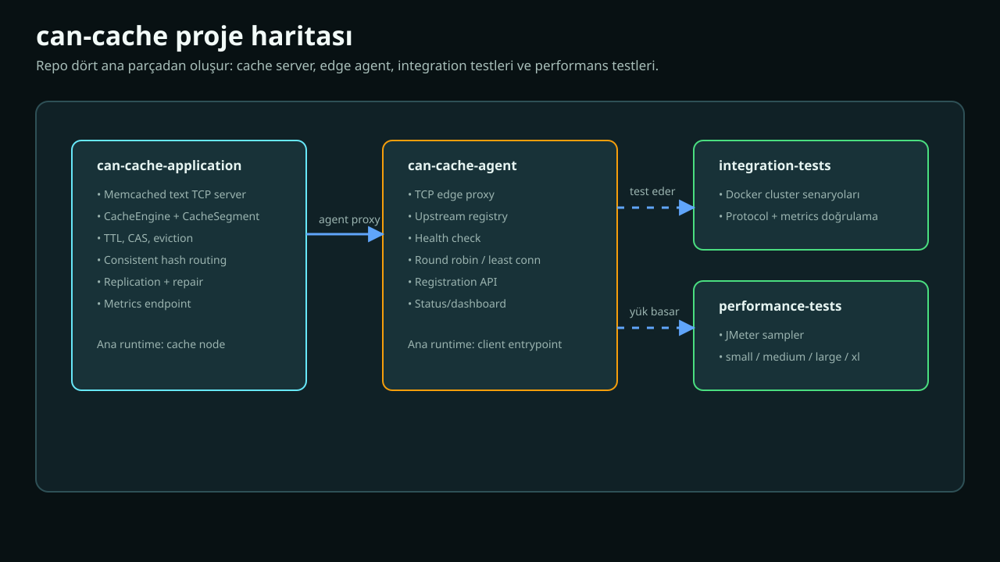
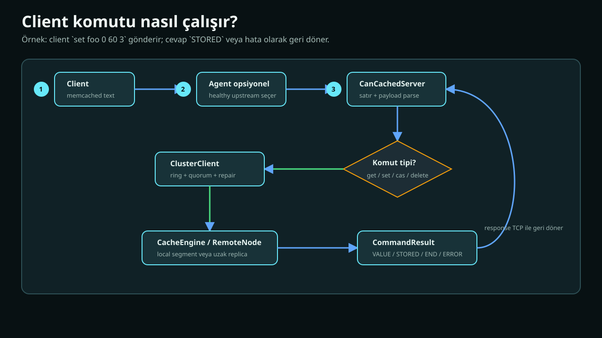
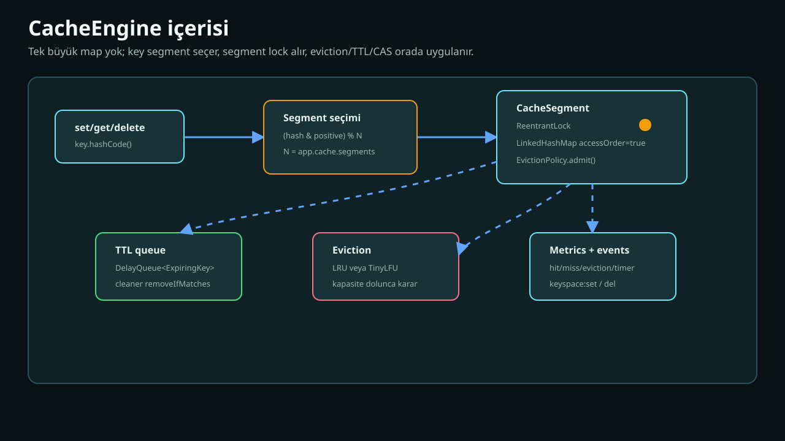
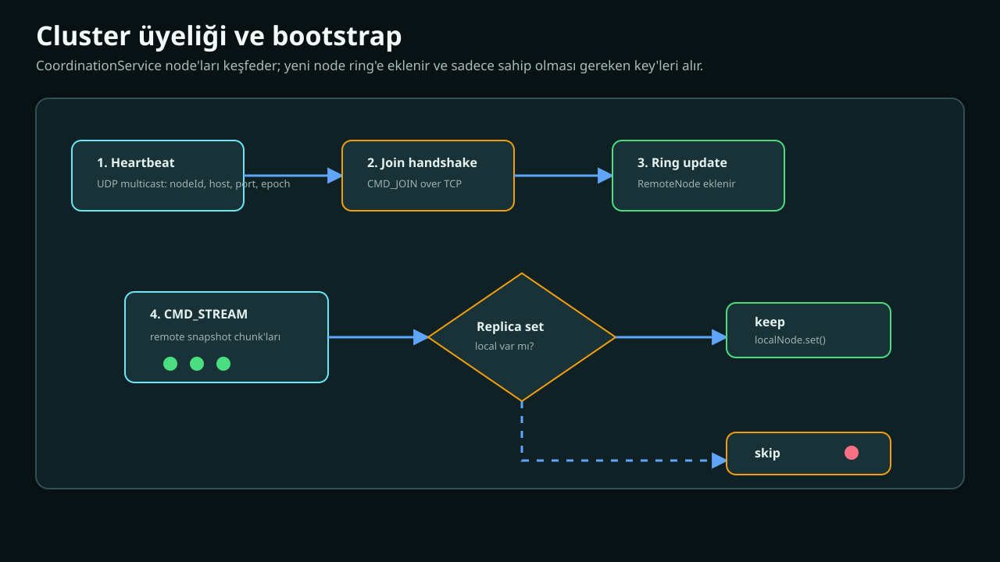
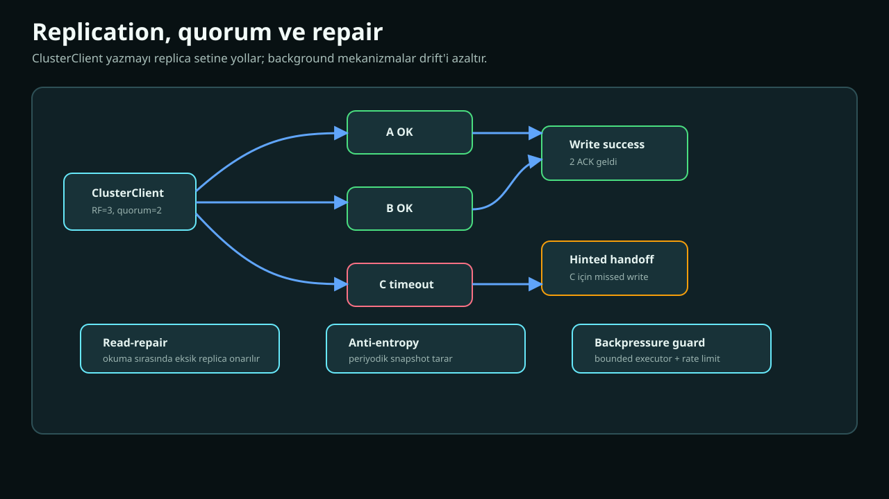
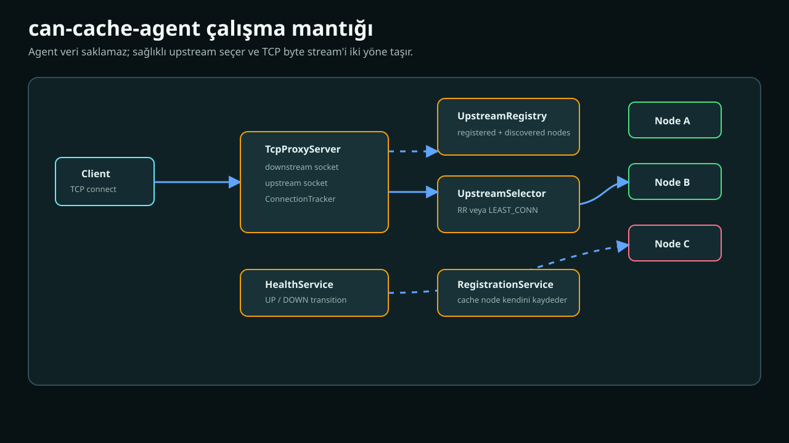
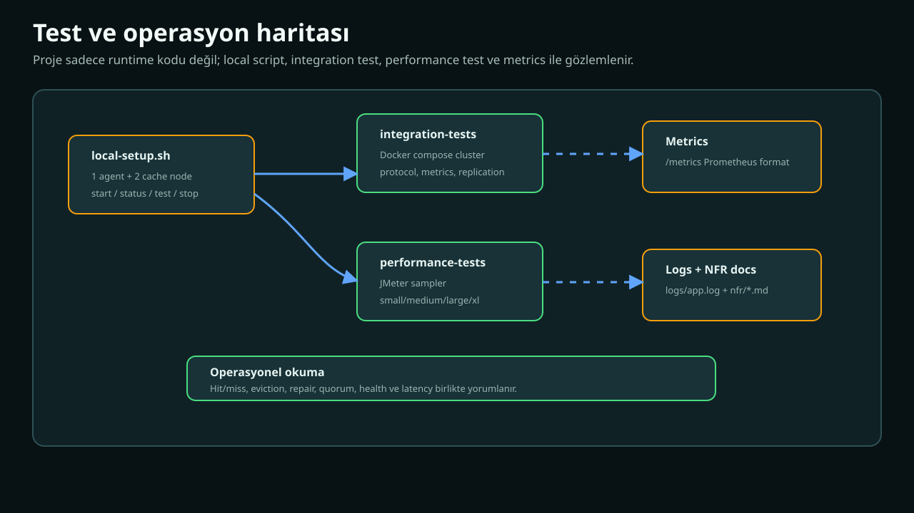

# can-cache Proje Çalışma Mantığı

Bu doküman, `can-cache` kodunu ilk kez açan bir geliştiricinin bütün sistemi uçtan uca anlayabilmesi için hazırlanmıştır. Amaç sadece "hangi dosya ne işe yarar?" demek değil; bir client isteğinin nasıl aktığını, cache motorunun nasıl karar verdiğini, cluster'ın nasıl kendi kendini toparladığını ve agent'ın trafiği nasıl yönettiğini anlatmaktır.

Bu rehber internet araştırması yapılmadan, repo içindeki güncel kod ve mevcut dokümanlarla uyumlu şekilde yazılmıştır.

## Görsel Rehber

Her büyük bölüm bir SVG diyagramıyla desteklenir. SVG dosyaları `docs/assets/helpme/` altındadır.

| Konu | Görsel |
| --- | --- |
| Proje ve modül haritası | [01-project-map.svg](docs/assets/helpme/01-project-map.svg) |
| Client komut yaşam döngüsü | [02-client-command-flow.svg](docs/assets/helpme/02-client-command-flow.svg) |
| CacheEngine iç yapısı | [03-cache-engine-internals.svg](docs/assets/helpme/03-cache-engine-internals.svg) |
| Cluster üyeliği ve bootstrap | [04-cluster-membership-bootstrap.svg](docs/assets/helpme/04-cluster-membership-bootstrap.svg) |
| Replication, quorum ve repair | [05-replication-repair.svg](docs/assets/helpme/05-replication-repair.svg) |
| Agent routing ve health | [06-agent-routing.svg](docs/assets/helpme/06-agent-routing.svg) |
| Test ve operasyon haritası | [07-testing-operations.svg](docs/assets/helpme/07-testing-operations.svg) |

## 1. Büyük Resim



`can-cache`, memcached text protokolüne uyumlu, bellek içi, cluster çalışabilen bir cache sistemidir. Repo dört ana modülden oluşur:

```text
can-cache-application
  Asıl cache node'u. Veriyi tutar, komutları işler, cluster replikasyonu yapar.

can-cache-agent
  Edge proxy. Client tek adrese bağlanır, agent sağlıklı cache node'u seçer.

can-cache-integration-tests
  Docker tabanlı çok node ve protokol doğrulama testleri.

can-cache-performance-tests
  JMeter tabanlı performans ve NFR senaryoları.
```

Kısa akıl modeli:

```text
Client
  -> Agent varsa agent
  -> can-cache-application
  -> CanCachedServer komutu parse eder
  -> ClusterClient key'in replica setini bulur
  -> CacheEngine local veriyle çalışır veya RemoteNode uzak node'a gider
  -> Sonuç memcached text response olarak geri döner
```

## 2. Modüller Ne İşe Yarıyor?

### 2.1. `can-cache-application`

Bu modül cache server'ın kendisidir. Ana sorumlulukları:

- TCP üzerinden memcached text protokolünü konuşmak.
- Komutları parse etmek.
- Veriyi RAM içinde saklamak.
- TTL, CAS ve eviction kurallarını uygulamak.
- Cluster içinde key'i doğru replica setine yönlendirmek.
- Node'lar arası binary replication yapmak.
- Hinted handoff, read-repair ve anti-entropy ile drift'i azaltmak.
- Metrics üretmek.

Önemli paketler:

| Paket | Görev |
| --- | --- |
| `net` | Client TCP server ve protocol parsing |
| `core` | CacheEngine, segment, TTL, eviction, CAS |
| `cluster` | Ring, quorum, hinted handoff, repair |
| `cluster.coordination` | Discovery, membership, bootstrap, replication protocol |
| `config` | Quarkus CDI wiring ve config mapping |
| `metric` | Counter/timer/metrics reporter |

### 2.2. `can-cache-agent`

Agent veri tutmaz. Client ile cache node arasında TCP proxy görevi görür.

Ana sorumlulukları:

- Upstream cache node listesini tutmak.
- Cache node registration bilgilerini kabul etmek.
- Periyodik health check yapmak.
- Sağlıklı node'lar arasından seçim yapmak.
- TCP bağlantısını seçilen upstream'e tünellemek.
- Connection sayısını ve status bilgisini takip etmek.

Agent key'i parse edip consistent hash route yapmaz. Bu bilinçli bir sadelik tercihidir: agent byte proxy olarak hızlı kalır.

### 2.3. Integration test modülü

Bu modül sistemin Docker ortamında çalışmasını doğrular. Tipik olarak şunları kapsar:

- Protocol uyumluluğu.
- Agent topology.
- Metrics endpoint.
- Multi-node replication.
- Repair davranışları.

### 2.4. Performance test modülü

Bu modül JMeter sampler ve NFR profillerini içerir:

- `small`
- `medium`
- `large`
- `xl`

Amaç sadece "çalışıyor mu?" değil; yüksek yükte latency, throughput ve sistem davranışını gözlemlemektir.

## 3. Client Komutu Nasıl Akar?



Bir client şu komutu gönderdi diyelim:

```text
set foo 0 60 3\r\n
bar\r\n
```

Sistem bunu şu aşamalardan geçirir.

### 3.1. TCP bağlantısı

Client ya doğrudan `can-cache-application` node'una bağlanır ya da agent'a bağlanır.

Doğrudan bağlantı:

```text
Client -> CanCachedServer
```

Agent üzerinden bağlantı:

```text
Client -> TcpProxyServer -> CanCachedServer
```

Agent kullanıldığında client tüm node listesini bilmek zorunda kalmaz.

### 3.2. Agent varsa upstream seçimi

Agent önce sağlıklı upstream listesini alır:

```text
UpstreamRegistry.ready()
```

Sonra `UpstreamSelector` seçimi yapar:

- `RoundRobinPolicy`
- `LeastConnPolicy`

Seçilen node'a upstream TCP bağlantısı açılır ve client'tan gelen byte'lar upstream'e, upstream'den gelen byte'lar client'a taşınır.

### 3.3. `CanCachedServer` parse eder

`CanCachedServer`, memcached text protokolünü okur. Bu protokol satır tabanlıdır ama storage komutlarında payload ayrıca beklenir.

Örnek:

```text
set foo 0 60 3\r\n
bar\r\n
```

Header:

```text
set foo 0 60 3
```

Payload:

```text
bar
```

Parser önce header'ı okur, sonra byte count kadar payload bekler.

### 3.4. Komut modeline çevrilir

Kodda komutlar şu yardımcı modellerle taşınır:

- `ImmediateCommand`
- `PendingStorageCommand`
- `StorageCommand`
- `CommandAction`
- `CommandResult`

Storage komutlarında body gelmeden komut tamamlanmış sayılmaz.

### 3.5. `ClusterClient` devreye girer

Server komutu parse ettikten sonra asıl veri operasyonu `ClusterClient` tarafına gider.

`ClusterClient` şunları yapar:

- Key için replica setini bulur.
- Yazma ise replica node'lara uygular.
- Quorum hesabı yapar.
- Okuma ise read-repair ayarlarına göre replica'ları okur.
- Başarısız replica için hinted handoff kaydı yapar.

### 3.6. Local veya remote node

Replica setinde local node varsa operasyon `CacheEngine` üzerinde yapılır. Uzak node varsa `RemoteNode` üzerinden replication protocol kullanılır.

Local:

```text
ClusterClient -> local Node -> CacheEngine
```

Remote:

```text
ClusterClient -> RemoteNode -> ReplicationServer -> CacheEngine
```

### 3.7. Response client'a döner

Sonuç memcached text response olarak döner:

- `STORED`
- `NOT_STORED`
- `VALUE ...`
- `END`
- `DELETED`
- `NOT_FOUND`
- `ERROR`

## 4. CacheEngine İç Yapısı



`CacheEngine`, projenin veri saklama merkezidir. Ama tek bir büyük `HashMap` değildir. Segmentlere bölünmüş bir yapıdır.

### 4.1. Neden segment var?

Tek büyük map ve tek lock olsaydı:

```text
Thread A key1 yazarken
Thread B key2 okumak için beklerdi
```

Segmentli yapıda:

```text
Thread A segment 1 ile çalışırken
Thread B segment 5 ile aynı anda çalışabilir
```

Bu tekniğe lock striping denir.

### 4.2. Key segmenti nasıl seçilir?

`CacheEngine` key'in hash değerini alır:

```text
(key.hashCode() & 0x7FFFFFFF) % segmentCount
```

`& 0x7FFFFFFF` negatif hash değerini pozitif aralığa çeker.

### 4.3. `CacheSegment` içinde ne var?

Her segment şunları tutar:

- `ReentrantLock`
- `LinkedHashMap<K, CacheValue>`
- `EvictionPolicy<K>`
- Removal listener

`LinkedHashMap` access-order modunda kullanıldığı için LRU davranışı doğal olarak desteklenir.

### 4.4. Value nasıl tutulur?

`CacheValue` şu iki alanı tutar:

```text
byte[] value
long expireAtMillis
```

Memcached metadata'sı ayrıca `StoredValueCodec` ile encode edilir:

```text
[cas][flags][expireAt][payload]
```

Bu sayede CAS, flags ve TTL bilgisi value ile birlikte taşınır.

### 4.5. TTL nasıl çalışır?

TTL iki mekanizmayla uygulanır:

1. Lazy expiration
   - `get` sırasında entry expired ise silinir ve miss döner.
2. Active expiration
   - `DelayQueue<ExpiringKey>` içine expire zamanı yazılır.
   - Background cleaner süresi gelen key'leri temizler.

Bu ikisi birlikte kullanılır çünkü sadece lazy cleanup yapılırsa okunmayan expired key bellekte kalır; sadece active cleanup yapılırsa cleaner gecikirse expired veri kısa süre map içinde durabilir.

### 4.6. Eviction nasıl çalışır?

Kapasite dolduğunda `EvictionPolicy.admit(...)` çağrılır.

Bu projede iki policy vardır:

- `LRU`
- `TINY_LFU`

LRU:

```text
map doluysa en eski erişilen entry kurban olur
```

TinyLFU:

```text
aday key'in frekansı ile mevcut kurbanın frekansı karşılaştırılır
aday daha değerliyse içeri alınır
değilse yeni key reddedilir
```

## 5. Cluster Üyeliği ve Bootstrap



Cluster modunda node'ların birbirini keşfetmesi gerekir. Bunu `CoordinationService` yürütür.

### 5.1. Heartbeat

Her node belirli aralıklarla multicast heartbeat gönderir.

Payload mantığı:

```text
HELLO|nodeId|host|replicationPort|epoch|clientPort
```

Bu paketleri diğer node'lar dinler.

### 5.2. Membership packet işleme

Bir node başka bir node'un heartbeat'ini görünce:

1. Kendi node ID'si ise ignore eder.
2. Mevcut member mı diye bakar.
3. Yeni veya adresi değişmişse handshake gerekir.
4. Eski member ise lastSeen güncellenir.
5. Handoff replay zamanı geldiyse hint replay tetiklenir.

### 5.3. Join handshake

Yeni node için TCP üzerinden join handshake yapılır:

```text
CMD_JOIN
localNodeId
localEpoch
```

Remote kabul ederse:

```text
RESP_ACCEPT
remoteNodeId
remoteEpoch
```

Bu handshake iki şeyi sağlar:

- Karşı node gerçekten beklenen node mu?
- Epoch bilgisiyle cluster state hizalansın mı?

### 5.4. Ring update

Handshake kabul edilirse `RemoteNode` oluşturulur ve `ConsistentHashRing` içine eklenir.

Ring'e eklenen şey doğrudan host/port değil, `Node<String,String>` arayüzünü uygulayan `RemoteNode` proxy nesnesidir.

### 5.5. Bootstrap

Yeni node boş olabilir. Bu yüzden mevcut node'dan stream istenir:

```text
CMD_STREAM
```

Remote node kendi `CacheEngine` snapshot'ını chunk'lar halinde gönderir.

Kritik detay:

```text
Her gelen key local node'a yazılmaz.
Önce ring.getReplicas(key, replicationFactor) hesaplanır.
Local node bu replica setindeyse yazılır.
Değilse skip edilir.
```

Bu filtre çok önemlidir. Aksi halde yeni node kendisine ait olmayan key'leri de taşır.

### 5.6. Dead member pruning

Heartbeat uzun süre gelmezse node ölü kabul edilir:

- Ring'den çıkarılır.
- RemoteNode kapatılır.
- Cluster epoch bump edilir.

## 6. Replication, Quorum ve Repair



Cluster'ın güvenilirlik davranışı üç ana fikirden oluşur:

- Replication
- Quorum
- Repair

### 6.1. Replica set seçimi

`ClusterClient`, key için şu çağrıyı yapar:

```text
ring.getReplicas(keyBytes, replicationFactor)
```

Ring, key hash'inden başlayıp clockwise yürür ve benzersiz node'ları toplar.

### 6.2. Yazma akışı

`set`, `delete`, `compareAndSwap` operasyonlarında:

1. Replica listesi bulunur.
2. Her node'a operasyon denenir.
3. Başarılı sayısı quorum'a ulaşırsa operasyon başarılıdır.
4. Ulaşılamayan node için hint kaydedilir.

Quorum:

```text
majority(nodes.size()) = (nodes / 2) + 1
```

RF=3 için quorum=2.

### 6.3. Hinted handoff

Bir replica yazma sırasında unreachable olursa write tamamen çöpe atılmaz.

`HintedHandoffService` hedef node için hint kuyruğu tutar:

- `SetHint`
- `DeleteHint`
- `CasHint`

Node tekrar görüldüğünde replay edilir.

### 6.4. Read-repair

Okuma sırasında replica drift fark edilirse onarım tetiklenebilir.

Modlar:

| Mod | Davranış |
| --- | --- |
| `FAST` | İlk bulunan değeri döner, repair arkaya atılır |
| `QUORUM` | Değerleri sayar, çoğunluk değerini seçer |

Quorum policy:

| Policy | Anlam |
| --- | --- |
| `STRICT` | Tam replica set çoğunluğu gerekir |
| `DEGRADED` | Sadece reachable replica çoğunluğu yeterlidir |

Read-repair korumaları:

- Bounded executor.
- Queue capacity.
- Per-key dedupe.
- Rate limit.

### 6.5. Anti-entropy

Anti-entropy, okuma beklemeden arka planda drift azaltır.

Akış:

```text
localEngine.forEachEntry(...)
  key replica setinde local var mı?
  yoksa skip
  remote missing/expired ise repair
  remote farklıysa conflict metric
```

Korumalar:

- Tek seferde maksimum repair bütçesi.
- Repair rate limit.
- Aynı anda ikinci anti-entropy run başlatmama.

## 7. Replication Protocol

Node'lar arası iletişim memcached text protokolüyle yapılmaz. Daha kompakt binary protocol kullanılır.

Komut örnekleri:

| Komut | Anlam |
| --- | --- |
| `CMD_SET` | Uzak node'a set uygula |
| `CMD_GET` | Uzak node'dan key oku |
| `CMD_DELETE` | Uzak node'dan key sil |
| `CMD_CAS` | Uzak node'da CAS dene |
| `CMD_JOIN` | Join handshake |
| `CMD_STREAM` | Bootstrap snapshot stream |
| `CMD_DIGEST` | Digest/fingerprint isteği |

SET frame mantığı:

```text
[cmd][keyLen][valueLen][expireAt][keyBytes][valueBytes]
```

Bu protocol `ReplicationServer` tarafından decode edilir, `RemoteNode` tarafından encode edilir.

## 8. RemoteNode ve Connection Pool

`RemoteNode`, uzak bir cache node'unu local `Node<String,String>` gibi gösterir.

Yani `ClusterClient` şunu bilmek zorunda değildir:

```text
Bu node local mi remote mu?
```

Remote ise `RemoteNode` arkada socket açar, binary frame gönderir, response parse eder.

### 8.1. Pool neden var?

Her request için TCP connection açmak pahalıdır. Bu yüzden connection reuse yapılır.

Akış:

```text
acquire pooled connection
send request
await response
release veya discard
```

### 8.2. Backpressure

Remote path sınırsız değildir:

- Request executor bounded.
- Queue capacity bounded.
- Socket pool size bounded.
- Acquire timeout var.
- Rejected task communication error'a çevrilir.

Bu, yavaş veya down remote node'un tüm JVM'i boğmasını engeller.

## 9. Agent Çalışma Mantığı



Agent, cache node değildir. Veri tutmaz. Sadece client bağlantısını sağlıklı bir upstream cache node'a taşır.

### 9.1. Upstream kaynakları

Agent upstream bilgisini iki yoldan alabilir:

1. Discovery config.
2. Cache node registration.

`UpstreamRegistry` bu node listesini tutar.

### 9.2. Health check

`HealthService`, upstream node'ları kontrol eder ve state günceller:

- `UNKNOWN`
- `UP`
- `DOWN`

State değiştikçe agent routing kararı etkilenir.

### 9.3. Seçim politikaları

`UpstreamSelector` config'e göre policy seçer:

| Policy | Davranış |
| --- | --- |
| `RR` | Sağlıklı node'ları sırayla seçer |
| `LEAST_CONN` | Aktif bağlantısı en az olan node'u seçer |

### 9.4. Proxy davranışı

`TcpProxyServer` client socket ve upstream socket arasında iki yönlü pipe kurar.

Agent payload'u parse etmez. Bunun avantajı:

- Basit ve hızlıdır.
- Memcached command detaylarına daha az bağımlıdır.

Dezavantaj:

- Key-aware routing yapmaz.
- Consistent hash kararını application node tarafı verir.

## 10. Config ve Wiring

### 10.1. `AppProperties`

Application config tip güvenli okunur.

Önemli alanlar:

| Config | Anlam |
| --- | --- |
| `app.cache.segments` | Cache segment sayısı |
| `app.cache.max-capacity` | Toplam entry kapasitesi |
| `app.cache.eviction-policy` | `LRU` veya `TINY_LFU` |
| `app.cluster.replication-factor` | Replica sayısı |
| `app.cluster.virtual-nodes` | Ring sanal node sayısı |
| `app.cluster.discovery.*` | Multicast heartbeat ayarları |
| `app.cluster.read-repair.*` | Read-repair ayarları |
| `app.cluster.coordination.*` | Anti-entropy ve coordination sınırları |
| `app.network.*` | Client server port/thread ayarları |
| `app.agent.*` | Application node'un agent'a kayıt ayarları |

### 10.2. `AppConfig`

`AppConfig`, Quarkus CDI bean'lerini üretir:

- `CacheEngine`
- Local `Node`
- `ClusterState`
- `HintedHandoffService`
- `ClusterClient`

Bu yüzden runtime wiring anlamak için `AppConfig` iyi bir başlangıç dosyasıdır.

### 10.3. Lifecycle

Başlangıçta:

1. Config okunur.
2. Bean'ler üretilir.
3. `CacheEngine` segmentleri ve cleaner timer'ı başlatır.
4. `CanCachedServer` client TCP portunu açar.
5. `ReplicationServer` node'lar arası portu açar.
6. `CoordinationService` heartbeat ve membership loop başlatır.
7. Agent integration açıksa node agent'a kaydolur.

Kapanışta:

1. Timer'lar iptal edilir.
2. Socket ve pool'lar kapatılır.
3. RemoteNode bağlantıları kapatılır.
4. Executor'lar shutdown edilir.

## 11. Test ve Operasyon



### 11.1. Local çalışma

Tek node:

```bash
./gradlew :can-cache-application:quarkusDev
```

Agent:

```bash
./gradlew :can-cache-agent:quarkusDev
```

Hazır script:

```bash
./local-setup.sh start
./local-setup.sh status
./local-setup.sh test
./local-setup.sh stop
```

### 11.2. Integration testler

`can-cache-integration-tests` Docker ile daha gerçekçi cluster senaryoları kurar.

Önemli doğrulama türleri:

- Protocol command davranışları.
- Agent topology.
- Metrics endpoint.
- Replication repair.
- Scalable cluster.

### 11.3. Performance testler

`can-cache-performance-tests` JMeter sampler ve NFR profilleri içerir.

Amaç:

- Throughput ölçmek.
- p95/p99 latency görmek.
- Large ve XL profilde replication/repair davranışını izlemek.
- Snapshot, thread starvation, replication lag gibi riskleri notlamak.

### 11.4. Metrics

Application metrics Prometheus formatında sunulur.

Takip edilmesi gereken metrik aileleri:

- hit/miss
- eviction
- get/set/delete latency
- read-repair attempts/repairs/conflicts
- anti-entropy runs/repairs/failures
- hinted handoff enqueued/replayed/failures
- node/role labels

## 12. Sık Görülen Senaryolar

### 12.1. Tek node cache

En basit mod:

```text
Client -> CanCachedServer -> ClusterClient -> local CacheEngine
```

Replication yoksa operasyon local cache üzerinde biter.

### 12.2. İki veya üç node cluster

Akış:

```text
Node'lar heartbeat ile birbirini görür.
Join handshake yapılır.
RemoteNode ring'e eklenir.
Key replica setleri ring üzerinden hesaplanır.
Yazmalar quorum ile kabul edilir.
```

### 12.3. Bir replica down

Yazma sırasında replica down ise:

```text
Başarılı replica sayısı quorum'a ulaşıyorsa client başarı alır.
Down replica için hint kuyruğa yazılır.
Replica geri gelince hint replay edilir.
```

### 12.4. Replica drift

Drift şu yollarla kapanabilir:

- Okuma sırasında read-repair.
- Periyodik anti-entropy.
- Node geri geldiğinde hinted handoff replay.

### 12.5. Cache kapasitesi dolar

Kapasite dolduğunda eviction policy devreye girer.

LRU:

```text
en eski erişilen entry silinir
```

TinyLFU:

```text
aday ve kurban frekansı karşılaştırılır
aday daha değerli değilse cache'e alınmaz
```

## 13. Kod Okuma Rotası

Projeyi anlamak için önerilen sıra:

1. `README.md`
2. `helpme.md`
3. `can-cache-application/src/main/java/com/cancache/agent/config/AppConfig.java`
4. `can-cache-application/src/main/java/com/cancache/agent/core/CacheEngine.java`
5. `can-cache-application/src/main/java/com/cancache/agent/core/CacheSegment.java`
6. `can-cache-application/src/main/java/com/cancache/agent/net/CanCachedServer.java`
7. `can-cache-application/src/main/java/com/cancache/agent/cluster/ConsistentHashRing.java`
8. `can-cache-application/src/main/java/com/cancache/agent/cluster/ClusterClient.java`
9. `can-cache-application/src/main/java/com/cancache/agent/cluster/coordination/CoordinationService.java`
10. `can-cache-application/src/main/java/com/cancache/agent/cluster/coordination/ReplicationServer.java`
11. `can-cache-application/src/main/java/com/cancache/agent/cluster/coordination/RemoteNode.java`
12. `can-cache-agent/src/main/java/com/cancache/agent/service/TcpProxyServer.java`
13. `can-cache-agent/src/main/java/com/cancache/agent/service/UpstreamRegistry.java`
14. `can-cache-agent/src/main/java/com/cancache/agent/service/HealthService.java`

## 14. Bu Projede Kararların Mantığı

### 14.1. Neden bellek içi?

Cache'in amacı düşük gecikmedir. Disk kalıcılığı hedeflenmediği için veri RAM'de tutulur.

Trade-off:

- Artı: düşük latency.
- Eksi: process restart sonrası veri kaybı.

### 14.2. Neden memcached text protocol?

Memcached text protocol basit, bilinen ve test etmesi kolaydır. `nc` ile bile denenebilir.

Trade-off:

- Artı: uyumluluk ve okunabilirlik.
- Eksi: binary protocol'e göre parse maliyeti.

### 14.3. Neden node'lar arası binary protocol?

Node'lar arası trafikte insan okunabilirlikten çok verim önemlidir. Bu yüzden replication protocol daha kompakt binary frame kullanır.

### 14.4. Neden consistent hashing?

Node sayısı değiştiğinde key'lerin çoğu yer değiştirmesin diye.

Basit modulo hashing:

```text
hash(key) % nodeCount
```

node sayısı değişince çok fazla key'i oynatır.

Consistent hashing key hareketini azaltır.

### 14.5. Neden repair mekanizmaları var?

Distributed cache'te her replica her an aynı olmayabilir.

Bu yüzden sistem üç zamanda onarım yapar:

- Yazmadan sonra: hinted handoff.
- Okuma sırasında: read-repair.
- Arka planda: anti-entropy.

## 15. Kısa Terimler

| Terim | Anlam |
| --- | --- |
| TTL | Key'in geçerlilik süresi |
| CAS | Versiyon kontrollü koşullu yazma |
| Eviction | Kapasite dolunca entry çıkarma |
| Segment | Cache map'inin lock contention azaltan parçası |
| Quorum | Operasyon için gereken minimum başarılı replica sayısı |
| Replica | Key'in başka node'daki kopyası |
| Hinted handoff | Down replica için missed write kuyruğu |
| Read-repair | Okuma sırasında replica onarımı |
| Anti-entropy | Arka planda replica drift azaltma |
| Backpressure | Sistem kapasitesinden fazla işi içeri almama |

## 16. Sonuç

`can-cache` tek bir sınıfın yaptığı basit bir key/value map değildir. Sistem birkaç katmanın birlikte çalışmasıyla oluşur:

```text
protocol parser
  -> cluster client
  -> cache engine
  -> replication protocol
  -> repair services
  -> agent proxy
  -> metrics and tests
```

Bu rehberi okurken en önemli zihinsel model şudur:

```text
Client isteği bir komuttur.
Komut önce protocol seviyesinde anlaşılır.
Sonra cluster seviyesinde hangi node'lara gideceği belirlenir.
Sonra cache seviyesinde TTL/CAS/eviction kuralları uygulanır.
Sonra response geri döner.
Arka planda cluster kendini heartbeat, bootstrap, handoff, read-repair ve anti-entropy ile toparlar.
```

Bu modeli oturttuğunuzda repo dosyaları birbirinden kopuk görünmez; her sınıf bu akışın bir yerinde sorumluluk alır.
